

**Universidad Peruana de Ciencias Aplicadas**

**Facultad de Ingeniería**

**Curso:** 1ASI0572 – Desarrollo de Soluciones IoT

**NRC:** 6776

**Nombre del profesor:** Marco Antonio León Baca

---

## Informe de Trabajo Final

**Nombre de la startup:** EduSolutions

**Nombre del producto:** EduSpace

---

**Integrantes:**

| Código     | Apellidos y Nombres            |
| ---------- | ------------------------------ |
| u202310877 | Alva Abanto, Luis Andrés       |
| u20191e414 | Antayhua Castillo, Josué Oscar |
| u202110385 | Loli Ramirez, Camila Cristina  |
| u202220528 | Torres García, Andrés Alberto  |
| u202312504 | Yalán Zhang, Angie Christina   |

**Lima - abril 2026**

---

## Registro de Versiones del Informe

| Versión | Fecha      | Autor  | Descripción de modificación |
| ------- | ---------- | ------ | --------------------------- |
| AV1     | 11/04/2026 | Alva Abanto, Luis Andrés   Antayhua Castillo, Josué Oscar   Loli Ramirez, Camila Cristina   Torres García, Andrés Alberto   Yalán Zhang, Angie Christina| Se han incluído los siguientes capítulos:  Capítulo I: Introducción   Capítulo II: Requirements Elicitation & Analysis   Capítulo III: Requirements Specification   Capítulo IV: Solution Software Design      |
| TB1     | 08/05/2026 | Torres García, Andrés Alberto | Se ha incluído la sección 6.2.1 (Sprint 1) del Capítulo VI:   6.2.1.1. Sprint Planning 1   6.2.1.2. Aspect Leaders and Collaborators   6.2.1.3. Sprint Backlog 1 |

---

## Project Report Collaboration Insights

URL del repositorio del Project Report en GitHub: [https://github.com/DesarrolloSolucionIoT/eduspace-report](https://github.com/DesarrolloSolucionIoT/eduspace-report)

---

## Contenido

- [Capítulo I: Introducción](#capítulo-i-introducción)
  - [1.1. Startup Profile](#11-startup-profile)
    - [1.1.1. Descripción de la Startup](#111-descripción-de-la-startup)
    - [1.1.2. Perfiles de integrantes del equipo](#112-perfiles-de-integrantes-del-equipo)
  - [1.2. Solution Profile](#12-solution-profile)
    - [1.2.1. Antecedentes y problemática](#121-antecedentes-y-problemática)
    - [1.2.2. Lean UX Process](#122-lean-ux-process)
      - [1.2.2.1. Lean UX Problem Statements](#1221-lean-ux-problem-statements)
        - [**a. DOMAIN**](#a-domain)
        - [**b. CUSTOMER SEGMENTS**](#b-customer-segments)
        - [**c. PAIN POINTS**](#c-pain-points)
        - [**d. GAP**](#d-gap)
        - [**e. VISION/STRATEGY**](#e-visionstrategy)
        - [**f. INITIAL SEGMENT**](#f-initial-segment)
      - [1.2.2.2. Lean UX Assumptions](#1222-lean-ux-assumptions)
      - [1.2.2.3. Lean UX Hypothesis Statements](#1223-lean-ux-hypothesis-statements)
      - [1.2.2.4. Lean UX Canvas](#1224-lean-ux-canvas)
  - [1.3. Segmentos objetivo](#13-segmentos-objetivo)
- [Capítulo II: Requirements Elicitation \& Analysis](#capítulo-ii-requirements-elicitation--analysis)
  - [2.1. Competidores](#21-competidores)
    - [2.1.1. Análisis competitivo](#211-análisis-competitivo)
    - [2.1.2. Estrategias y tácticas frente a competidores](#212-estrategias-y-tácticas-frente-a-competidores)
      - [**Frente a las fortalezas de los competidores**](#frente-a-las-fortalezas-de-los-competidores)
        - [**Fortalezas de EduSpace:**](#fortalezas-de-eduspace)
        - [**Estrategias**](#estrategias)
        - [**Tácticas**](#tácticas)
      - [**Frente a las debilidades de los competidores**](#frente-a-las-debilidades-de-los-competidores)
        - [**Debilidades de EduSpace:**](#debilidades-de-eduspace)
        - [**Estrategias**](#estrategias-1)
        - [**Tácticas**](#tácticas-1)
  - [2.2. Entrevistas](#22-entrevistas)
    - [2.2.1. Diseño de entrevistas](#221-diseño-de-entrevistas)
      - [Segmento 1: Administradores de instituciones educativas](#segmento-1-administradores-de-instituciones-educativas)
      - [Segmento 2: Docentes y auxiliares](#segmento-2-docentes-y-auxiliares)
    - [2.2.2. Registro de entrevistas](#222-registro-de-entrevistas)
    - [Segmento objetivo #1: Administradores de instituciones educativas](#segmento-objetivo-1-administradores-de-instituciones-educativas)
        - [Datos del Entrevistado #1](#datos-del-entrevistado-1)
        - [Datos del Entrevistado #2](#datos-del-entrevistado-2)
        - [Datos del Entrevistado #3](#datos-del-entrevistado-3)
    - [Segmento objetivo #2: Docentes y auxiliares](#segmento-objetivo-2-docentes-y-auxiliares)
        - [Datos del Entrevistado #1](#datos-del-entrevistado-1-1)
        - [Datos del Entrevistado #2](#datos-del-entrevistado-2-1)
        - [Datos del Entrevistado #3](#datos-del-entrevistado-3-1)
    - [2.2.3. Análisis de entrevistas](#223-análisis-de-entrevistas)
      - [Principales hallazgos (insights)](#principales-hallazgos-insights)
      - [Patrones identificados](#patrones-identificados)
      - [Pain Points validados](#pain-points-validados)
      - [Oportunidades detectadas](#oportunidades-detectadas)
      - [Riesgos identificados](#riesgos-identificados)
      - [Conclusión del análisis](#conclusión-del-análisis)
  - [2.3. Needfinding](#23-needfinding)
    - [2.3.1. User Personas](#231-user-personas)
      - [User persona 1: Administradores de instituciones educativas](#user-persona-1-administradores-de-instituciones-educativas)
    - [User persona 2: Docentes y auxiliares](#user-persona-2-docentes-y-auxiliares)
    - [2.3.2. User Task Matrix](#232-user-task-matrix)
    - [2.3.3. User Journey Mapping](#233-user-journey-mapping)
      - [User persona 1: Administradores de instituciones educativas](#user-persona-1-administradores-de-instituciones-educativas-1)
    - [User persona 2: Docentes y auxiliares](#user-persona-2-docentes-y-auxiliares-1)
    - [2.3.4. Empathy Mapping](#234-empathy-mapping)
      - [User persona 1: Administradores de instituciones educativas](#user-persona-1-administradores-de-instituciones-educativas-2)
    - [User persona 2: Docentes y auxiliares](#user-persona-2-docentes-y-auxiliares-2)
  - [2.4. Big Picture EventStorming](#24-big-picture-eventstorming)
  - [2.5. Ubiquitous Language](#25-ubiquitous-language)
- [Capítulo III: Requirements Specification](#capítulo-iii-requirements-specification)
  - [3.1. User Stories](#31-user-stories)
  - [3.2. Impact Mapping](#32-impact-mapping)
  - [3.3. Product Backlog](#33-product-backlog)
- [Capítulo IV: Solution Software Design](#capítulo-iv-solution-software-design)
  - [4.1. Strategic-Level Domain-Driven Design](#41-strategic-level-domain-driven-design)
    - [4.1.1. Design-Level EventStorming](#411-design-level-eventstorming)
      - [4.1.1.1. Candidate Context Discovery](#4111-candidate-context-discovery)
      - [4.1.1.2. Domain Message Flows Modeling](#4112-domain-message-flows-modeling)
      - [4.1.1.3. Bounded Context Canvases](#4113-bounded-context-canvases)
    - [4.1.2. Context Mapping](#412-context-mapping)
    - [4.1.3. Software Architecture](#413-software-architecture)
      - [4.1.3.1. Software Architecture System Landscape Diagram](#4131-software-architecture-system-landscape-diagram)
      - [4.1.3.2. Software Architecture Context Level Diagrams](#4132-software-architecture-context-level-diagrams)
      - [4.1.3.3. Software Architecture Container Level Diagrams](#4133-software-architecture-container-level-diagrams)
      - [4.1.3.4. Software Architecture Deployment Diagrams](#4134-software-architecture-deployment-diagrams)
  - [4.2. Tactical-Level Domain-Driven Design](#42-tactical-level-domain-driven-design)
    - [Bounded Contexts válidos](#bounded-contexts-válidos)
      - [4.2.1. Identity, Access \& Profile Management](#421-identity-access--profile-management)
        - [4.2.1.1. Domain Layer](#4211-domain-layer)
        - [4.2.1.2. Interface Layer](#4212-interface-layer)
        - [4.2.1.3. Application Layer](#4213-application-layer)
        - [4.2.1.4. Infrastructure Layer](#4214-infrastructure-layer)
        - [4.2.1.5. Bounded Context Software Architecture Component Level Diagrams](#4215-bounded-context-software-architecture-component-level-diagrams)
        - [4.2.1.6. Bounded Context Software Architecture Code Level Diagrams](#4216-bounded-context-software-architecture-code-level-diagrams)
          - [4.2.1.6.1. Bounded Context Domain Layer Class Diagram](#42161-bounded-context-domain-layer-class-diagram)
          - [4.2.1.6.2. Bounded Context Database Design Diagram](#42162-bounded-context-database-design-diagram)
      - [4.2.2. Space \& Resource Management](#422-space--resource-management)
        - [4.2.2.1. Domain Layer](#4221-domain-layer)
        - [4.2.2.2. Interface Layer](#4222-interface-layer)
        - [4.2.2.3. Application Layer](#4223-application-layer)
        - [4.2.2.4. Infrastructure Layer](#4224-infrastructure-layer)
        - [4.2.2.5. Bounded Context Software Architecture Component Level Diagrams](#4225-bounded-context-software-architecture-component-level-diagrams)
        - [4.2.2.6. Bounded Context Software Architecture Code Level Diagrams](#4226-bounded-context-software-architecture-code-level-diagrams)
          - [4.2.2.6.1. Bounded Context Domain Layer Class Diagram](#42261-bounded-context-domain-layer-class-diagram)
          - [4.2.2.6.2. Bounded Context Database Design Diagram](#42262-bounded-context-database-design-diagram)
      - [4.2.3. Reservation \& Scheduling](#423-reservation--scheduling)
        - [4.2.3.1. Domain Layer](#4231-domain-layer)
        - [4.2.3.2. Interface Layer](#4232-interface-layer)
        - [4.2.3.3. Application Layer](#4233-application-layer)
        - [4.2.3.4. Infrastructure Layer](#4234-infrastructure-layer)
        - [4.2.3.5. Bounded Context Software Architecture Component Level Diagrams](#4235-bounded-context-software-architecture-component-level-diagrams)
        - [4.2.3.6. Bounded Context Software Architecture Code Level Diagrams](#4236-bounded-context-software-architecture-code-level-diagrams)
          - [4.2.3.6.1. Bounded Context Domain Layer Class Diagram](#42361-bounded-context-domain-layer-class-diagram)
          - [4.2.3.6.2. Bounded Context Database Design Diagram](#42362-bounded-context-database-design-diagram)
      - [4.2.4. Breakdown Management](#424-breakdown-management)
        - [4.2.4.1. Domain Layer](#4241-domain-layer)
        - [4.2.4.2. Interface Layer](#4242-interface-layer)
        - [4.2.4.3. Application Layer](#4243-application-layer)
        - [4.2.4.4. Infrastructure Layer](#4244-infrastructure-layer)
        - [4.2.4.5. Bounded Context Software Architecture Component Level Diagrams](#4245-bounded-context-software-architecture-component-level-diagrams)
        - [4.2.4.6. Bounded Context Software Architecture Code Level Diagrams](#4246-bounded-context-software-architecture-code-level-diagrams)
          - [4.2.4.6.1. Bounded Context Domain Layer Class Diagram](#42461-bounded-context-domain-layer-class-diagram)
          - [4.2.4.6.2. Bounded Context Database Design Diagram](#42462-bounded-context-database-design-diagram)
      - [4.2.5. IoT Monitoring](#425-iot-monitoring)
        - [4.2.5.1. Domain Layer](#4251-domain-layer)
        - [4.2.5.2. Interface Layer](#4252-interface-layer)
        - [4.2.5.3. Application Layer](#4253-application-layer)
        - [4.2.5.4. Infrastructure Layer](#4254-infrastructure-layer)
        - [4.2.5.5. Bounded Context Software Architecture Component Level Diagrams](#4255-bounded-context-software-architecture-component-level-diagrams)
        - [4.2.5.6. Bounded Context Software Architecture Code Level Diagrams](#4256-bounded-context-software-architecture-code-level-diagrams)
          - [4.2.5.6.1. Bounded Context Domain Layer Class Diagram](#42561-bounded-context-domain-layer-class-diagram)
          - [4.2.5.6.2. Bounded Context Database Design Diagram](#42562-bounded-context-database-design-diagram)
- [Capítulo V: Solution UI/UX Design](#capítulo-v-solution-uiux-design)
  - [5.1. Style Guidelines](#51-style-guidelines)
    - [5.1.1. General Style Guidelines](#511-general-style-guidelines)
    - [5.1.2. Web, Mobile and IoT Style Guidelines](#512-web-mobile-and-iot-style-guidelines)
  - [5.2. Information Architecture](#52-information-architecture)
    - [5.2.1. Organization Systems](#521-organization-systems)
    - [5.2.2. Labeling Systems](#522-labeling-systems)
    - [5.2.3. SEO Tags and Meta Tags](#523-seo-tags-and-meta-tags)
    - [5.2.4. Searching Systems](#524-searching-systems)
    - [5.2.5. Navigation Systems](#525-navigation-systems)
  - [5.3. Landing Page UI Design](#53-landing-page-ui-design)
    - [5.3.1. Landing Page Wireframe](#531-landing-page-wireframe)
    - [5.3.2. Landing Page Mock-up](#532-landing-page-mock-up)
  - [5.4. Applications UX/UI Design](#54-applications-uxui-design)
    - [5.4.1. Applications Wireframes](#541-applications-wireframes)
    - [5.4.2. Applications Wireflow Diagrams](#542-applications-wireflow-diagrams)
    - [5.4.3. Applications Mock-ups](#543-applications-mock-ups)
    - [5.4.4. Applications User Flow Diagrams](#544-applications-user-flow-diagrams)
  - [5.5. Applications Prototyping](#55-applications-prototyping)
  - [5.6. IoT Device Design](#56-iot-device-design)
- [Capítulo VI: Product Implementation, Validation \& Deployment](#capítulo-vi-product-implementation-validation--deployment)
  - [6.2. Landing Page, Services \& Applications Implementation](#62-landing-page-services--applications-implementation)
    - [6.2.1. Sprint 1](#621-sprint-1)
      - [6.2.1.1. Sprint Planning 1](#6211-sprint-planning-1)
      - [6.2.1.2. Aspect Leaders and Collaborators](#6212-aspect-leaders-and-collaborators)
      - [6.2.1.3. Sprint Backlog 1](#6213-sprint-backlog-1)
      - [6.2.1.4. Development Evidence for Sprint Review.](#6214-development-evidence-for-sprint-review)
      - [6.2.1.5. Testing Suite Evidence for Sprint Review.](#6215-testing-suite-evidence-for-sprint-review)
      - [6.2.1.6. Execution Evidence for Sprint Review.](#6216-execution-evidence-for-sprint-review)
      - [6.2.1.7. Services Documentation Evidence for Sprint Review.](#6217-services-documentation-evidence-for-sprint-review)
      - [6.2.1.8. Software Deployment Evidence for Sprint Review.](#6218-software-deployment-evidence-for-sprint-review)
      - [6.2.1.9. Team Collaboration Insights during Sprint.](#6219-team-collaboration-insights-during-sprint)
- [Conclusiones](#conclusiones)
  - [Conclusiones y recomendaciones](#conclusiones-y-recomendaciones)
- [Bibliografía](#bibliografía)
- [Anexos](#anexos)
  - [Anexo A: Estructura para la sección Student Outcome](#anexo-a-estructura-para-la-sección-student-outcome)
  - [Anexo B: Videos de Exposiciones](#anexo-b-videos-de-exposiciones)

---

## Student Outcome

El curso contribuye al cumplimiento del Student Outcome ABET:

**ABET – EAC - Student Outcome 5:** La capacidad de funcionar efectivamente en un equipo cuyos miembros juntos proporcionan liderazgo, crean un entorno de colaboración e inclusivo, establecen objetivos, planifican tareas y cumplen objetivos.

En el siguiente cuadro se describe las acciones realizadas y enunciados de conclusiones por parte del grupo, que permiten sustentar el haber alcanzado el logro del ABET – EAC - Student Outcome 5.

| Criterio específico | Acciones realizadas | Conclusiones |
|---------------------|---------------------|--------------|
| Trabaja en equipo para proporcionar liderazgo en forma conjunta | Angie Christina Yalán Zhang **AV1** Durante el desarrollo de EduSpace, trabajé de manera colaborativa con mi equipo, aportando ideas y participando activamente en la toma de decisiones. Asumí un rol de liderazgo compartido, apoyando en la organización de entregables y asegurando que todos contribuyamos al avance del proyecto.   Luis Alva **AV1** Participé activamente en la definición de la arquitectura de software del sistema EduSpace IoT, liderando el diseño estratégico basado en Domain-Driven Design. Contribuí en la identificación de bounded contexts, la elaboración del Design-Level EventStorming y la construcción de los diagramas C4, asegurando que las decisiones arquitectónicas fueran consistentes con los requerimientos del sistema y los lineamientos del curso.   Camila Cristina Loli Ramirez **AV1** Realicé la organización del capítulo 1, me enfoqué en mejorar la estructura del Lean UX, se corrigieron puntos como el Problem Statement, 5W2H, segmentos objetivo y canvas. Asimismo, contribuí en la preparación de la presentación.   Andrés Alberto Torres García **AV1** Asumí el liderazgo técnico del bounded context IoT Monitoring, nuevo contexto incorporado en esta iteración para soportar el monitoreo ambiental de las aulas. Conduje el modelado del bounded context en sesiones colaborativas de Design-Level EventStorming, elaboré el Bounded Context Canvas correspondiente y diseñé el caso de Domain Message Flow asociado al monitoreo IoT y generación de alertas (sec. 4.1.1.2). Lideré además la documentación íntegra del Tactical-Level DDD para el bounded context IoT Monitoring (sec. 4.2.5), cubriendo Domain, Application, Interface e Infrastructure Layers junto con los diagramas de componentes y código. **TB1** Asumí el rol de Líder de los aspectos IAM e IoT Monitoring, y de Colaborador en Landing Page y Space & Resource Management según la matriz LACX (sec. 6.2.1.2). Validé y dejé operativo el flujo de autenticación del bounded context IAM heredado (T-IAM-01: endpoints de sign-in/sign-up con JWT) y conduje el scaffolding del nuevo bounded context IoT Monitoring (T-IoT-01: estructura de carpetas alineada al Capítulo 4.2.5; T-IoT-02: entidades de dominio Sensor, Reading y Alert según los Aggregates definidos en sec. 4.2.5.1), dejando la base lista para integrar telemetría real en el Sprint 2. Adicionalmente, redacté íntegramente la sección 6.2.1 del Capítulo VI (Sprint Planning, matriz LACX y Sprint Backlog) y coordiné la creación del tablero de proyecto en Jira con el detalle de tasks, asignaciones y trazabilidad hacia las User Stories del Product Backlog. | El equipo distribuyó el liderazgo técnico de forma coherente con la organización del informe en bounded contexts y capítulos. Cada integrante asumió la responsabilidad principal de un aspecto del diseño estratégico o táctico, mientras las decisiones arquitectónicas transversales se tomaron en sesiones grupales de EventStorming y Context Mapping. Esta distribución permitió avanzar en paralelo sin perder coherencia y demuestra que el equipo es capaz de proporcionar liderazgo de forma conjunta, sin depender de una única figura central. |
| Crea un entorno colaborativo e inclusivo, establece metas, planifica tareas y cumple objetivos. | Angie Christina Yalán Zhang **AV1** Contribuí a generar un ambiente de trabajo colaborativo, donde se respetaron las ideas de todos. Participé en la planificación de tareas y en el cumplimiento de los objetivos, lo que permitió avanzar de forma ordenada en entregables como entrevistas, user personas y modelos del sistema.   Luis Alva **AV1** Colaboré en la planificación y distribución de tareas del equipo para la primera entrega, estableciendo un orden de trabajo por secciones del informe. Participé en sesiones de trabajo colaborativo para la elaboración del Big Picture EventStorming y los Bounded Context Canvases, promoviendo un entorno de discusión inclusivo donde cada decisión de diseño fue consensuada con el equipo.   Camila Cristina Loli Ramirez **AV1** Colaboré en la revisión y mejora de los contenidos del proyecto. Esto permitió actualizar el Lean UX acorde a la nueva propuesta de solución. Cumplimos el objetivo de mantener coherencia a lo largo del informe mediante la realización de cada tarea.   Andrés Alberto Torres García **AV1** Participé en la planificación inicial del ciclo, alineando la incorporación del componente IoT con el alcance heredado de la plataforma EduSpace. Coordiné con el equipo la distribución de bounded contexts entre los integrantes y propuse el cronograma de entregables del Capítulo IV. Cumplí con los objetivos asignados de modelar el bounded context IoT Monitoring de extremo a extremo y de aportar en la consolidación de los diagramas C4 de Container y Deployment, integrando el Edge API y los dispositivos ESP32 al landscape de la solución. **TB1** Aporté en la planificación del Sprint 1 redactando el acta de la reunión y consolidando la matriz LACX de Aspect Leaders & Collaborators, garantizando que cada aspecto del producto contara con al menos un Líder y un Colaborador para evitar puntos únicos de falla. Cumplí con los entregables comprometidos como Líder de IAM e IoT Monitoring (T-IAM-01, T-IoT-01, T-IoT-02), revisé los avances de Camila en T-IAM-02 y de Josué en T-IoT-03 antes de mergear a `main`, y mantuve la trazabilidad entre el Sprint Backlog del informe y el tablero de Jira para asegurar consistencia entre la evidencia escrita y la herramienta de gestión. | El equipo estableció al inicio de AV1 metas claras en términos de capítulos del informe a entregar (Capítulos I-IV) y artefactos por sección, distribuyéndolos según la afinidad de cada integrante. Las decisiones de diseño se tomaron de forma consensuada en sesiones colaborativas, respetando las propuestas de todos los miembros y garantizando un entorno inclusivo. El cumplimiento de los entregables — Lean UX, User Stories, Big Picture y Design-Level EventStorming, Bounded Context Canvases, Context Map, diagramas C4 y los cinco bounded contexts documentados a nivel táctico — confirma que el equipo planificó adecuadamente y ejecutó conforme a lo planificado. |

---

# Capítulo I: Introducción

## 1.1. Startup Profile

### 1.1.1. Descripción de la Startup

EduSolutions es una startup enfocada en el desarrollo de soluciones tecnológicas innovadoras para el sector educativo. Su objetivo es mejorar el manejo integral de espacios educativos en institutos que cuentan con grandes infraestructuras.

En este contexto, surge la creación de la aplicación EduSpace, una aplicación que facilita la coordinación del personal y fortalece la comunicación entre trabajadores y supervisores.

EduSpace permite registrar y gestionar cada ambiente educativo, incluyendo aulas, su aforo y el docente responsable, así como ambientes deportivos y su equipamiento. La plataforma también gestiona los datos de los trabajadores, como docentes y personal de limpieza, facilitando la reasignación de responsabilidades en caso de ausencias.

Asimismo, cuenta con la interacción de sensores IoT para el monitoreo del entorno, permitiendo detectar la presencia de personas, temperatura, humedad, y automatizar el control de la iluminación. Esto contribuye a una gestión más eficiente y sostenible de recursos.

De esta manera, EduSpace permite a las instituciones educativas optimizar su eficiencia operativa, mejorar el uso de recursos y fortalecer su gestión interna.

**Misión:** Brindar soluciones tecnológicas y sostenibles que optimicen la gestión de espacios y recursos en instituciones educativas, mejorando su eficiencia operativa mediante herramientas digitales e integración de IoT.

**Visión:** Liderar en el rubro de servicios educativos en Latinoamérica con nuestra startup por ofrecer soluciones sostenibles y accesibles, destacando por la innovación en la gestión inteligente de espacios.

### 1.1.2. Perfiles de integrantes del equipo

| Foto del Participante                                                                                                                                                                                     | Nombres y Apellidos           | Código de Estudiante | Descripción de Carrera | Resumen de Conocimientos y Habilidades                                                                                                                                                                                                                                                                                                                                                                                                                                                                                                                                                                                                                                     |
| --------------------------------------------------------------------------------------------------------------------------------------------------------------------------------------------------------- | ----------------------------- | -------------------- | ---------------------- | -------------------------------------------------------------------------------------------------------------------------------------------------------------------------------------------------------------------------------------------------------------------------------------------------------------------------------------------------------------------------------------------------------------------------------------------------------------------------------------------------------------------------------------------------------------------------------------------------------------------------------------------------------------------------- |
|  | Andrés Alberto Torres García  | u202220528           | Ingeniería de Software | Hola, soy Andrés Alberto Torres García, tengo 20 años y curso el séptimo ciclo de Ingeniería de Software. Me apasiona la tecnología y siempre busco entender cómo funcionan las cosas, lo que me ha permitido adquirir experiencia en C++, Python, JavaScript y TypeScript, así como en el desarrollo de aplicaciones web con Next.js, TailwindCSS y Firebase, bases de datos como MySQL, MongoDB y Firestore, y el uso de herramientas como Docker y GitHub. Además, el fútbol es otra de mis grandes pasiones, disciplina que me ha enseñado valores como el trabajo en equipo, la perseverancia y la constancia, que aplico también en mi vida académica y profesional. |
|                                                                                                                                                           | Camila Cristina Loli Ramirez  | u202110385           | Ingeniería de Software | Soy Camila Cristina Loli Ramirez, tengo 21 años y soy estudiante de la carrera Ingeniería de Software. Mi carrera se basa en los conocimientos y técnicas científicas para crear un programa informático. Tengo experiencia con el trabajo en equipo, creación de proyectos y creación de programas básicos. Aportaré al equipo mi creatividad, compromiso de trabajo en equipo, puntualidad y responsabilidad. Me comprometo a trabajar constantemente para mejorar nuestro proyecto y a generar un entorno de trabajo sano con mi grupo.                                                                                                                                 |
|                                                                                                                                                                                                           | Oscar Josué Antayhua Castillo | u20191e414           | Ingeniería de Software |        Soy estudiante de Ingeniería de Software con experiencia en desarrollo full stack, automatización de procesos y análisis de datos. Manejo tecnologías como Python, SQL, JavaScript, TypeScript, Next.js y Django, y me caracterizo por ser una persona proactiva, responsable y comprometida con el trabajo en equipo                                                                                                                                                                                                                                                                                                                                                                                                                                                                                                                                                                                                                                                                    |
|                                                                                                                                                                                                           | Luis Andrés Alva Abanto       | u202310877           | Ingeniería de Software |    Mi nombre es Luis Andrés Alva Abanto, tengo 20 años y estudio ingeniería de software.                                                                                                                                                                                                                                                                                                                                                                                                                                                                                                                                                                                                                                                                          |
|                                                                                                                                                                                                           | Angie Christina Yalán Zhang   | u202312504           | Ingeniería de Software | Mi nombre es Angie Yalán. Soy estudiante de la carrera Ingeniería de Software y tengo 20 años. Me considero una persona proactiva que le gustan nuevas experiencias y aprender cosas diferentes. Sigo en el proceso de mejora en cuanto a la programación y cuento con toda la iniciativa para ser cada día mejor en ello.  |

## 1.2. Solution Profile

### 1.2.1. Antecedentes y problemática

Según el equipo de Expertos en Educación de la Universidad Internacional de Valencia (2025), en Perú, la gestión educativa enfrenta varios obstáculos que incluyen factores económicos, tecnológicos y organizacionales. Estas limitaciones impactan de manera negativa la infraestructura y la disponibilidad de recursos dentro de las instituciones educativas, lo que dificulta su adecuada administración.

Asimismo, el reducido uso de tecnologías en los procesos de gestión impide alcanzar niveles óptimos de eficiencia administrativa (Diaz, 2023). Diferentes estudios mencionan que la integración de herramientas tecnológicas permite optimizar procesos, mejorar la toma decisiones y fortalece la coordinación entre los trabajadores del entorno educativo (Valencia & Almeida, 2024).

Respecto al nivel organizacional, según Córdova Negrete et al. (2025) evidencian que las instituciones educativas presentan ineficiencias en sus procesos administrativos y limitaciones en su capacidad de respuesta. Estas condiciones generan problemas en la gestión de espacios, recursos y personal, lo que afecta la eficiencia operativa.

En consecuencia de la falta de una gestión apropiada, también hay diferentes problemas en el uso de recursos como la energía. El consumo eléctrico puede representar entre el 20% y 30% de los costos operativos en instituciones educativas (Birimisa, 2025), esto causa que haya una falta de control adecuado que perjudica tanto el aspecto financiero como el ambiental.

Además, la ausencia de sistemas de monitoreo impide regular de forma adecuada factores ambientales como la temperatura y la humedad dentro de los espacios educativos (aulas, laboratorios, entre otros). Estas condiciones pueden afectar el bienestar de los usuarios, generando riesgos para la salud, como problemas respiratorios o estrés térmico.

En este contexto, se identifica como problemática principal la gestión ineficiente de los espacios educativos y la falta de sistemas integrados que permitan una coordinación efectiva del personal, el monitoreo en tiempo real y la optimización de los recursos dentro de instituciones educativas con infraestructuras complejas.

Para analizar con más detalle los antecedentes y problemáticas, se realizó con anticipación la técnica 5 ‘W’s & 2 ‘H’s:

- ### _WHAT?_

El problema que se ha identificado es la gestión ineficiente de los espacios educativos con grandes infraestructuras. Estas organizaciones manejan múltiples espacios y recursos, lo que dificulta mantener un control adecuado sobre su disponibilidad y uso. Por consecuencia, esto ocasiona problemas de comunicación entre los empleados, retrasos en la toma de decisiones y dificultades para gestionar cambios o incidencias en tiempo real.

- ### _WHEN?_

La problemática surge cuando las instituciones experimentan un crecimiento o complejidad en su operación diaria, esto dificulta la gestión eficiente de sus espacios, personal y recursos. Esta situación se vuelve más crítica en situaciones como la planificación de nuevos semestres, la coordinación de actividades entre diferentes ambientes, la gestión de ausencias de personal, o cuando se enfrentan a la necesidad de automatizar procesos administrativos para mantener la eficiencia y evitar errores.

- ### _WHERE?_

Esta problemática ocurre dentro de instituciones educativas como universidades, colegios e institutos, especialmente en aquellos entornos que cuentan con múltiples espacios como aulas, laboratorios, bibliotecas y áreas deportivas. Es en estos contextos que la división de recursos y la falta de un sistema centralizado dificultan la gestión y coordinación diaria.

- ### _WHY?_

La causa principal del problema radica en la falta de integración y automatización en la gestión de los espacios y recursos. Muchas instituciones dependen de procesos manuales o sistemas desarticulados, esto genera una comunicación deficiente entre áreas, retrasos en la toma de decisiones y dificultades para coordinar al personal y los recursos disponibles.

- ### _WHO?_

En la problemática abordada, los afectados son los docentes, personal administrativo, y otros miembros del equipo de una institución educativa, quienes dependen de la organización de espacios y recursos para desarrollar sus tareas. La falta de coordinación impacta en su desempeño y en la eficiencia de las operaciones realizadas en la institución.

- ### _HOW?_

Este problema puede abordarse mediante la implementación de una solución tecnológica centralizada que permita gestionar de manera eficiente los espacios, recursos y personal. El uso de herramientas digitales facilitaría la automatización de procesos, mejora en la comunicación interna y monitoreo en tiempo real de los ambientes educativos.

- ### _HOW MUCH?_
  El consumo energético de instituciones educativos puede representar entre el 20% y 30% de sus costos operativos (Birimisa, 2025), lo que evidencia que una gestión ineficiente de los recursos puede generar un impacto económico significativo.

### 1.2.2. Lean UX Process

#### 1.2.2.1. Lean UX Problem Statements

En el estado actual de la gestión administrativa en centros educativos con grandes infraestructuras es deficiente. En ambos segmentos, es complicado seguir un orden de procesos, ya que los procesos administrativos suelen depender de métodos manuales o sistemas desintegrados. Esto dificulta la coordinación del personal, el control de la disponibilidad de los espacios y correcta gestión de recursos.

Esta situación se ve agravada por la falta de herramientas tecnológicas accesibles que permitan monitorear en tiempo real el uso de los ambientes educativos, y factores relevantes como el consumo energético y las condiciones ambientales dentro de las aulas, bibliotecas, laboratorios, entre otros.

En consecuencia, las instituciones sufren de diferentes problemas, como retrasos en la forma de decisiones, uso ineficiente de recursos, aumento en costos operativos y una limitada capacidad de respuesta ante incidentes.

¿Cómo podríamos mejorar la gestión y monitoreo de espacios educativos para optimizar el uso de recursos, reducir costos operativos y elevar la eficiencia en la coordinación del personal?

##### **a. DOMAIN**

Gestión de espacios educativos y recursos en instituciones con infraestructuras complejas que requieren coordinación eficiente del personal, control de ambientes y optimización del uso de recursos.

##### **b. CUSTOMER SEGMENTS**

Administradores de instituciones educativas y docentes y auxiliares que gestionan múltiples espacios físicos y necesitan mejorar su organización y control.

##### **c. PAIN POINTS**

- Coordinación ineficaz del personal entre diferentes espacios.
- Comunicación deficiente entre trabajadores y supervisores.
- Procesos administrativos manuales y propensos a errores.
- Dificultad en el seguimiento y mantenimiento de equipos e inventarios.
- Falta de disponibilidad y uso de os espacios educativos.

##### **d. GAP**

No existe una solución integrada que permita centralizar la gestión de espacios, recursos y personal, y monitorear en tiempo real el uso de los ambientes educativos, esto limita la eficiencia operativa de las instituciones.

##### **e. VISION/STRATEGY**

Desarrollar una plataforma integral que permita facilitar la gestión eficiente de espacios educativos, automatizar tareas administrativas, mejorar la comunicación y coordinación del personal y el monitoreo en tiempo real de recursos, esto contribuye a un funcionamiento más eficiente y sostenible.

##### **f. INITIAL SEGMENT**

Las grandes instituciones educativas que enfrentan problemas en la coordinación de espacios y la administración de personal están buscando una solución digital para optimizar estos procesos.

#### 1.2.2.2. Lean UX Assumptions

Business Assumptions: 

- **Creemos que nuestros usuarios necesitan** una manera eficiente de gestionar los espacios educativos, recursos y personal en instituciones con múltiples ambientes.
- **Estas necesidades se pueden resolver con** una aplicación móvil centralizada que permita automatizar procesos, mejorar la coordinación interna y monitorear en tiempo real el uso de los espacios.
- **Nuestros clientes iniciales son** docentes de instituciones educativas y personal administrativo que buscan optimizar sus procesos.
- **El valor #1 que un cliente requiere de nuestro servicio** es optimizar el uso de espacios y recursos, para evitar ineficiencias en el funcionamiento de la institución.
- **El cliente también puede obtener estos beneficios adicionales** mejorar la comunicación entre el personal, reducción de errores administrativos, ahorro en el consumo energético.
- **Adquiriremos a nuestros clientes a través** campañas de marketing digital, demostraciones en línea y referencias de clientes existentes.
- **Haremos dinero a través** de la venta d planes de suscripción adaptados a las necesidades de las instituciones educativas.
- **Nuestra competencia de mercado** serán aplicaciones de gestión educativa tradicionales que no integran monitoreo en tiempo real ni automatización avanzada de recursos.
- **Los venceremos debido** a la integración de monitoreo en tiempo real, automatización de procesos y optimización del uso de recursos mediante tecnologías IoT.
- **Nuestros mayores riesgos son** que las instituciones educativas no perciban un valor claro en la adopción de una nueva plataforma, que el plan de suscripción no se ajuste a sus necesidades.
- **Resolveremos esto mediante** el desarrollo del producto, nuestra prioridad es entender las necesidades de los usuarios y proveer una solución tecnológica, que sea intuitiva de utilizar.
- **Sabremos que hemos tenido éxito cuando uno de estos cambios en el comportamiento de nuestro cliente:** El usuario logra gestionar la asignación de espacios y recursos en menor tiempo, reduzcan errores en la coordinación de actividades y utilicen activamente el sistema para monitorear el ambiente de las aulas.
- **Qué otras suposiciones tenemos que, de probarse falsas pueden causar que nuestro proyecto fracase:** suponer que los segmentos objetivos prefieren mantener el uso de sistemas manuales para monitorear los ambientes y recursos disponibles.

**Business Outcomes:** 

- Mejorar la eficiencia operativa de las instituciones educativas un 25% en sus primeros 4 meses de uso del sistema.
- Se espera que al menos el 30% de nuestros clientes nos recomienden a otras instituciones dentro de los primeros 6 meses.
- Ofrecer la aplicación en múltiples idiomas incrementará la base de usuarios en un 25% en los primeros seis meses, permitiendo que más instituciones educativas de diferentes regiones utilicen la plataforma y contribuyendo a un crecimiento anual del 15%
-  Crear interfaz fácil de usar y visualmente atractiva que retenga al menos el 50% de usuarios después de los primeros 7 meses.
- Conseguir que más del 65% de usuarios pague la suscripción (anual o mensual) ofrecida. 

**User Assumptions:** 

**¿Quiénes serán nuestros usuarios?** 

Nuestros usuarios principales son: 

- Docentes y auxiliares entre las edades de 22 a 65 años que buscan una solución que facilite el monitoreo de ambientes y mejore la comunicación con los administradores.
- Administradores de instituciones educativas entre 35 a 60 años que necesitan una herramienta que permita gestionar eficazmente los espacios y recursos.

**¿Dónde encaja nuestro producto en su vida o trabajo?** 

El producto se adapta al trabajo diario de los usuarios, facilitando la gestión de ambientes, equipos y recursos del centro educativo, y mejorando la comunicación entre el personal.

**¿Qué problemas tiene nuestro producto y cómo se pueden resolver?** 

La falta de control sobre los espacios educativos, la comunicación ineficiente y la ausencia de monitoreo en tiempo real.

**¿Cómo y cuándo es usado nuestro producto?** 

EduSolutions se utiliza de forma diaria para gestionar la asignación de espacios, coordinar actividades y monitorear el estado de los ambientes educativos.

**¿Qué características son importantes?** 

Acceso en tiempo real, facilidad de uso, centralización de información y automatización de procesos.

**¿Cómo debe verse y comportarse nuestro producto?** 

El producto debe de ser intuitivo, rápido, disponible durante el horario laboral, y accesible desde distintos dispositivos, lo que permitirá una gestión eficiente sin complejidad técnica.

**El valor principal que un usuario quiere obtener de nuestra funcionalidad es:**

- Mejora en la gestión de los espacios y recursos, junto con una comunicación más eficiente entre los trabajadores.

**Los usuarios también pueden obtener estos beneficios adicionales:**

- Acceso rápido a la información en cualquier momento y desde cualquier dispositivo.

**El mayor riesgo para el usuario es:**

- Que la aplicación no se adapte correctamente a diferentes dispositivos o que no facilite la comunicación interna como se espera.

**User Outcomes:**

- Acceso a Notificaciones y Actualizaciones: Al implementar un sistema de notificaciones, se espera que el 80% de los usuarios reciban y respondan a los eventos y cambios importantes en la aplicación dentro de las primeras 24 horas. Esto mejorará su capacidad de gestionar tareas en tiempo real, optimizando su productividad en un 15%.
- Reducción del Tiempo de Familiarización: Una interfaz intuitiva y fácil de usar reducirá el tiempo de familiarización de los usuarios en un 30%, permitiendo que al menos el 90% de ellos dominen las funcionalidades básicas en menos de una semana sin necesidad de capacitaciones adicionales.
- Mejora en el Control de Inventarios: Con la introducción de funciones para registrar y gestionar el inventario de equipos y recursos, se espera que los usuarios logren un aumento del 25% en el control y monitoreo de sus recursos. Esto resultará en una mejora de la productividad en un 20%, al optimizar el uso de los recursos disponibles en los centros educativos.

**Features Assumptions:**

- Acceso a Notificaciones y Actualizaciones:
  - Sistema de Notificaciones en Tiempo Real: Implementar una funcionalidad que envíe notificaciones automáticas sobre eventos importantes y cambios en la aplicación, permitiendo a los usuarios reaccionar rápidamente. Esto ayudará a que el 80% de los usuarios estén al tanto de las actualizaciones dentro de las primeras 24 horas.
- Reducción del Tiempo de Familiarización:
  - Interfaz Intuitiva y Fácil de Usar: Desarrollar una interfaz que sea simple e intuitiva, reduciendo el tiempo de aprendizaje en un 30%. Se espera que el 90% de los usuarios puedan dominar las funciones principales en menos de una semana sin necesidad de capacitación adicional.
- Mejora en el Control de Inventarios:
  - Gestión de Inventarios de Recursos: Crear una funcionalidad que permita a los usuarios registrar y gestionar el inventario de equipos y recursos en su centro educativo. Esto incrementará el control y monitoreo de los recursos en un 25%, mejorando la productividad en un 20% al optimizar el uso de los mismos.

* Monitoreo del ambiente mediante IoT:
  - Incorporación de sensores que permitan detectar la presencia de personas, así como medir la temperatura y humedad en los ambientes educativos.

#### 1.2.2.3. Lean UX Hypothesis Statements

- Nosotros creemos que los usuarios necesitan una aplicación que les permita gestionar los espacios de su centro educativo de manera eficiente. Sabremos que es verdad cuando al menos el 50% de usuarios adquiera los planes de suscripción durante el primer mes.
- Nosotros creemos que al contar con una interfaz intuitiva, visualmente atractiva y sea fácil de usar reducirá la tasa de abandono del sistema. Sabremos que es verdad cuando al menos el 70% de los usuarios continúen utilizando la plataforma después del primer mes.
- Nosotros creemos que el monitoreo en tiempo real mediante tecnologías IoT (presencia, temperatura, humedad y consumo energético) aportará valor a los usuarios en la gestión de los espacios. Sabremos que es verdad cuando los usuarios utilicen activamente estas funcionalidades y las consideren relevantes en la toma de decisiones operativas.

#### 1.2.2.4. Lean UX Canvas

## 1.3. Segmentos objetivo

Nuestra aplicación se enfoca en optimizar la gestión de espacios educativos y la coordinación del personal a través de una plataforma integral. EduSpace facilita la grabación de aulas, espacios deportivos y entornos personales, y permite una gestión detallada de los recursos. Además, automatiza la nómina y proporciona un control completo del inventario de equipos y recursos con valoraciones contables. Los usuarios capturan información sobre sus actividades y necesidades operativas para mejorar la eficiencia y la comunicación. Así, nuestros segmentos objetivo serán los siguientes:

**Administradores de instituciones educativas**

- Edad: 35 a 60 años
- Perfil: Directivos, coordinadores académicos, personal administrativo encargados de la gestión operativo de institución educativa.
- Uso de tecnología: Intermedio
- Necesidad principal: Optimizar la gestión de espacios, recursos y personal de manera centralizada.
- Beneficios buscados: Tener mayor control operativo, reducción de errores, ahorro de tiempo y mejora en la toma de decisiones.

**Características demográficas:** Profesionales entre 35 a 60 años, de género masculino y femenino, con formación en gestión educativa, administración o especialidades afines, que trabajan solamente en instituciones educativas.

**Características geográficas:** Principalmente ubicados en zonas urbanas de Perú, especialmente Lima Metropolitana, donde existen instituciones educativas con infraestructuras grandes y complejas.

**Docentes y auxiliares**

- Edad: 22 a 65 años
- Perfil: Profesores y personal de apoyo que utilizan los espacios educativos de las instituciones donde trabajan para desarrollar sus actividades diarias.
- Uso de tecnología: Básico a intermedio
- Necesidad principal: Acceder rápidamente a información sobre la disponibilidad de espacios y coordinar actividades sin complicaciones.
- Beneficios buscados: Acceso rápido a la información sobre los recursos y espacios disponibles, mejor comunicación y menos errores en la asignación de espacios.

**Características demográficas:** Profesionales del sector educativo entre 22 a 65 años, de género masculino y femenino, con formación académica en sus respectivas disciplinas (ciencias, literatura, entre otros), con experiencia en enseñanza.

**Características geográficas:** Principalmente ubicados en instituciones educativas con infraestructura compleja de zonas urbanas o semiurbanas de Perú, especialmente Lima Metropolitana.

---

# Capítulo II: Requirements Elicitation & Analysis

## 2.1. Competidores

### 2.1.1. Análisis competitivo

El análisis competitivo permite identificar las soluciones existentes que abordan el monitoreo de espacios, consumo energético y condiciones ambientales mediante tecnologías IoT. A partir de este análisis, se evalúan plataformas como Siemens, Cisco, Honeywell y Spacewell, las cuales ofrecen soluciones avanzadas orientadas a entornos corporativos.

<table border="1" cellpadding="10" cellspacing="0" style="margin-left: auto; margin-right: auto;">
  <tr>
    <th colspan="7">Competitive Analysis Landscape</th>
  </tr>
  <tr>
    <td colspan="2" rowspan="2">¿Por qué llevar a cabo este análisis?</td>
    <td colspan="5">¿Cómo se posicionan las soluciones actuales de monitoreo inteligente de espacios frente a una propuesta enfocada en el entorno educativo, y qué oportunidades existen para diferenciarse mediante especialización y analítica en tiempo real?</td>
  </tr>
  <tr>
    <td colspan="5">Identificar cómo las soluciones actuales de smart buildings gestionan espacios, energía y monitoreo, y determinar cómo una solución enfocada en entornos educativos puede diferenciarse mediante especialización, accesibilidad y lógica académica.</td>
  </tr>
  <tr>
   <td colspan="2">Nombre y logo</td>
    <td style="text-align: center;">EduSpace    </td>
    <td style="text-align: center;">Siemens Smart Infrastructure   </td>
    <td style="text-align: center;">Cisco Spaces   </td>
    <td style="text-align: center;">Honeywell Building Tech  </td>
    <td style="text-align: center;">Spacewell   </td> 
  </tr>
  <tr>
    <td rowspan="2">Perfil</td>
    <td>Overview</td>
    <td>Plataforma IoT enfocada en instituciones educativas que monitorea ocupación, ambiente y consumo energético en aulas, generando analítica y alertas en tiempo real</td>
    <td>Ecosistema integral de automatización de edificios inteligentes que incluye energía, seguridad, climatización y analítica avanzada</td>
    <td>Plataforma de analítica de espacios basada en ubicación mediante WiFi, enfocada en comportamiento de usuarios</td>
    <td>Plataforma de gestión de edificios que integra monitoreo ambiental, energía, seguridad y automatización</td>
    <td>Plataforma de facility management que optimiza el uso de espacios de trabajo mediante IoT, sensores y analítica</td>
  </tr>
  <tr>
    <td>Ventaja competitiva ¿Qué valor ofrece a los clientes?</td>
    <td>Especialización en educación + integración con horarios académicos + modelo accesible + lógica de scoring y alertas inteligentes</td>
    <td>Alta precisión, confiabilidad y soluciones completas a gran escala</td>
    <td>Analítica avanzada de ocupación con mapas de calor y comportamiento</td>
    <td>Integración completa de sistemas físicos del edificio + experiencia industrial</td>
    <td>Enfoque en optimización de espacios de trabajo + integración de datos IoT + enfoque en experiencia del usuario</td>
  </tr>
  <tr>
    <td rowspan="2">Perfil de Marketing</td>
    <td>Mercado objetivo</td>
    <td>Instituciones educativas con grandes y pequeñas infraestructuras que buscan optimizar la gestión de sus espacios y recursos.</td>
    <td>Grandes empresas e instituciones que buscan centralizar la gestión de sus instalaciones con un enfoque en sostenibilidad.</td>
    <td>Empresas, retail, oficinas corporativas, que requieren soluciones fáciles de usar para la gestión de instalaciones.</td>
    <td>Grandes instituciones y empresas que necesitan una solución completa para la gestión de sus instalaciones y recursos.</td>
    <td>Industrias, edificios comerciales, hospitales</td>
  </tr>
  <tr>
    <td>Estrategias de marketing</td>
    <td>Marketing dirigido a administradores de grandes y de pequeñas instituciones educativas, destacando la eficiencia y el control exhaustivo de recursos.</td>
    <td>Enfoque en la sostenibilidad y la eficiencia, con campañas dirigidas a administradores de instalaciones y responsables de sostenibilidad.</td>
    <td>Enfoque en la simplicidad y efectividad, con marketing dirigido a usuarios que buscan facilidad de uso en la gestión de instalaciones.</td>
    <td>Posicionamiento como solución de analítica inteligente basada en datos</td>
    <td>Campañas dirigidas a grandes organizaciones que necesitan una solución robusta y completa para la gestión de sus instalaciones.</td>
  </tr>
  <tr>
    <td rowspan="3">Perfil de Producto</td>
    <td>Productos & Servicios</td>
    <td>Monitoreo de aulas, dashboard en tiempo real, sistema de alertas, score de eficiencia, analítica histórica, integración con backend académico</td>
    <td>Automatización HVAC, control energético, seguridad, analítica avanzada, mantenimiento predictivo.</td>
    <td>Mapas de calor, conteo de personas, analítica de comportamiento, optimización de espacios</td>
    <td>Control de climatización, energía, seguridad, monitoreo ambiental, mantenimiento</td>
    <td>Gestión de espacios, sensores de ocupación, reservas de espacios, analítica de uso, facility management</td>
  </tr>
  <tr>
    <td>Precios & Costos</td>
    <td>Planes de suscripción, basados en la escala de la institución educativa y el número de funcionalidades utilizadas. </td>
    <td>Precios basados en suscripciones, ajustados según la cantidad de instalaciones y funcionalidades requeridas.</td>
    <td>Planes de suscripción con diferentes niveles de servicio, ajustados según el tamaño de la institución y sus necesidades.</td>
    <td>Precios altos por la adquisición de licencias e implementación de insfraestructuras.</td>
    <td>Precios personalizados basados en la escala y complejidad de la implementación para grandes organizaciones.</td>
  </tr>
  <tr>
    <td>Canales de distribución (Web y/o Móvil)</td>
    <td>Plataforma web y aplicación móvil.</td>
    <td>Plataforma web con soporte para aplicaciones móviles y monitoreo en tiempo real.</td>
    <td>Plataforma SaaS basada en cloud</td>
    <td>Soluciones empresariales personalizadas</td>
    <td>Plataforma SaaS (web) + integraciones empresariales</td>
  </tr>
  <tr>
    <td rowspan="5">Analisis SWOT</td>
  </tr>
 <tr>
    <td>Fortalezas</td>
    <td>Enfoque educativo; bajo costo; integración con horarios, aulas y docentes; dashboard con alertas y score; fácil adaptación a universidades/colegios.</td>
    <td>Marca global; alta confiabilidad; soluciones completas; gran experiencia en automatización.</td>
    <td>Analítica avanzada de ocupación; mapas de calor; uso de infraestructura WiFi existente.</td>
    <td>Experiencia industrial; integración de energía, seguridad y ambiente; soluciones robustas.</td>
    <td>Fuerte en gestión de espacios; usa IoT y analítica; modelo SaaS; enfoque en experiencia de usuario.</td>
  </tr>
  <tr>
    <td>Debilidades</td>
    <td>Menor precisión frente a soluciones industriales; dependencia de sensores básicos; requiere validación en campo; menor reputación inicial.</td>
    <td>Costos muy altos; implementación compleja; poco enfoque específico en educación.</td>
    <td>Depende de red WiFi robusta; menor enfoque en variables ambientales; no especializado en aulas.</td>
    <td>Alto costo; instalación compleja; enfoque generalista, no educativo.</td>
    <td>Orientado a oficinas/coworking; requiere integración empresarial; costo elevado para instituciones pequeñas.</td>
  </tr>
  <tr>
    <td>Oportunidades</td>
    <td>Crecimiento de smart campus; transformación digital educativa; optimización de aulas; integración futura con IA y predicción de uso.</td>
    <td>Expansión de smart buildings y smart cities; demanda de eficiencia energética.</td>
    <td>Mayor interés por analítica de espacios e híbrido laboral; expansión a campus.</td>
    <td>Crecimiento de edificios sostenibles e inteligentes; mantenimiento predictivo.</td>
    <td>Crecimiento del trabajo híbrido; demanda de optimización de espacios; posible expansión a educación.</td>
  </tr>
  <tr>
    <td>Amenazas</td>
    <td>Grandes empresas pueden adaptar sus soluciones al sector educativo; presupuestos limitados; resistencia al cambio tecnológico.</td>
    <td>Startups más económicas y especializadas; soluciones modulares más accesibles.</td>
    <td>Competidores IoT más completos; privacidad de datos de ubicación.</td>
    <td>Soluciones ágiles más baratas; adopción lenta por costos altos.</td>
    <td>Soluciones especializadas en educación; competidores con hardware más económico; barreras de adopción por costo.</td>
  </tr>
</table>

### 2.1.2. Estrategias y tácticas frente a competidores

Con base en el análisis competitivo realizado, se identificaron las principales fortalezas, debilidades, oportunidades y amenazas de las soluciones actuales en el ámbito de smart buildings y gestión de espacios, como Siemens, Cisco Spaces, Honeywell y Spacewell. Este análisis permite definir un conjunto de estrategias y tácticas que orienten a Smart Campus IoT a posicionarse como una solución diferenciada, accesible y especializada en el sector educativo.

A continuación, se detallan las estrategias y tácticas propuestas:

#### **Frente a las fortalezas de los competidores**

Los competidores analizados destacan por:

- Alto nivel de automatización y precisión en sus sistemas
- Soluciones integrales a gran escala (energía, seguridad, infraestructura)
- Amplia experiencia y posicionamiento en el mercado
- Uso de tecnologías avanzadas como IA, Big Data y analítica predictiva

##### **Fortalezas de EduSpace:**

- Especialización en el sector educativo
- Integración con procesos académicos (aulas, horarios, docentes)
- Bajo costo de implementación
- Flexibilidad y escalabilidad modular
- Enfoque en analítica aplicada a la toma de decisiones académicas

##### **Estrategias**

- Diferenciar la propuesta mediante un enfoque específico en educación.
- Posicionar la solución como una herramienta de gestión académica basada en datos.
- Priorizar la simplicidad y accesibilidad frente a soluciones complejas y costosas.

##### **Tácticas**

- Desarrollar dashboards orientados a indicadores académicos (uso de aulas, eficiencia).
- Comunicar el valor del sistema en términos de mejora del aprendizaje y optimización de recursos.
- Implementar módulos iniciales simples que puedan escalar progresivamente.

#### **Frente a las debilidades de los competidores**

Se identificaron las siguientes debilidades en los competidores:

- Alto costo de implementación
- Complejidad técnica e infraestructura pesada
- Falta de enfoque en el sector educativo
- Limitada adaptación a procesos académicos específicos

##### **Debilidades de EduSpace:**

- Menor precisión frente a soluciones industriales
- Dependencia de sensores de bajo costo
- Limitada validación en escenarios reales

##### **Estrategias**

- Aprovechar la falta de especialización educativa de los competidores.
- Enfocar la solución en necesidades concretas de instituciones educativas.
- Diseñar un sistema fácil de implementar y mantener.

##### **Tácticas**

- Desarrollar funcionalidades específicas como monitoreo por horario académico y score de aula.
- Realizar pilotos en instituciones educativas para validar el sistema.
- Optimizar el uso de sensores accesibles manteniendo precisión suficiente para el contexto educativo.

## 2.2. Entrevistas

### 2.2.1. Diseño de entrevistas

Las entrevistas permitirán recolectar información cualitativa sobre cómo se gestionan actualmente los espacios académicos, recursos e infraestructura en instituciones educativas, identificando problemas, necesidades y oportunidades para validar la propuesta de EduSpace.

#### Segmento 1: Administradores de instituciones educativas

Objetivo: Comprender cómo los administradores gestionan aulas y recursos, qué dificultades enfrentan y qué valor perciben en una solución basada en monitoreo en tiempo real.

* ¿Cómo verifican si las aulas están siendo utilizadas correctamente?
* ¿Qué herramientas utilizan para el control de espacios y recursos?
* ¿Cómo monitorean el consumo de energía o mantenimiento de aulas?
* ¿Qué dificultades enfrentan en la gestión de aulas?
* ¿Qué tan frecuente es el desperdicio de recursos (luces, equipos encendidos)?
* ¿Tienen visibilidad en tiempo real de lo que ocurre en las aulas?
* ¿Qué tan importante sería contar con datos en tiempo real sobre uso de aulas?
* ¿Te sería útil recibir alertas sobre ineficiencias o problemas?
* ¿Qué opinas de un sistema que monitoree aulas en tiempo real?
* ¿Qué funcionalidades considerarías más importantes?
* ¿Qué te generaría más valor: ahorro de costos, control o mejora académica?
* ¿Implementarías una solución así en tu institución? ¿Por qué?
* ¿Qué barreras ves para su implementación? (costo, tecnología, cultura, etc.)

#### Segmento 2: Docentes y auxiliares

Objetivo: Comprender cómo perciben el uso de aulas, condiciones del entorno y problemas que afectan el desarrollo de clases.

* ¿Has tenido problemas con temperatura, ruido o equipos?
* ¿Qué te gustaría mejorar en las aulas?
* ¿Te sería útil conocer el estado de un aula antes de ingresar?
* ¿Qué opinas de un sistema que monitoree las condiciones del aula?
* ¿Te ayudaría saber si un aula está disponible o en buenas condiciones?
* ¿Qué funcionalidad te sería más útil como docente?
* ¿Crees que un sistema así mejoraría tu experiencia al enseñar?

### 2.2.2. Registro de entrevistas

### Segmento objetivo #1: Administradores de instituciones educativas
##### Datos del Entrevistado #1
- **Nombre completo:** Victor Otto Reinoso Díaz
- **Segmento Objetivo:** Administradores de instituciones educativas
- **Edad:** 28
- **Distrito:** Lurigancho - Chosica
- **Inicio de la entrevista:** 00:00
- **Duración:** 4:19
- **Screenshot del cuadro de video:** 
- **URL del video (Microsoft Stream):** *[Entrevista 03](https://upcedupe-my.sharepoint.com/:l:/g/personal/u202312504_upc_edu_pe/JABq1Tk15HtaSqVGyJ4LGDFXAXKjrk2rXKsj0pI6lrjvc5M?e=zQ8JTi)*

**Resumen:** El entrevistado señala que actualmente la gestión de aulas se realiza mediante hojas de cálculo y coordinación manual entre áreas, lo que genera errores frecuentes y poca visibilidad del uso real de los espacios. Indica que no cuentan con información en tiempo real sobre ocupación ni consumo energético, lo que ocasiona desperdicio de recursos como luces y equipos encendidos. Considera que una solución como EduSpace sería valiosa, especialmente si permite visualizar el estado de las aulas y recibir alertas automáticas. Sin embargo, menciona que el principal reto sería el costo de implementación y la adaptación del personal al cambio tecnológico.

##### Datos del Entrevistado #2
- **Nombre completo:** Rosa Elvira Loayza
- **Segmento Objetivo:** Administradores de instituciones educativas
- **Edad:** 47
- **Distrito:** Huachipa  
- **Inicio de la entrevista:** 00:00
- **Duración:** 3:21
- **Screenshot del cuadro de video:** 
- **URL del video (Microsoft Stream):** *[Entrevista 03](https://upcedupe-my.sharepoint.com/:l:/g/personal/u202312504_upc_edu_pe/JABq1Tk15HtaSqVGyJ4LGDFXAXKjrk2rXKsj0pI6lrjvc5M?e=zQ8JTi)*

**Resumen:** La entrevistada menciona que uno de los principales problemas es la falta de coordinación entre docentes y administración, lo que genera conflictos en la asignación de aulas. Señala que muchas veces las aulas están vacías o mal utilizadas sin que el sistema lo detecte. Considera importante contar con indicadores claros para la toma de decisiones y mejorar la eficiencia operativa. Percibe alto valor en una plataforma como EduSpace, especialmente en la automatización de procesos y monitoreo ambiental, ya que esto permitiría mejorar tanto la gestión como la experiencia educativa.

##### Datos del Entrevistado #3
- **Nombre completo:** Jairo Anderson Escobar Coronado
- **Segmento Objetivo:** Administradores de instituciones educativas
- **Edad:** 27
- **Distrito:** Miraflores
- **Inicio de la entrevista:** 00:00
- **Duración:** 3:45
- **Screenshot del cuadro de video:** 
- **URL del video (Microsoft Stream):** *[Entrevista 03](https://upcedupe-my.sharepoint.com/:l:/g/personal/u202312504_upc_edu_pe/JABq1Tk15HtaSqVGyJ4LGDFXAXKjrk2rXKsj0pI6lrjvc5M?e=zQ8JTi)*

**Resumen:** El entrevistado indica que su institución ha crecido rápidamente y la gestión de espacios se ha vuelto cada vez más compleja. Actualmente no cuentan con herramientas integradas, lo que genera retrasos en la toma de decisiones. Menciona que el consumo energético es un problema importante y que no existe un control eficiente. Considera que EduSpace podría aportar valor al centralizar la información y ofrecer datos en tiempo real. Destaca que la facilidad de uso será clave para su adopción.

### Segmento objetivo #2: Docentes y auxiliares
##### Datos del Entrevistado #1
- **Nombre completo:** Mariano Melgar
- **Segmento Objetivo:** Docentes y auxiliares
- **Edad:** 30
- **Distrito:** San Juan de Miraflores
- **Inicio de la entrevista:** 00:00
- **Duración:** 4:05 
- **Screenshot del cuadro de video:** 
- **URL del video (Microsoft Stream):** *[Entrevista 03](https://upcedupe-my.sharepoint.com/:l:/g/personal/u202312504_upc_edu_pe/JABq1Tk15HtaSqVGyJ4LGDFXAXKjrk2rXKsj0pI6lrjvc5M?e=zQ8JTi)*

**Resumen:** El docente menciona que frecuentemente encuentra problemas en las aulas, como equipos que no funcionan o condiciones ambientales inadecuadas (calor, poca ventilación). Indica que esto afecta el desarrollo de sus clases y genera pérdida de tiempo. Considera que sería muy útil conocer el estado del aula antes de ingresar. Percibe positivamente la propuesta de EduSpace, especialmente si permite anticipar problemas y mejorar las condiciones del entorno educativo.

  
##### Datos del Entrevistado #2
- **Nombre completo:** Jostin Ninamango
- **Segmento Objetivo:** Docentes y auxiliares
- **Edad:** 25
- **Distrito:** Surco
- **Inicio de la entrevista:** 00:00
- **Duración:** 3:46
- **Screenshot del cuadro de video:** 
- **URL del video (Microsoft Stream):** *[Entrevista 03](https://upcedupe-my.sharepoint.com/:l:/g/personal/u202312504_upc_edu_pe/JABq1Tk15HtaSqVGyJ4LGDFXAXKjrk2rXKsj0pI6lrjvc5M?e=zQ8JTi)*

**Resumen:** El entrevistado señala que uno de los principales inconvenientes es la falta de organización en la asignación de aulas, lo que genera confusiones o retrasos al inicio de clases. También menciona que no existe un canal claro para reportar problemas en los ambientes. Considera que una plataforma como EduSpace podría mejorar la comunicación con el área administrativa y facilitar la gestión de incidencias. Valora especialmente la posibilidad de recibir notificaciones y acceder a información en tiempo real.

##### Datos del Entrevistado #3
- **Nombre completo:** Karina Baygorrea Paquiyauri
- **Segmento Objetivo:** Docentes y auxiliares
- **Edad:** 36
- **Distrito:** Huamanga
- **Inicio de la entrevista:** 00:00
- **Duración:** 5:15
- **Screenshot del cuadro de video:** 
- **URL del video (Microsoft Stream):** *[Entrevista 03](https://upcedupe-my.sharepoint.com/:l:/g/personal/u202312504_upc_edu_pe/JABq1Tk15HtaSqVGyJ4LGDFXAXKjrk2rXKsj0pI6lrjvc5M?e=zQ8JTi)*

**Resumen:** La entrevistada indica que el estado de las aulas influye directamente en la calidad de la enseñanza y en la atención de los estudiantes. Menciona que en varias ocasiones ha tenido que adaptarse a espacios no adecuados, lo que afecta su planificación. Considera que el uso de tecnología puede mejorar significativamente la experiencia docente, siempre que sea fácil de usar. Destaca que EduSpace podría aportar valor si brinda información clara, rápida y accesible sobre disponibilidad y condiciones de los espacios.

### 2.2.3. Análisis de entrevistas

A partir de las entrevistas realizadas a los dos segmentos objetivo (administradores y docentes/auxiliares), se identificaron patrones claros en relación a los problemas actuales, necesidades y percepción de valor frente a la solución propuesta EduSpace.

#### Principales hallazgos (insights)

**Administradores:** 
* Existe una dependencia alta de procesos manuales (Excel, coordinación verbal).
* No cuentan con visibilidad en tiempo real del uso de aulas.
* Se presentan ineficiencias en la asignación de espacios (aulas vacías o duplicadas).
* El consumo energético no es monitoreado adecuadamente, generando costos innecesarios.
* Hay una necesidad fuerte de centralización de información.
* Perciben alto valor en: Alertas automáticas, dashboard en tiempo real e indicadores para toma de decisiones

**Docentes y auxiliares**

Frecuentes problemas en aulas:
* Temperatura inadecuada
* Equipos que no funcionan
* Aulas ocupadas o mal asignadas
* Se pierde tiempo al inicio de clases por problemas logísticos.
* No existe un sistema eficiente para:
* Reportar incidencias
* Ver estado del aula previamente
* Existe alta disposición a usar tecnología, siempre que sea simple.
* Valoran: Información rápida, notificaciones y mejora en condiciones del aula

#### Patrones identificados

Se identifican patrones comunes en ambos segmentos:

* Falta de información en tiempo real
* Problemas de coordinación entre áreas
* Uso ineficiente de espacios y recursos
* Procesos desarticulados
* Ausencia de monitoreo ambiental

Esto confirma directamente el problema planteado en el proyecto.

#### Pain Points validados

Los principales dolores del usuario son:

* No saber si un aula está disponible o en condiciones adecuadas
* Pérdida de tiempo por desorganización
* Falta de control sobre recursos (energía, equipos)
* Comunicación ineficiente entre personal
* Dificultad para tomar decisiones rápidas

#### Oportunidades detectadas

Las entrevistas revelan oportunidades claras para EduSpace:

* Implementar monitoreo en tiempo real de aulas
* Crear un dashboard centralizado de gestión
* Integrar alertas inteligentes (IoT)
* Facilitar la comunicación entre docentes y administración
* Incorporar un sistema de reportes de incidencias
* Generar indicadores de eficiencia (score de aulas)

#### Riesgos identificados
* Resistencia al cambio en personal administrativo
* Limitaciones presupuestarias en instituciones educativas
* Necesidad de capacitación inicial
* Dependencia de infraestructura tecnológica

#### Conclusión del análisis

Las entrevistas confirman que existe una problemática real y relevante en la gestión de espacios educativos, caracterizada por la falta de integración tecnológica, monitoreo en tiempo real y coordinación eficiente.

En este contexto, EduSpace se posiciona como una solución con alto potencial de adopción, al responder directamente a las necesidades identificadas, mediante una propuesta basada en automatización, centralización de información y uso de tecnologías IoT para optimizar recursos y mejorar la eficiencia operativa en instituciones educativas.

## 2.3. Needfinding

### 2.3.1. User Personas

#### User persona 1: Administradores de instituciones educativas

### User persona 2: Docentes y auxiliares

### 2.3.2. User Task Matrix

| Tareas/Tasks | Frecuencia (Administrador - Carlos) | Importancia (Administrador - Carlos) | Frecuencia (Docente - Ana) | Importancia (Docente - Ana) |
|-------------|--------------------------------------|--------------------------------------|-----------------------------|-----------------------------|
| Revisar programación y asignación de aulas | Alta | Muy Alta | Media | Alta |
| Verificar disponibilidad de aulas antes de uso | Alta | Muy Alta | Alta | Muy Alta |
| Detectar problemas en aulas (equipos, temperatura, ruido) | Media | Muy Alta | Alta | Muy Alta |
| Coordinar cambios de aula o reasignaciones | Media | Alta | Media | Alta |
| Monitorear uso real de aulas (ocupación) | Alta | Muy Alta | Baja | Media |
| Supervisar consumo de recursos (energía, equipos) | Media | Alta | Baja | Baja |
| Reportar incidencias en aulas | Media | Alta | Alta | Alta |
| Recibir alertas sobre problemas en tiempo real | Alta | Muy Alta | Media | Muy Alta |
| Tomar decisiones para optimizar uso de espacios | Alta | Muy Alta | Baja | Media |
| Adaptarse a condiciones del aula durante la clase | Baja | Media | Alta | Muy Alta |
| Buscar información previa del estado del aula | Media | Alta | Alta | Muy Alta |
| Comunicar problemas a administración | Media | Alta | Media | Alta |
| Evaluar eficiencia en uso de aulas (reportes históricos) | Media | Alta | Baja | Baja |

### 2.3.3. User Journey Mapping

#### User persona 1: Administradores de instituciones educativas

### User persona 2: Docentes y auxiliares

### 2.3.4. Empathy Mapping

#### User persona 1: Administradores de instituciones educativas

### User persona 2: Docentes y auxiliares

## 2.4. Big Picture EventStorming

Para comprender el dominio del negocio de EduSpace en su totalidad, el equipo llevó a cabo una sesión de Big Picture EventStorming de manera colaborativa. El objetivo principal fue identificar los eventos de dominio más relevantes del sistema, mapear a los actores involucrados y descubrir los bounded contexts de forma natural a partir del flujo de eventos.

La sesión se desarrolló de forma remota utilizando LucidChart como herramienta de trabajo colaborativo. El proceso siguió las siguientes etapas:

1. **Exploración caótica:** Cada miembro del equipo colocó libremente todos los Domain Events que consideró relevantes para el negocio de EduSpace, sin ningún orden establecido. Se utilizaron sticky notes naranjas siguiendo la convención estándar de EventStorming.
2. **Ordenamiento cronológico:** Una vez generados los eventos, el equipo los ordenó en una línea de tiempo de izquierda a derecha, agrupándolos según su secuencia natural dentro del flujo del negocio.
3. **Identificación de actores y sistemas externos:** Se asoció a cada evento el actor que lo origina, ya sea una persona (Admin o Teacher) o un sistema externo (ESP32, Edge API, Web API), utilizando sticky notes amarillas para personas y rojas para sistemas.
4. **Identificación de hotspots:** El equipo marcó con sticky notes rosas los puntos de duda, conflicto o incertidumbre que requieren decisiones de diseño o aclaraciones futuras.
5. **Descubrimiento de Bounded Contexts:** Finalmente, se agruparon los eventos relacionados en bounded contexts, delimitados con rectángulos punteados. Este paso permitió identificar las fronteras naturales del dominio y sirvió como base para el diseño estratégico del sistema.

Como resultado de la sesión se identificaron seis bounded contexts: Identity & Access Management, Profile Management, Space & Resource Management, Reservation & Scheduling, Breakdown Management y el nuevo IoT Monitoring, incorporado para soportar el monitoreo en tiempo real de condiciones ambientales y ocupación de aulas mediante dispositivos IoT.

A continuación se presenta el diagrama resultante de la sesión:

## 2.5. Ubiquitous Language

---

| Term (English) | Término (Español) | Definition |
|----------------|------------------|-----------|
| User | Usuario | Persona que interactúa con la gestión de espacios educativos, como administradores o docentes. |
| Administrator | Administrador | Usuario encargado de gestionar aulas, horarios y recursos dentro de la institución educativa. |
| Teacher | Docente | Usuario que utiliza las aulas para dictar clases y desarrollar actividades académicas. |
| Classroom | Aula | Espacio físico destinado al desarrollo de clases o actividades educativas. |
| Shared Area | Espacio compartido | Espacio dentro de la institución que puede ser reservado para actividades no necesariamente académicas. |
| Schedule | Horario | Organización de tiempos en los que se asignan aulas o espacios para actividades. |
| Class Session | Sesión de clase | Periodo específico en el que se dicta una clase en un aula determinada. |
| Assignment | Asignación de aula | Proceso mediante el cual se designa un aula a una sesión de clase. |
| Reservation | Reserva | Proceso mediante el cual se solicita o asigna el uso de un espacio en un periodo determinado. |
| Meeting | Reunión | Actividad programada en un espacio educativo con un propósito específico institucional. |
| Occupancy | Ocupación | Estado que indica si un aula está siendo utilizada en un momento determinado. |
| Occupancy Status | Estado de ocupación | Condición actual del uso del aula (ocupada o libre) en tiempo real. |
| Availability | Disponibilidad | Condición que indica si un espacio está libre para ser utilizado. |
| Space Utilization | Uso de espacios | Nivel de aprovechamiento de los espacios en función de su ocupación y asignación. |
| Resource Usage | Uso de recursos | Consumo de recursos dentro de un aula, como iluminación o equipos electrónicos. |
| Resource | Recurso | Elemento físico disponible dentro de un espacio, como equipos o mobiliario. |
| Capacity | Aforo | Número máximo de personas que puede albergar un espacio. |
| Condition | Condición del aula | Estado ambiental o funcional del aula, como temperatura, ventilación o equipos disponibles. |
| Environmental Metric | Métrica ambiental | Variable medida en el aula como temperatura, humedad o nivel de luz. |
| Sensor | Sensor | Dispositivo que mide condiciones ambientales o presencia dentro de un espacio. |
| Sensor Reading | Lectura de sensor | Dato capturado por un sensor en un momento específico. |
| IoT Device | Dispositivo IoT | Equipo físico instalado en un aula que integra sensores para monitoreo. |
| Threshold | Umbral | Valor límite que define condiciones normales o anómalas dentro del aula. |
| Monitoring | Monitoreo | Proceso de seguimiento continuo del estado y uso de los espacios educativos. |
| Real-time Data | Datos en tiempo real | Información actualizada inmediatamente sobre el estado de aulas y recursos. |
| Alert | Alerta | Notificación generada ante condiciones anómalas o ineficiencias detectadas. |
| Alert Severity | Severidad de alerta | Nivel de importancia de una alerta según su impacto (bajo, medio, alto, crítico). |
| Incident | Incidencia | Evento que afecta el uso normal de un aula o recurso. |
| Breakdown Report | Reporte de falla | Registro formal de un problema detectado en un espacio, recurso o dispositivo. |
| Maintenance | Mantenimiento | Proceso de reparación o mejora de espacios, equipos o dispositivos. |
| Technician | Técnico | Persona encargada de resolver incidencias o realizar mantenimiento. |
| Inefficiency | Ineficiencia | Situación en la que los recursos o espacios no se utilizan de manera óptima. |
| Resource Optimization | Optimización de recursos | Mejora en el uso de espacios y recursos para reducir desperdicio. |
| Operational Efficiency | Eficiencia operativa | Capacidad de gestionar espacios y recursos de manera efectiva. |
| Academic Planning | Planificación académica | Organización de horarios, aulas y actividades educativas. |
| Decision-making | Toma de decisiones | Proceso de uso de datos para mejorar la gestión de espacios. |
| User Experience | Experiencia del usuario | Percepción del usuario sobre el uso y condiciones de los espacios educativos. |

# Capítulo III: Requirements Specification

## 3.1. User Stories

| Epic / Story ID | Título | Descripción | Criterios de Aceptación | Relacionado con (Epic ID) |
|-----------------|--------|-------------|--------------------------|----------------------------|
| EP01 / US01 | Visualizar estado de aulas | Como administrador, quiero ver el estado de las aulas en tiempo real para tomar decisiones. | Given el sistema operativo When el administrador consulta aulas Then el sistema muestra estado actualizado de ocupación | EP01 |
| EP01 / US02 | Ver disponibilidad de aulas | Como administrador, quiero conocer la disponibilidad para planificar horarios. | Given aulas registradas When se consulta disponibilidad Then el sistema muestra aulas libres y ocupadas | EP01 |
| EP01 / US03 | Detectar aulas vacías | Como administrador, quiero identificar aulas no utilizadas para optimizar recursos. | Given aulas asignadas When no hay ocupación detectada Then el sistema marca aula como ineficiente | EP01 |
| EP01 / US04 | Recibir alertas de uso ineficiente | Como administrador, quiero recibir alertas para actuar rápidamente. | Given una condición anómala When se detecta ineficiencia Then el sistema genera alerta | EP01 |
| EP01 / US05 | Ver reportes de uso | Como administrador, quiero analizar datos históricos. | Given datos almacenados When se solicita reporte Then el sistema muestra información histórica | EP01 |
| EP01 / US06 | Filtrar información | Como administrador, quiero filtrar datos por aula o fecha. | Given múltiples registros When se aplican filtros Then el sistema muestra resultados filtrados | EP01 |
| EP01 / US07 | Monitorear ocupación | Como administrador, quiero supervisar ocupación general. | Given sensores activos When se consulta estado Then el sistema muestra ocupación en tiempo real | EP01 |
| EP01 / US08 | Evaluar eficiencia | Como administrador, quiero medir eficiencia del uso de aulas. | Given datos de uso When se calcula eficiencia Then el sistema muestra indicadores | EP01 |
| EP01 / US09 | Tomar decisiones | Como administrador, quiero usar datos para optimizar espacios. | Given datos disponibles When se analizan métricas Then el sistema facilita la toma de decisiones | EP01 |
| EP01 / US10 | Centralizar información | Como administrador, quiero ver todo en una sola plataforma. | Given múltiples fuentes When se accede al sistema Then la información está centralizada | EP01 |
| EP02 / US11 | Ver estado del aula | Como docente, quiero conocer el estado del aula antes de usarla. | Given aula asignada When el docente consulta Then el sistema muestra estado actual | EP02 |
| EP02 / US12 | Ver disponibilidad previa | Como docente, quiero verificar disponibilidad antes de clase. | Given horario definido When consulta aula Then el sistema indica disponibilidad | EP02 |
| EP02 / US13 | Detectar problemas | Como docente, quiero saber si hay fallas antes de ingresar. | Given sensores activos When existe problema Then el sistema lo informa | EP02 |
| EP02 / US14 | Reportar incidencias | Como docente, quiero reportar problemas. | Given problema detectado When se reporta Then el sistema registra incidencia | EP02 |
| EP02 / US15 | Recibir alertas | Como docente, quiero recibir notificaciones de problemas. | Given condición crítica When ocurre evento Then el sistema envía alerta | EP02 |
| EP02 / US16 | Consultar condiciones | Como docente, quiero conocer condiciones ambientales. | Given sensores activos When consulta aula Then el sistema muestra métricas | EP02 |
| EP02 / US17 | Reducir retrasos | Como docente, quiero evitar retrasos en clases. | Given información disponible When inicia clase Then el docente no presenta inconvenientes | EP02 |
| EP02 / US18 | Adaptar clase | Como docente, quiero adaptar clase según condiciones. | Given condiciones variables When se detectan Then el docente puede ajustar actividad | EP02 |
| EP02 / US19 | Mejorar experiencia | Como docente, quiero mejorar el entorno educativo. | Given condiciones adecuadas When se realiza clase Then mejora la experiencia | EP02 |
| EP02 / US20 | Optimizar tiempo | Como docente, quiero aprovechar mejor el tiempo. | Given información previa When inicia clase Then no se pierde tiempo | EP02 |
| EP03 / US21 | Monitorear consumo | Como administrador, quiero controlar consumo energético. | Given sensores activos When se monitorea consumo Then el sistema registra datos | EP03 |
| EP03 / US22 | Detectar consumo excesivo | Como administrador, quiero identificar consumo alto. | Given umbrales definidos When se supera límite Then el sistema alerta | EP03 |
| EP03 / US23 | Registrar mantenimiento | Como administrador, quiero registrar mantenimientos. | Given mantenimiento realizado When se registra Then el sistema guarda información | EP03 |
| EP03 / US24 | Gestionar incidencias | Como administrador, quiero gestionar problemas. | Given incidencia registrada When se gestiona Then cambia su estado | EP03 |
| EP03 / US25 | Asignar técnico | Como administrador, quiero asignar responsables. | Given incidencia When se asigna técnico Then queda registrado | EP03 |
| EP03 / US26 | Ver historial | Como administrador, quiero ver historial de fallas. | Given registros previos When se consulta Then se muestra historial | EP03 |
| EP03 / US27 | Evaluar mantenimiento | Como administrador, quiero evaluar efectividad. | Given datos históricos When se analiza Then se obtiene desempeño | EP03 |
| EP03 / US28 | Reducir fallas | Como administrador, quiero minimizar incidencias. | Given análisis previo When se aplican mejoras Then disminuyen fallas | EP03 |
| EP03 / US29 | Automatizar alertas | Como administrador, quiero automatizar alertas. | Given condición anómala When ocurre evento Then se genera alerta automática | EP03 |
| EP03 / US30 | Optimizar recursos | Como administrador, quiero optimizar recursos. | Given datos disponibles When se analizan Then se mejora eficiencia | EP03 |
| EP04 / US31 | Ver landing page | Como visitante, quiero acceder a la web para conocer EduSpace. | Given sitio disponible When accede Then se muestra información | EP04 |
| EP04 / US32 | Conocer beneficios | Como visitante, quiero conocer ventajas del sistema. | Given contenido disponible When navega Then identifica beneficios | EP04 |
| EP04 / US33 | Ver funcionalidades | Como visitante, quiero ver funcionalidades. | Given sección activa When accede Then se muestran features | EP04 |
| EP04 / US34 | Contactar equipo | Como visitante, quiero comunicarme con el equipo. | Given formulario When se envía Then se registra contacto | EP04 |
| EP04 / US35 | Ver casos de uso | Como visitante, quiero entender aplicaciones reales. | Given contenido When navega Then ve casos reales | EP04 |
| EP05 / US36 | Obtener datos de sensores | Como developer, quiero recibir datos IoT vía API. | Given request válido When se consulta API Then retorna datos correctos | EP05 |
| EP05 / US37 | Registrar datos | Como developer, quiero almacenar datos de sensores. | Given datos válidos When se envían Then se almacenan correctamente | EP05 |
| EP05 / US38 | Generar alertas API | Como developer, quiero emitir alertas vía API. | Given condición crítica When se detecta Then se envía respuesta de alerta | EP05 |
| EP05 / US39 | Consultar historial | Como developer, quiero consultar datos históricos. | Given request válido When se consulta Then retorna historial | EP05 |
| EP05 / US40 | Validar requests | Como developer, quiero validar solicitudes. | Given request inválido When se procesa Then retorna error controlado | EP05 |

## 3.2. Impact Mapping

## 3.3. Product Backlog

| Prioridad | Story ID | Título | Descripción | Story Points | Justificación de Valor |
|----------|---------|--------|-------------|--------------|------------------------|
| 1 | US11 | Ver estado del aula | Docente visualiza estado del aula antes de clase | 5 | Impacto directo en experiencia educativa |
| 2 | US04 | Recibir alertas de uso ineficiente | Administrador recibe alertas | 5 | Reduce desperdicio inmediato |
| 3 | US01 | Visualizar estado de aulas | Administrador monitorea aulas en tiempo real | 8 | Base del sistema |
| 4 | US12 | Ver disponibilidad previa | Docente verifica disponibilidad | 5 | Evita conflictos de uso |
| 5 | US16 | Consultar condiciones | Docente revisa condiciones ambientales | 5 | Mejora calidad de clase |
| 6 | US31 | Ver landing page | Visitante accede a EduSpace | 3 | Primer contacto con el producto |
| 7 | US32 | Conocer beneficios | Visitante entiende valor | 3 | Conversión y validación |
| 8 | US34 | Contactar equipo | Visitante envía contacto | 3 | Generación de leads |
| 9 | US03 | Detectar aulas vacías | Administrador identifica ineficiencia | 5 | Optimización de espacios |
| 10 | US02 | Ver disponibilidad de aulas | Administrador planifica mejor | 5 | Mejora operativa |
| 11 | US05 | Ver reportes de uso | Administrador analiza datos | 8 | Decisiones estratégicas |
| 12 | US14 | Reportar incidencias | Docente reporta problemas | 5 | Mejora mantenimiento |
| 13 | US21 | Monitorear consumo | Administrador controla energía | 8 | Ahorro de costos |
| 14 | US22 | Detectar consumo excesivo | Identificar sobreuso | 5 | Optimización económica |
| 15 | US30 | Optimizar recursos | Administrador mejora eficiencia | 8 | Valor estratégico |
| 16 | US33 | Ver funcionalidades | Visitante explora sistema | 3 | Marketing digital |
| 17 | US35 | Ver casos de uso | Visitante comprende aplicación | 3 | Validación de producto |
| 18 | US07 | Monitorear ocupación | Ver uso general | 5 | Control operativo |
| 19 | US08 | Evaluar eficiencia | Medir desempeño | 8 | Mejora continua |
| 20 | US17 | Reducir retrasos | Docente evita demoras | 5 | Experiencia directa |
| 21 | US18 | Adaptar clase | Ajustar según condiciones | 5 | Flexibilidad docente |
| 22 | US19 | Mejorar experiencia | Mejor entorno educativo | 8 | Impacto en usuario |
| 23 | US20 | Optimizar tiempo | Uso eficiente del tiempo | 5 | Productividad |
| 24 | US23 | Registrar mantenimiento | Registrar tareas | 5 | Control operativo |
| 25 | US24 | Gestionar incidencias | Administrar problemas | 5 | Continuidad |
| 26 | US25 | Asignar técnico | Delegar mantenimiento | 3 | Organización |
| 27 | US26 | Ver historial | Revisar fallas pasadas | 5 | Análisis |
| 28 | US27 | Evaluar mantenimiento | Medir eficiencia | 5 | Mejora continua |
| 29 | US28 | Reducir fallas | Minimizar incidencias | 8 | Estabilidad |
| 30 | US29 | Automatizar alertas | Alertas automáticas | 5 | Automatización |
| 31 | US06 | Filtrar información | Filtrar datos | 3 | Usabilidad |
| 32 | US09 | Tomar decisiones | Soporte estratégico | 8 | Valor institucional |
| 33 | US10 | Centralizar información | Todo en un sistema | 8 | Integración |
| 34 | US13 | Detectar problemas | Identificar fallas | 5 | Prevención |
| 35 | US15 | Recibir alertas docente | Notificaciones docente | 3 | Mejora UX |
| 36 | US36 | Obtener datos sensores | API IoT | 8 | Base técnica |
| 37 | US37 | Registrar datos | Almacenamiento | 8 | Persistencia |
| 38 | US38 | Generar alertas API | Backend alertas | 5 | Integración |
| 39 | US39 | Consultar historial API | API histórica | 5 | Soporte |
| 40 | US40 | Validar requests | Validación API | 3 | Control técnico |

Link del trello: https://trello.com/invite/b/69edfb314ab741198fef7020/ATTI0d12cd13b753e0c11971c7322f7821d32297D49D/iot

---

# Capítulo IV: Solution Software Design

## 4.1. Strategic-Level Domain-Driven Design

En este capítulo, el equipo presenta las decisiones de diseño estratégico para la solución EduSpace IoT, aplicando los principios de Domain-Driven Design (DDD). El objetivo de este nivel de diseño es identificar y definir los bounded contexts que conforman el sistema, comprender cómo interactúan entre sí y establecer una arquitectura clara que soporte tanto las funcionalidades existentes de gestión de espacios como las nuevas capacidades de monitoreo IoT. Las secciones a continuación abarcan las sesiones de Design-Level EventStorming, el proceso de Candidate Context Discovery, el modelado de Domain Message Flows, los Bounded Context Canvases, el Context Mapping y los diagramas de Arquitectura de Software.

### 4.1.1. Design-Level EventStorming

Tomando como base el Big Picture EventStorming realizado en el Capítulo II, el equipo llevó a cabo una serie de sesiones de Design-Level EventStorming con el objetivo de modelar cada bounded context con mayor nivel de detalle. A diferencia de la sesión de Big Picture, que se enfocó en comprender el dominio del negocio a alto nivel, el Design-Level EventStorming profundiza en la mecánica interna de cada contexto, incorporando Commands, Aggregates, Policies y Read Models junto a los Domain Events.

Las sesiones se realizaron de forma colaborativa utilizando LucidChart como herramienta de modelado, y abarcaron los seis bounded contexts identificados durante la sesión de Big Picture: Identity & Access Management, Space & Resource Management, Reservation & Scheduling, Breakdown Management y el nuevo contexto de IoT Monitoring. Se prestó especial atención al contexto de IoT Monitoring, al ser la incorporación principal de esta iteración e introducir nuevos actores como el dispositivo ESP32 y el Edge API.

A continuación se presentan los diagramas resultantes para cada bounded context.

#### 4.1.1.1. Candidate Context Discovery

A partir del Design-Level EventStorming realizado, el equipo llevó a cabo el proceso de Candidate Context Discovery con el objetivo de identificar y delimitar los bounded contexts del sistema. Para ello se aplicó la técnica look-for-pivotal-events, que consiste en identificar los eventos clave del negocio que marcan cambios de estado significativos entre diferentes partes del proceso, y que naturalmente señalan las fronteras entre contextos.

Como resultado del análisis, se identificaron seis bounded contexts. A continuación se presenta cada uno con su justificación:

| #   | Bounded Context                           | Eventos pivote que delimitan su frontera                                                                | Justificación                                                                                                                                                                                                                                                                                                                                                                                                                           |
| --- | ----------------------------------------- | ------------------------------------------------------------------------------------------------------- | --------------------------------------------------------------------------------------------------------------------------------------------------------------------------------------------------------------------------------------------------------------------------------------------------------------------------------------------------------------------------------------------------------------------------------------- |
| 1   | **Identity, Access & Profile Management** | `AdminAccountCreated`, `TeacherAccountCreated`, `SessionStarted`                                        | Agrupa todo lo relacionado con la autenticación, control de acceso y gestión de perfiles de usuario. Es el contexto de entrada obligatorio para cualquier usuario y concentra tanto las credenciales de acceso como la información personal asociada a cada cuenta.                                                                                                                                                                     |
| 2   | **Space & Resource Management**           | `ClassroomRegistered`, `SharedAreaRegistered`, `ResourceAddedToClassroom`, `TeacherAssignedToClassroom` | Agrupa la configuración y administración de todos los espacios físicos e inventario de recursos de la institución. Es el contexto core del negocio original.                                                                                                                                                                                                                                                                            |
| 3   | **Reservation & Scheduling**              | `SharedAreaReserved`, `ReservationConfirmed`, `MeetingScheduled`, `TeacherInvitedToMeeting`             | Gestiona la planificación y reserva de espacios compartidos y reuniones. Se separa de Space & Resource Management porque opera sobre disponibilidad y tiempo, no sobre el registro de espacios.                                                                                                                                                                                                                                         |
| 4   | **Breakdown Management**                  | `BreakdownReported`, `ReportStatusUpdated`                                                              | Concentra el ciclo de vida completo de los reportes de averías, desde su creación por un docente hasta su resolución por el administrador.                                                                                                                                                                                                                                                                                              |
| 5   | **IoT Monitoring**                        | `SensorReadingCaptured`, `EnvironmentalThresholdExceeded`, `OccupancyStatusChanged`, `AlertGenerated`   | Contexto nuevo incorporado en esta iteración. Gestiona la captura, procesamiento y visualización de datos provenientes de los dispositivos IoT instalados en las aulas, así como la generación de alertas automáticas. Se delimita como contexto independiente debido a que introduce nuevos actores (ESP32, Edge API), un flujo de datos completamente distinto al resto del sistema y requisitos técnicos propios del mundo embebido. |

#### 4.1.1.2. Domain Message Flows Modeling

En esta sección el equipo modeló los flujos de mensajes entre los bounded contexts identificados, con el objetivo de visualizar cómo colaboran entre sí para resolver los casos de negocio más importantes del sistema. Para ello se aplicó la técnica de Domain Storytelling, que permite representar de forma narrativa y visual cómo los actores, los sistemas y los bounded contexts se comunican e intercambian información a través de work objects (documentos, datos o mensajes).

Se modelaron los siguientes casos de negocio, seleccionados por su relevancia e impacto en el sistema:

1. Registro de un docente y acceso a la plataforma
2. Reserva de un espacio compartido por un docente
3. Monitoreo IoT y generación de alertas

A continuación se presentan los diagramas de Domain Storytelling para cada caso:

**Caso 1: Registro de docentes y acceso a plataforma**

Este flujo modela cómo el administrador registra la cuenta de un nuevo docente en el sistema y cómo este último accede a la plataforma. El bounded context de Identity, Access & Profile Management es el único involucrado, al ser el responsable tanto de la creación de cuentas como de la autenticación. El administrador envía las credenciales del docente al sistema, que confirma el registro. Posteriormente, el docente inicia sesión con sus credenciales y el sistema le carga el dashboard correspondiente a su rol.

**Caso 2: Reserva de espacio compartido**

Este flujo ilustra la colaboración entre los bounded contexts de Reservation & Scheduling y Space & Resource Management. El docente consulta la disponibilidad de un espacio compartido, el sistema le retorna el calendario de disponibilidad, y el docente realiza la solicitud de reserva. Para confirmarla, Reservation & Scheduling consulta los datos del espacio a Space & Resource Management, que le responde con la información necesaria. Finalmente, el sistema confirma la reserva al docente.

**Caso 3: Monitoreo IoT y generación de alertas**

Este flujo modela el nuevo proceso incorporado en esta iteración. El dispositivo ESP32 captura lecturas de los sensores y las envía al Edge API, que las procesa y las reenvía al bounded context de IoT Monitoring. Este contexto evalúa internamente los umbrales configurados y, en caso de detectar una condición anormal, genera una alerta que notifica al bounded context de Identity, Access & Profile Management para que informe a los usuarios correspondientes. Adicionalmente, tanto administradores como docentes pueden consultar el dashboard de IoT Monitoring para visualizar el estado ambiental de las aulas en tiempo real.

#### 4.1.1.3. Bounded Context Canvases

Con el fin de detallar el diseño de cada bounded context identificado durante las sesiones de EventStorming, el equipo elaboró un Bounded Context Canvas por cada contexto, siguiendo la estructura propuesta por el DDD Crew (V4). Este artefacto permite documentar de forma estructurada la descripción del contexto, su clasificación estratégica, el lenguaje ubicuo específico, las decisiones de negocio clave y los flujos de comunicación entrante y saliente con otros colaboradores del sistema.

Los canvases se presentan en orden de importancia para el negocio, comenzando por el contexto core de la nueva iteración IoT y continuando con los contextos de soporte existentes.

A continuación se presentan los cinco Bounded Context Canvases elaborados:

**Iot Monitoring**

**Space & Resource Management**

**Reservation & Scheduling**

**Breakdown Management**

**IAM & Profile Management**

### 4.1.2. Context Mapping

En esta sección el equipo elaboró el Context Map de la plataforma EduSpace IoT, con el objetivo de visualizar las relaciones estructurales entre los bounded contexts identificados y definir los patrones de integración que gobiernan dichas relaciones. Para ello se analizaron las dependencias entre contextos identificadas durante las sesiones de EventStorming y los Bounded Context Canvases, evaluando alternativas de integración y seleccionando los patrones más adecuados según la naturaleza de cada relación.

Los patrones de relación entre Bounded Contexts aplicados en este Context Map son los siguientes:

- Customer/Supplier (C/S): El contexto downstream (customer) depende del contexto upstream (supplier). El supplier define la interfaz y el customer la consume.
- Conformist (CF): El contexto downstream adopta el modelo del upstream sin modificaciones, adaptándose completamente a él.
- Anti-Corruption Layer (ACL): El contexto downstream traduce el modelo del upstream a través de una capa de traducción para proteger su propio modelo de dominio.

A continuación se presenta el diagrama de Context Mapping resultante:

### 4.1.3. Software Architecture

Para la representación de la arquitectura de software de la plataforma EduSpace IoT, el equipo aplicó el modelo C4 (Context, Container, Component, Code), utilizando Structurizr DSL como herramienta de modelado. Este modelo permite describir la arquitectura en diferentes niveles de abstracción, facilitando la comunicación entre los distintos stakeholders del proyecto. A continuación se presentan los diagramas correspondientes a los niveles de System Landscape, System Context, Container y Deployment.

#### 4.1.3.1. Software Architecture System Landscape Diagram

El diagrama de System Landscape presenta una visión general del ecosistema de la plataforma EduSpace IoT, mostrando el sistema principal en relación con los actores que lo utilizan y los sistemas externos con los que interactúa. En este nivel de abstracción, el sistema se representa como una caja única sin detallar su estructura interna.

Los actores identificados son el Administrador, responsable de la gestión institucional y la configuración del monitoreo IoT, y el Docente, quien utiliza la plataforma para reservar espacios, reportar averías y consultar el estado ambiental de las aulas. El único sistema externo con el que interactúa EduSpace IoT es SendGrid, servicio de entrega de correos electrónicos utilizado para el envío de notificaciones y verificaciones a los usuarios.

#### 4.1.3.2. Software Architecture Context Level Diagrams

El diagrama de System Context profundiza en las relaciones directas entre la plataforma EduSpace IoT, sus usuarios y los sistemas externos. A diferencia del System Landscape, este diagrama se centra exclusivamente en el sistema principal y sus interacciones inmediatas.

Dado que EduSpace IoT es una plataforma independiente que no se integra con otros sistemas institucionales externos más allá de SendGrid, el diagrama de System Context coincide con el System Landscape en términos de elementos representados. Esta situación es consistente con el alcance del proyecto, que no contempla integraciones con sistemas de gestión universitaria externos como ERP o SIS institucionales.

#### 4.1.3.3. Software Architecture Container Level Diagrams

El diagrama de Containers desglosa la estructura interna de la plataforma EduSpace IoT, mostrando los contenedores de software que la componen, sus responsabilidades y las relaciones entre ellos. Este nivel de abstracción permite visualizar las principales decisiones tecnológicas y la distribución de responsabilidades entre los distintos componentes del sistema.

La plataforma está compuesta por los siguientes contenedores: la Landing Page como sitio web estático, la Web Application como SPA desarrollada en Vue.js, la Mobile Application desarrollada en Flutter, el Web API como backend RESTful desarrollado en ASP.NET Core que implementa la lógica de negocio de todos los bounded contexts, el Edge API desarrollado en Flask que actúa como intermediario entre los dispositivos IoT y el Web API, la Embedded Application en MicroPython que corre directamente en el ESP32, la Base de Datos principal en MySQL y la Edge Database en SQLite para el almacenamiento local en el Edge API.

#### 4.1.3.4. Software Architecture Deployment Diagrams

El diagrama de Deployment muestra cómo los contenedores de la plataforma EduSpace IoT se distribuyen en la infraestructura de despliegue. Este diagrama refleja las decisiones de infraestructura tomadas para el entorno de producción del proyecto.

La Landing Page se despliega en GitHub Pages por su naturaleza estática y gratuidad. La Web Application se despliega en Netlify, plataforma que ofrece despliegue continuo desde GitHub. La Mobile Application se distribuye mediante Firebase App Distribution para pruebas en dispositivos físicos. El Web API, el Edge API, la Edge Database y la Base de Datos MySQL se despliegan en Railway, plataforma de hosting en la nube que permite gestionar múltiples servicios en un mismo entorno. Finalmente, la Embedded Application reside directamente en el microcontrolador ESP32, instalado físicamente en el aula monitoreada.

# 4.2. Tactical-Level Domain-Driven Design

## Bounded Contexts válidos

1. Identity, Access & Profile Management  
2. Space & Resource Management  
3. Reservation & Scheduling  
4. Breakdown Management  
5. IoT Monitoring  

### 4.2.1. Identity, Access & Profile Management

#### 4.2.1.1. Domain Layer

Este bounded context gestiona la identidad digital de los usuarios, sus credenciales, roles, permisos y datos de perfil dentro de EduSpace IoT.

**Entities**

- **User**
  - Propósito: representa a un usuario registrado en la plataforma.
  - Atributos principales: `id`, `email`, `passwordHash`, `status`, `createdAt`, `updatedAt`.
  - Métodos principales: `activate()`, `deactivate()`, `changePassword()`, `assignRole()`, `removeRole()`.
  - Relaciones clave: posee un `Profile` y mantiene asociación con uno o más `Role`.

- **Profile**
  - Propósito: almacena información personal e institucional del usuario.
  - Atributos principales: `id`, `userId`, `firstName`, `lastName`, `institutionalCode`, `phoneNumber`.
  - Métodos principales: `updatePersonalInformation()`, `updateContactInformation()`.
  - Relaciones clave: pertenece a un único `User`.

- **Role**
  - Propósito: define el nivel de acceso funcional del usuario.
  - Atributos principales: `id`, `name`, `description`.
  - Métodos principales: `addPermission()`, `removePermission()`.
  - Relaciones clave: agrupa múltiples `Permission`.

- **Permission**
  - Propósito: representa una acción autorizada dentro del sistema.
  - Atributos principales: `id`, `code`, `description`.
  - Métodos principales: `matchesAction()`.
  - Relaciones clave: se asocia a uno o más `Role`.

**Value Objects**

- **EmailAddress**
  - Propósito: encapsula y valida el correo electrónico institucional.
  - Atributos principales: `value`.
  - Métodos principales: `validateFormat()`.

- **PasswordHash**
  - Propósito: representa una contraseña cifrada.
  - Atributos principales: `value`, `algorithm`.
  - Métodos principales: `verify()`.

**Aggregates / Aggregate Roots**

- **User** es el aggregate root principal.
  - Controla la consistencia de credenciales, estado, perfil y roles asignados.
  - Garantiza que un usuario inactivo no pueda autenticarse ni ejecutar acciones protegidas.

**Domain Services**

- **AuthenticationDomainService**
  - Propósito: valida credenciales y estado del usuario.
  - Métodos principales: `authenticate(email, password)`.

- **AuthorizationDomainService**
  - Propósito: verifica si un usuario posee permisos para una acción determinada.
  - Métodos principales: `canPerform(user, permissionCode)`.

**Repository Interfaces**

- **UserRepository**
  - Métodos: `findById()`, `findByEmail()`, `save()`, `existsByEmail()`.

- **RoleRepository**
  - Métodos: `findByName()`, `findById()`, `save()`.

**Enumerations**

- **UserStatus**
  - Valores: `ACTIVE`, `INACTIVE`, `LOCKED`.

- **RoleName**
  - Valores sugeridos: `ADMINISTRATOR`, `TEACHER`, `STUDENT`, `MAINTENANCE_STAFF`.

**Reglas de negocio**

- No puede existir más de un usuario con el mismo correo electrónico.
- Solo usuarios activos pueden iniciar sesión.
- Un usuario debe tener al menos un rol asignado para acceder a funciones protegidas.
- Las operaciones administrativas requieren permisos explícitos.

#### 4.2.1.2. Interface Layer

**Controllers / Endpoints**

- `POST /api/auth/login`
- `POST /api/auth/logout`
- `POST /api/users`
- `GET /api/users/{id}`
- `PUT /api/users/{id}/profile`
- `PUT /api/users/{id}/roles`

**Requests y Responses**

- `LoginRequest`: `email`, `password`.
- `LoginResponse`: `accessToken`, `userId`, `roles`, `permissions`.
- `CreateUserRequest`: `email`, `password`, `firstName`, `lastName`, `roleIds`.
- `UserResponse`: `id`, `email`, `status`, `profile`, `roles`.

**Interacción con aplicaciones**

- La Web Application consume la Web API para autenticación, administración de usuarios y gestión de perfiles.
- La Mobile Application consume la Web API para autenticación y consulta del perfil del usuario.
- La RESTful Web API expone los endpoints del contexto.
- No requiere interacción directa con Edge API ni Embedded Application.

**Actores involucrados**

- Administrador
- Docente
- Estudiante
- Personal de mantenimiento

#### 4.2.1.3. Application Layer

**Application Services**

- **AuthenticationApplicationService**
  - Coordina el inicio de sesión, validación de credenciales y emisión de tokens.

- **UserManagementApplicationService**
  - Gestiona creación, actualización, activación y desactivación de usuarios.

- **ProfileApplicationService**
  - Coordina la actualización de datos de perfil.

**Command Handlers**

- `CreateUserCommandHandler`
- `UpdateProfileCommandHandler`
- `AssignRoleCommandHandler`
- `ChangePasswordCommandHandler`

**Query Services**

- `UserQueryService`
  - Consultas: búsqueda por identificador, correo electrónico, rol o estado.

**Casos de uso principales**

- Registrar usuario.
- Autenticar usuario.
- Actualizar perfil.
- Asignar roles.
- Consultar permisos.

**Coordinación**

La capa de aplicación invoca servicios de dominio para validar reglas de autenticación y autorización. Luego utiliza interfaces de repositorio para persistir cambios mediante implementaciones de infraestructura.

#### 4.2.1.4. Infrastructure Layer

**Repository Implementations**

- `SQLiteUserRepository`
- `SQLiteRoleRepository`

**Persistencia**

- Base de datos principal: SQLite.
- Mapeo ORM sugerido: entidades `users`, `profiles`, `roles`, `permissions`, `user_roles`, `role_permissions`.

**Integraciones**

- Servicio externo de correo para recuperación de contraseña y notificaciones de cuenta.

**Adaptadores**

- `EmailNotificationAdapter`
  - Envía correos de activación, recuperación de contraseña o cambios críticos de cuenta.

#### 4.2.1.5. Bounded Context Software Architecture Component Level Diagrams

Componentes principales:

- **Auth Controller**
  - Container: Web API.
  - Expone operaciones de autenticación.

- **User Controller**
  - Container: Web API.
  - Expone operaciones de administración de usuarios y perfiles.

- **Authentication Application Service**
  - Container: Web API.
  - Coordina autenticación y generación de tokens.

- **User Management Application Service**
  - Container: Web API.
  - Coordina casos de uso de usuarios, roles y perfiles.

- **Domain Model**
  - Container: Web API.
  - Contiene entidades, value objects, servicios de dominio y reglas de negocio.

- **SQLite Repository Adapter**
  - Container: Web API.
  - Implementa persistencia en SQLite.

- **External Email Adapter**
  - Container: Web API.
  - Integra el servicio externo de correo.

#### 4.2.1.6. Bounded Context Software Architecture Code Level Diagrams

##### 4.2.1.6.1. Bounded Context Domain Layer Class Diagram

##### 4.2.1.6.2. Bounded Context Database Design Diagram

### 4.2.2. Space & Resource Management

#### 4.2.2.1. Domain Layer

Este bounded context administra los espacios físicos de la institución educativa y los recursos disponibles para reserva, operación académica y monitoreo.

**Entities**

- **Space**
  - Propósito: representa un ambiente físico, como aula, laboratorio o sala.
  - Atributos principales: `id`, `name`, `code`, `capacity`, `type`, `status`, `location`.
  - Métodos principales: `enable()`, `disable()`, `updateCapacity()`, `assignResource()`.
  - Relaciones clave: contiene recursos y puede estar asociado a dispositivos IoT.

- **Resource**
  - Propósito: representa un recurso disponible dentro de un espacio.
  - Atributos principales: `id`, `name`, `type`, `status`, `spaceId`.
  - Métodos principales: `markAvailable()`, `markUnavailable()`, `moveToSpace()`.
  - Relaciones clave: pertenece a un `Space`.

- **Location**
  - Propósito: representa la ubicación física del espacio dentro de la institución.
  - Atributos principales: `building`, `floor`, `roomNumber`.
  - Métodos principales: `fullDescription()`.

**Value Objects**

- **SpaceCode**
  - Propósito: identifica de forma única un espacio físico.
  - Atributos principales: `value`.
  - Métodos principales: `validateFormat()`.

- **Capacity**
  - Propósito: encapsula la capacidad máxima permitida.
  - Atributos principales: `value`.
  - Métodos principales: `isExceededBy(quantity)`.

**Aggregates / Aggregate Roots**

- **Space** es el aggregate root.
  - Controla la consistencia de estado, capacidad, ubicación y recursos asociados.

**Domain Services**

- **SpaceAvailabilityDomainService**
  - Propósito: determina si un espacio está habilitado para ser utilizado o reservado.
  - Métodos principales: `isUsable(space)`.

**Repository Interfaces**

- **SpaceRepository**
  - Métodos: `findById()`, `findByCode()`, `save()`, `searchAvailableSpaces()`.

- **ResourceRepository**
  - Métodos: `findById()`, `findBySpaceId()`, `save()`.

**Enumerations**

- **SpaceType**
  - Valores: `CLASSROOM`, `LABORATORY`, `AUDITORIUM`, `MEETING_ROOM`.

- **SpaceStatus**
  - Valores: `AVAILABLE`, `UNAVAILABLE`, `MAINTENANCE`.

- **ResourceStatus**
  - Valores: `AVAILABLE`, `UNAVAILABLE`, `IN_MAINTENANCE`.

**Reglas de negocio**

- Cada espacio debe tener un código único.
- Un espacio en mantenimiento no puede ser reservado.
- La capacidad de un espacio debe ser mayor que cero.
- Un recurso no disponible no debe considerarse como parte de la oferta operativa del espacio.

#### 4.2.2.2. Interface Layer

**Controllers / Endpoints**

- `POST /api/spaces`
- `GET /api/spaces`
- `GET /api/spaces/{id}`
- `PUT /api/spaces/{id}`
- `PUT /api/spaces/{id}/status`
- `POST /api/spaces/{id}/resources`
- `GET /api/spaces/{id}/resources`

**Requests y Responses**

- `CreateSpaceRequest`: `name`, `code`, `capacity`, `type`, `location`.
- `SpaceResponse`: `id`, `name`, `code`, `capacity`, `type`, `status`, `location`.
- `CreateResourceRequest`: `name`, `type`, `spaceId`.
- `ResourceResponse`: `id`, `name`, `type`, `status`.

**Interacción con aplicaciones**

- La Web Application permite administrar espacios y recursos.
- La Mobile Application consulta espacios disponibles.
- La Web API centraliza las operaciones del contexto.
- IoT Monitoring puede referenciar espacios para asociar dispositivos y lecturas.

**Actores involucrados**

- Administrador
- Docente
- Estudiante
- Personal de mantenimiento

#### 4.2.2.3. Application Layer

**Application Services**

- **SpaceApplicationService**
  - Gestiona creación, actualización, habilitación y deshabilitación de espacios.

- **ResourceApplicationService**
  - Gestiona alta, actualización, movimiento y estado de recursos.

**Command Handlers**

- `CreateSpaceCommandHandler`
- `UpdateSpaceCommandHandler`
- `ChangeSpaceStatusCommandHandler`
- `AssignResourceToSpaceCommandHandler`

**Query Services**

- `SpaceQueryService`
  - Consulta espacios por estado, tipo, capacidad y ubicación.

- `ResourceQueryService`
  - Consulta recursos por espacio o estado.

**Casos de uso principales**

- Registrar espacio.
- Actualizar datos de espacio.
- Consultar espacios disponibles.
- Registrar recurso.
- Cambiar estado de recurso.

**Coordinación**

La capa de aplicación valida reglas del dominio antes de persistir espacios o recursos. También proporciona información a Reservation & Scheduling para determinar disponibilidad base de los espacios.

#### 4.2.2.4. Infrastructure Layer

**Repository Implementations**

- `SQLiteSpaceRepository`
- `SQLiteResourceRepository`

**Persistencia**

- Base de datos principal: SQLite.
- Tablas principales: `spaces`, `resources`.

**ORM / Mapeo**

- `SpaceEntity`
- `ResourceEntity`
- Conversión entre modelos persistentes y objetos de dominio.

**Integraciones**

- No requiere integración directa con servicios externos.
- Puede ser referenciado por IoT Monitoring para asociar dispositivos con espacios físicos.

#### 4.2.2.5. Bounded Context Software Architecture Component Level Diagrams

Componentes principales:

- **Space Controller**
  - Container: Web API.
  - Expone endpoints para gestión de espacios.

- **Resource Controller**
  - Container: Web API.
  - Expone endpoints para gestión de recursos.

- **Space Application Service**
  - Container: Web API.
  - Coordina casos de uso sobre espacios.

- **Resource Application Service**
  - Container: Web API.
  - Coordina casos de uso sobre recursos.

- **Domain Model**
  - Container: Web API.
  - Contiene reglas de consistencia del espacio y sus recursos.

- **SQLite Repository Adapter**
  - Container: Web API.
  - Implementa persistencia del contexto.

#### 4.2.2.6. Bounded Context Software Architecture Code Level Diagrams

##### 4.2.2.6.1. Bounded Context Domain Layer Class Diagram

##### 4.2.2.6.2. Bounded Context Database Design Diagram

### 4.2.3. Reservation & Scheduling

#### 4.2.3.1. Domain Layer

Este bounded context gestiona reservas de espacios compartidos, reuniones institucionales, disponibilidad, programación horaria y conflictos de calendario.

**Entities**

- **Reservation**
  - Propósito: representa la solicitud o asignación de uso de un shared area.
  - Atributos principales: `id`, `sharedAreaId`, `requestedByUserId`, `schedule`, `purpose`, `status`.
  - Métodos principales: `confirm()`, `cancel()`, `reject()`, `reschedule()`.
  - Relaciones clave: referencia un shared area y al usuario solicitante mediante identificadores.

- **Meeting**
  - Propósito: representa una reunión programada por un administrador o responsable académico.
  - Atributos principales: `id`, `organizerId`, `classroomId`, `meetingDate`, `session`, `topic`, `status`.
  - Métodos principales: `schedule()`, `reschedule()`, `cancel()`, `inviteTeacher()`.
  - Relaciones clave: agrupa una colección de `MeetingInvitation`.

- **MeetingInvitation**
  - Propósito: representa la invitación cursada a un docente para participar en una reunión.
  - Atributos principales: `id`, `meetingId`, `teacherId`, `status`, `sentAt`, `respondedAt`.
  - Métodos principales: `send()`, `accept()`, `decline()`.
  - Relaciones clave: pertenece a un `Meeting`.

- **Schedule**
  - Propósito: representa el intervalo temporal de una reserva de espacio.
  - Atributos principales: `startDateTime`, `endDateTime`.
  - Métodos principales: `overlapsWith()`, `duration()`.

**Value Objects**

- **ReservationPurpose**
  - Propósito: describe el motivo académico o institucional de la reserva.
  - Atributos principales: `description`.
  - Métodos principales: `validateLength()`.

- **MeetingDate**
  - Propósito: representa la fecha calendario de una reunión.
  - Atributos principales: `value`.
  - Métodos principales: `isInPast()`.

- **MeetingSession**
  - Propósito: representa el bloque horario asignado a la reunión.
  - Atributos principales: `startTime`, `endTime`.
  - Métodos principales: `overlapsWith(otherSession)`, `duration()`.

**Aggregates / Aggregate Roots**

- **Reservation** es el aggregate root.
  - Controla estado, horario y reglas de modificación de una reserva.

- **Meeting** es un aggregate root independiente.
  - Controla la programación de la reunión, la coherencia temporal y el ciclo de vida de sus invitaciones.

**Domain Services**

- **ReservationConflictDomainService**
  - Propósito: determina si existe superposición de horarios para un mismo espacio.
  - Métodos principales: `hasConflict(spaceId, schedule)`.

- **ReservationPolicyDomainService**
  - Propósito: valida reglas de reserva según estado del espacio y usuario.
  - Métodos principales: `canCreateReservation(userId, spaceId, schedule)`.

- **MeetingSchedulingDomainService**
  - Propósito: valida disponibilidad del aula y del bloque horario para programar reuniones.
  - Métodos principales: `canScheduleMeeting(classroomId, meetingDate, session)`.

- **TeacherInvitationDomainService**
  - Propósito: valida si un docente puede ser invitado a una reunión sin duplicidad ni conflicto evidente.
  - Métodos principales: `canInviteTeacher(meetingId, teacherId)`.

**Repository Interfaces**

- **ReservationRepository**
  - Métodos: `findById()`, `findBySpaceAndSchedule()`, `findByUserId()`, `save()`.

- **MeetingRepository**
  - Métodos: `findById()`, `findByClassroomAndSession()`, `findByOrganizerId()`, `save()`.

**Enumerations**

- **ReservationStatus**
  - Valores: `PENDING`, `CONFIRMED`, `CANCELLED`, `REJECTED`.

- **MeetingStatus**
  - Valores: `SCHEDULED`, `RESCHEDULED`, `CANCELLED`, `COMPLETED`.

- **InvitationStatus**
  - Valores: `PENDING`, `SENT`, `ACCEPTED`, `DECLINED`.

**Reglas de negocio**

- No se permiten reservas con horarios superpuestos para el mismo espacio.
- Una reserva cancelada no puede confirmarse.
- El horario de fin debe ser posterior al horario de inicio.
- Solo espacios disponibles pueden ser reservados.
- Un usuario autenticado debe ser responsable de cada reserva.
- No se puede programar una reunión en un aula ocupada en la misma franja horaria.
- Una reunión debe tener un organizador válido y al menos un objetivo definido.
- Un docente no debe recibir invitaciones duplicadas para la misma reunión.
- La invitación a docentes solo puede emitirse cuando la reunión ya fue programada.

#### 4.2.3.2. Interface Layer

**Controllers / Endpoints**

- `POST /api/reservations`
- `GET /api/reservations/{id}`
- `GET /api/reservations?userId={userId}`
- `GET /api/spaces/{spaceId}/reservations`
- `PUT /api/reservations/{id}/confirm`
- `PUT /api/reservations/{id}/cancel`
- `PUT /api/reservations/{id}/reschedule`
- `POST /api/meetings`
- `GET /api/meetings/{id}`
- `PUT /api/meetings/{id}/reschedule`
- `PUT /api/meetings/{id}/cancel`
- `POST /api/meetings/{id}/invitations`

**Requests y Responses**

- `CreateReservationRequest`: `spaceId`, `startDateTime`, `endDateTime`, `purpose`.
- `ReservationResponse`: `id`, `spaceId`, `userId`, `schedule`, `purpose`, `status`.
- `RescheduleReservationRequest`: `startDateTime`, `endDateTime`.
- `ScheduleMeetingRequest`: `classroomId`, `meetingDate`, `startTime`, `endTime`, `topic`, `teacherIds`.
- `MeetingResponse`: `id`, `organizerId`, `classroomId`, `meetingDate`, `session`, `topic`, `status`, `invitations`.
- `InviteTeacherRequest`: `teacherId`.

**Interacción con aplicaciones**

- La Web Application permite administrar y aprobar reservas, programar reuniones e invitar docentes.
- La Mobile Application permite consultar y crear reservas, así como revisar reuniones e invitaciones.
- La Web API ejecuta validaciones de disponibilidad, conflictos de horario y emisión de invitaciones.
- Consulta información de Space & Resource Management para validar estado del espacio.

**Actores involucrados**

- Administrador
- Docente
- Estudiante

#### 4.2.3.3. Application Layer

**Application Services**

- **ReservationApplicationService**
  - Coordina creación, confirmación, cancelación y reprogramación de reservas.

- **MeetingSchedulingApplicationService**
  - Coordina programación, reprogramación y cancelación de reuniones.

- **MeetingInvitationApplicationService**
  - Coordina la emisión y seguimiento de invitaciones a docentes.

**Command Handlers**

- `CreateReservationCommandHandler`
- `ConfirmReservationCommandHandler`
- `CancelReservationCommandHandler`
- `RescheduleReservationCommandHandler`
- `ScheduleMeetingCommandHandler`
- `RescheduleMeetingCommandHandler`
- `CancelMeetingCommandHandler`
- `InviteTeacherToMeetingCommandHandler`

**Query Services**

- `ReservationQueryService`
  - Consulta reservas por usuario, espacio, fecha o estado.

- `MeetingQueryService`
  - Consulta reuniones por aula, organizador, fecha o estado.

**Event Handlers**

- `ReservationConfirmedEventHandler`
  - Puede activar notificaciones al usuario.

- `ReservationCancelledEventHandler`
  - Puede notificar cambios de disponibilidad.

- `MeetingScheduledEventHandler`
  - Emite el evento pivote `MeetingScheduled` y desencadena invitaciones iniciales.

- `TeacherInvitedToMeetingEventHandler`
  - Emite el evento pivote `TeacherInvitedToMeeting` y coordina notificaciones.

**Casos de uso principales**

- Crear reserva.
- Confirmar reserva.
- Cancelar reserva.
- Reprogramar reserva.
- Consultar calendario de espacio.
- Programar reunión.
- Reprogramar reunión.
- Invitar docente a reunión.
- Consultar agenda de reuniones.

**Coordinación**

La capa de aplicación consulta repositorios de reserva y reunión, además de servicios del contexto Space & Resource Management, para validar disponibilidad. Luego persiste reservas y reuniones, y emite los eventos pivote `SharedAreaReserved`, `ReservationConfirmed`, `MeetingScheduled` y `TeacherInvitedToMeeting` cuando corresponde.

#### 4.2.3.4. Infrastructure Layer

**Repository Implementations**

- `SQLiteReservationRepository`
- `SQLiteMeetingRepository`

**Persistencia**

- Base de datos principal: SQLite.
- Tablas principales: `reservations`, `meetings`, `meeting_invitations`.

**Integraciones**

- Adaptador de consulta hacia Space & Resource Management para verificar estado del espacio.
- Adaptador de notificación/correo para avisos de confirmación, cancelación o cambios.
- Adaptador SendGrid para remitir invitaciones y actualizaciones de reuniones a docentes.

**Mensajería**

- Eventos internos de aplicación para confirmaciones, cancelaciones, programación de reuniones e invitaciones.

#### 4.2.3.5. Bounded Context Software Architecture Component Level Diagrams

Componentes principales:

- **Reservation Controller**
  - Container: Web API.
  - Expone endpoints de reservas.

- **Meeting Controller**
  - Container: Web API.
  - Expone endpoints para programación de reuniones e invitaciones.

- **Reservation Application Service**
  - Container: Web API.
  - Coordina el ciclo de vida de una reserva.

- **Meeting Scheduling Application Service**
  - Container: Web API.
  - Coordina la agenda de reuniones y la emisión de invitaciones.

- **Reservation Domain Model**
  - Container: Web API.
  - Contiene reglas de conflicto, estado y programación de reservas.

- **Meeting Domain Model**
  - Container: Web API.
  - Contiene reglas de calendario, reuniones e invitaciones.

- **Space Availability Adapter**
  - Container: Web API.
  - Consulta información del contexto Space & Resource Management.

- **SQLite Reservation Repository**
  - Container: Web API.
  - Persiste reservas, reuniones e invitaciones.

- **Notification Adapter**
  - Container: Web API.
  - Envía comunicaciones sobre cambios de reserva y reuniones.

#### 4.2.3.6. Bounded Context Software Architecture Code Level Diagrams

##### 4.2.3.6.1. Bounded Context Domain Layer Class Diagram

##### 4.2.3.6.2. Bounded Context Database Design Diagram

### 4.2.4. Breakdown Management

#### 4.2.4.1. Domain Layer

Este bounded context administra reportes de fallas, incidencias y atención de problemas relacionados con espacios, recursos o dispositivos IoT.

**Entities**

- **BreakdownReport**
  - Propósito: representa un reporte de falla generado por un usuario o por monitoreo IoT.
  - Atributos principales: `id`, `reportedByUserId`, `spaceId`, `resourceId`, `deviceId`, `description`, `priority`, `status`.
  - Métodos principales: `assignTechnician()`, `markInProgress()`, `resolve()`, `close()`.
  - Relaciones clave: puede asociarse a espacio, recurso o dispositivo IoT.

- **MaintenanceAssignment**
  - Propósito: representa la asignación de atención a personal responsable.
  - Atributos principales: `id`, `breakdownReportId`, `technicianUserId`, `assignedAt`.
  - Métodos principales: `reassign()`.

- **ResolutionRecord**
  - Propósito: registra la solución aplicada.
  - Atributos principales: `id`, `breakdownReportId`, `description`, `resolvedAt`.
  - Métodos principales: `updateDescription()`.

**Value Objects**

- **BreakdownDescription**
  - Propósito: encapsula la descripción de la falla.
  - Atributos principales: `value`.
  - Métodos principales: `validateMinimumLength()`.

**Aggregates / Aggregate Roots**

- **BreakdownReport** es el aggregate root.
  - Controla estado, prioridad, asignación y resolución.

**Domain Services**

- **BreakdownPriorityDomainService**
  - Propósito: calcula prioridad según impacto, espacio afectado o alerta IoT.
  - Métodos principales: `calculatePriority()`.

**Repository Interfaces**

- **BreakdownReportRepository**
  - Métodos: `findById()`, `findByStatus()`, `findBySpaceId()`, `save()`.

**Enumerations**

- **BreakdownStatus**
  - Valores: `REPORTED`, `ASSIGNED`, `IN_PROGRESS`, `RESOLVED`, `CLOSED`.

- **BreakdownPriority**
  - Valores: `LOW`, `MEDIUM`, `HIGH`, `CRITICAL`.

**Reglas de negocio**

- Un reporte cerrado no puede modificarse.
- Un reporte debe tener descripción y al menos una referencia válida: espacio, recurso o dispositivo.
- Solo un reporte asignado puede pasar a estado en progreso.
- Todo reporte resuelto debe tener un registro de resolución.

#### 4.2.4.2. Interface Layer

**Controllers / Endpoints**

- `POST /api/breakdowns`
- `GET /api/breakdowns`
- `GET /api/breakdowns/{id}`
- `PUT /api/breakdowns/{id}/assign`
- `PUT /api/breakdowns/{id}/in-progress`
- `PUT /api/breakdowns/{id}/resolve`
- `PUT /api/breakdowns/{id}/close`

**Requests y Responses**

- `CreateBreakdownReportRequest`: `spaceId`, `resourceId`, `deviceId`, `description`.
- `AssignBreakdownRequest`: `technicianUserId`.
- `ResolveBreakdownRequest`: `resolutionDescription`.
- `BreakdownReportResponse`: `id`, `description`, `priority`, `status`, `assignedTechnician`, `createdAt`.

**Interacción con aplicaciones**

- La Web Application permite gestionar reportes y asignaciones.
- La Mobile Application permite reportar fallas y consultar estado.
- IoT Monitoring puede generar reportes automáticos ante alertas críticas.
- La Web API centraliza la operación del contexto.

**Actores involucrados**

- Administrador
- Docente
- Estudiante
- Personal de mantenimiento

#### 4.2.4.3. Application Layer

**Application Services**

- **BreakdownApplicationService**
  - Coordina creación, asignación, avance y cierre de reportes.

**Command Handlers**

- `CreateBreakdownReportCommandHandler`
- `AssignBreakdownCommandHandler`
- `StartBreakdownWorkCommandHandler`
- `ResolveBreakdownCommandHandler`
- `CloseBreakdownCommandHandler`

**Query Services**

- `BreakdownQueryService`
  - Consulta reportes por estado, prioridad, espacio o técnico asignado.

**Event Handlers**

- `IoTAlertRaisedEventHandler`
  - Crea reportes de falla cuando una alerta IoT supera criterios críticos.

- `BreakdownResolvedEventHandler`
  - Notifica resolución al usuario que reportó la incidencia.

**Casos de uso principales**

- Registrar falla.
- Asignar personal de mantenimiento.
- Actualizar estado de atención.
- Resolver falla.
- Cerrar reporte.

**Coordinación**

La capa de aplicación valida transiciones de estado mediante el aggregate root. También puede consumir eventos de IoT Monitoring para crear reportes automáticos.

#### 4.2.4.4. Infrastructure Layer

**Repository Implementations**

- `SQLiteBreakdownReportRepository`

**Persistencia**

- Base de datos principal: SQLite.
- Tablas principales: `breakdown_reports`, `maintenance_assignments`, `resolution_records`.

**Integraciones**

- Adaptador con servicio externo de notificaciones/correo.
- Adaptador de eventos internos desde IoT Monitoring.

**Mensajería**

- Eventos de aplicación para alertas críticas, asignación de reportes y resolución de fallas.

#### 4.2.4.5. Bounded Context Software Architecture Component Level Diagrams

Componentes principales:

- **Breakdown Controller**
  - Container: Web API.
  - Expone operaciones de reportes de fallas.

- **Breakdown Application Service**
  - Container: Web API.
  - Coordina el flujo de atención.

- **Breakdown Domain Model**
  - Container: Web API.
  - Define reglas de estado, prioridad y resolución.

- **IoT Alert Event Consumer**
  - Container: Web API.
  - Recibe alertas críticas desde IoT Monitoring.

- **SQLite Breakdown Repository**
  - Container: Web API.
  - Persiste reportes, asignaciones y resoluciones.

- **Notification Adapter**
  - Container: Web API.
  - Notifica asignaciones y cambios de estado.

#### 4.2.4.6. Bounded Context Software Architecture Code Level Diagrams

##### 4.2.4.6.1. Bounded Context Domain Layer Class Diagram

##### 4.2.4.6.2. Bounded Context Database Design Diagram

### 4.2.5. IoT Monitoring

#### 4.2.5.1. Domain Layer

Este bounded context gestiona dispositivos IoT, sensores, lecturas ambientales, ocupación, umbrales, alertas y sincronización entre Edge API, Embedded Application y Web API.

**Entities**

- **IoTDevice**
  - Propósito: representa un dispositivo físico instalado en un espacio educativo.
  - Atributos principales: `id`, `deviceCode`, `spaceId`, `status`, `lastConnectionAt`.
  - Métodos principales: `registerConnection()`, `markOffline()`, `assignToSpace()`.
  - Relaciones clave: contiene uno o más sensores.

- **Sensor**
  - Propósito: representa un sensor físico o lógico del dispositivo.
  - Atributos principales: `id`, `deviceId`, `type`, `unit`, `status`.
  - Métodos principales: `activate()`, `deactivate()`, `recordReading()`.
  - Relaciones clave: pertenece a un `IoTDevice`.

- **SensorReading**
  - Propósito: representa una lectura capturada por un sensor.
  - Atributos principales: `id`, `sensorId`, `metricType`, `value`, `recordedAt`, `syncedAt`.
  - Métodos principales: `markAsSynced()`, `isPendingSync()`.
  - Relaciones clave: pertenece a un `Sensor`.

- **Threshold**
  - Propósito: define límites operativos para una métrica ambiental o de ocupación.
  - Atributos principales: `id`, `spaceId`, `metricType`, `minValue`, `maxValue`, `enabled`.
  - Métodos principales: `evaluate(reading)`, `enable()`, `disable()`.

- **Alert**
  - Propósito: representa una condición anómala detectada por lecturas IoT.
  - Atributos principales: `id`, `deviceId`, `sensorId`, `spaceId`, `metricType`, `severity`, `status`, `message`.
  - Métodos principales: `acknowledge()`, `resolve()`, `escalate()`.
  - Relaciones clave: se origina por una o más lecturas fuera de umbral.

- **SyncBatch**
  - Propósito: agrupa lecturas pendientes enviadas desde Edge API hacia Web API.
  - Atributos principales: `id`, `edgeNodeId`, `status`, `createdAt`, `sentAt`.
  - Métodos principales: `markSent()`, `markFailed()`, `markProcessed()`.

**Value Objects**

- **DeviceCode**
  - Propósito: identifica de manera única un dispositivo IoT.
  - Atributos principales: `value`.
  - Métodos principales: `validateFormat()`.

- **MetricValue**
  - Propósito: encapsula el valor numérico de una métrica.
  - Atributos principales: `value`, `unit`.
  - Métodos principales: `isWithin(min, max)`.

- **OccupancyValue**
  - Propósito: representa cantidad o porcentaje de ocupación.
  - Atributos principales: `value`.
  - Métodos principales: `exceedsCapacity(capacity)`.

**Aggregates / Aggregate Roots**

- **IoTDevice**
  - Aggregate root para sensores y estado operativo del dispositivo.

- **Alert**
  - Aggregate root para el ciclo de vida de alertas.

- **SyncBatch**
  - Aggregate root para consistencia de sincronización Edge-Servidor.

**Domain Services**

- **ThresholdEvaluationDomainService**
  - Propósito: evalúa lecturas contra umbrales configurados.
  - Métodos principales: `evaluate(reading, threshold)`.

- **OccupancyCalculationDomainService**
  - Propósito: calcula ocupación a partir de lecturas del sensor.
  - Métodos principales: `calculateOccupancy(readings)`.

- **SyncPolicyDomainService**
  - Propósito: determina si una lectura requiere sincronización.
  - Métodos principales: `shouldSync(reading)`.

**Repository Interfaces**

- **IoTDeviceRepository**
  - Métodos: `findById()`, `findByDeviceCode()`, `save()`.

- **SensorReadingRepository**
  - Métodos: `save()`, `findPendingSync()`, `findBySensorAndDateRange()`.

- **ThresholdRepository**
  - Métodos: `findBySpaceAndMetricType()`, `save()`.

- **AlertRepository**
  - Métodos: `save()`, `findActiveBySpaceId()`, `findById()`.

- **SyncBatchRepository**
  - Métodos: `save()`, `findPending()`, `findById()`.

**Enumerations**

- **DeviceStatus**
  - Valores: `ONLINE`, `OFFLINE`, `MAINTENANCE`.

- **SensorType**
  - Valores: `TEMPERATURE`, `HUMIDITY`, `CO2`, `MOTION`, `OCCUPANCY`, `LIGHT`.

- **MetricType**
  - Valores: `TEMPERATURE`, `HUMIDITY`, `CO2_LEVEL`, `OCCUPANCY`, `LIGHT_LEVEL`.

- **AlertSeverity**
  - Valores: `LOW`, `MEDIUM`, `HIGH`, `CRITICAL`.

- **AlertStatus**
  - Valores: `ACTIVE`, `ACKNOWLEDGED`, `RESOLVED`.

- **SyncStatus**
  - Valores: `PENDING`, `SENT`, `PROCESSED`, `FAILED`.

**Reglas de negocio**

- Un dispositivo debe estar asociado a un espacio válido para reportar métricas operativas.
- Una lectura debe conservar fecha, sensor y tipo de métrica.
- Las lecturas capturadas en Edge deben almacenarse localmente antes de sincronizarse.
- Una lectura fuera de umbral debe generar o actualizar una alerta activa.
- Las lecturas sincronizadas no deben duplicarse en SQLite.
- Una alerta crítica puede originar un reporte en Breakdown Management.
- La pérdida de conexión del dispositivo no debe impedir la captura local si el Edge API sigue disponible.

#### 4.2.5.2. Interface Layer

**Controllers / Consumers / Endpoints**

En Edge API:

- `POST /edge/readings`
- `GET /edge/readings/pending-sync`
- `POST /edge/sync`

En Web API:

- `POST /api/iot/readings/sync`
- `GET /api/iot/devices`
- `GET /api/iot/devices/{id}`
- `GET /api/iot/spaces/{spaceId}/metrics`
- `POST /api/iot/thresholds`
- `PUT /api/iot/thresholds/{id}`
- `GET /api/iot/alerts`
- `PUT /api/iot/alerts/{id}/acknowledge`
- `PUT /api/iot/alerts/{id}/resolve`

**Requests y Responses**

- `RegisterSensorReadingRequest`: `deviceCode`, `sensorId`, `metricType`, `value`, `unit`, `recordedAt`.
- `SyncReadingsRequest`: `edgeNodeId`, `batchId`, `readings`.
- `SensorReadingResponse`: `id`, `sensorId`, `metricType`, `value`, `recordedAt`, `syncStatus`.
- `ThresholdRequest`: `spaceId`, `metricType`, `minValue`, `maxValue`.
- `AlertResponse`: `id`, `spaceId`, `deviceId`, `metricType`, `severity`, `status`, `message`.

**Interacción con aplicaciones**

- La Embedded Application captura datos desde sensores y los envía a Edge API.
- Edge API almacena lecturas en SQLite y sincroniza con Web API.
- Web API persiste el histórico en SQLite.
- Web Application visualiza métricas, alertas, dispositivos y configuración de umbrales.
- Mobile Application puede consultar alertas y estado de espacios.
- Breakdown Management puede recibir eventos de alertas críticas.

**Actores involucrados**

- Administrador
- Personal de mantenimiento
- Docente
- Estudiante, principalmente como consumidor de disponibilidad o estado del espacio

#### 4.2.5.3. Application Layer

**Application Services**

- **EdgeReadingApplicationService**
  - Ejecuta la recepción local de lecturas desde la Embedded Application.

- **ReadingSynchronizationApplicationService**
  - Coordina el envío de lecturas pendientes desde SQLite hacia Web API.

- **IoTMonitoringApplicationService**
  - Procesa lecturas sincronizadas, evalúa umbrales y registra histórico.

- **ThresholdApplicationService**
  - Gestiona configuración de umbrales.

- **AlertApplicationService**
  - Gestiona creación, reconocimiento y resolución de alertas.

**Command Handlers**

- `RegisterSensorReadingCommandHandler`
- `SynchronizeReadingsCommandHandler`
- `CreateThresholdCommandHandler`
- `UpdateThresholdCommandHandler`
- `AcknowledgeAlertCommandHandler`
- `ResolveAlertCommandHandler`

**Query Services**

- `DeviceQueryService`
- `SensorReadingQueryService`
- `EnvironmentalMetricQueryService`
- `AlertQueryService`

**Event Handlers**

- `SensorReadingRecordedEventHandler`
  - Evalúa umbrales localmente o prepara sincronización.

- `ThresholdExceededEventHandler`
  - Crea o actualiza alertas.

- `CriticalAlertRaisedEventHandler`
  - Publica evento para Breakdown Management.

**Casos de uso principales**

- Registrar dispositivo IoT.
- Capturar lectura de sensor.
- Almacenar lectura local en Edge.
- Sincronizar lecturas con servidor.
- Consultar métricas ambientales históricas.
- Configurar umbrales.
- Generar alertas por valores fuera de rango.
- Resolver alertas.

**Coordinación**

La capa de aplicación en Edge API coordina captura local y persistencia en SQLite. La capa de aplicación en Web API recibe lotes sincronizados, evita duplicados, persiste en SQLite, evalúa umbrales y genera alertas o eventos para otros contextos.

#### 4.2.5.4. Infrastructure Layer

**Repository Implementations**

En Edge API:

- `SQLiteSensorReadingRepository`
- `SQLiteSyncBatchRepository`

En Web API:

- `SQLiteIoTDeviceRepository`
- `SQLiteSensorReadingRepository`
- `SQLiteThresholdRepository`
- `SQLiteAlertRepository`
- `SQLiteSyncBatchRepository`

**Persistencia**

- SQLite en Edge API:
  - Almacena lecturas locales, estado de sincronización y lotes pendientes.
- SQLite en Web API:
  - Almacena dispositivos, sensores, histórico de lecturas, umbrales y alertas.

**Integraciones**

- Embedded Application hacia Edge API mediante endpoints locales.
- Edge API hacia Web API mediante sincronización HTTP.
- Web API hacia servicio externo de notificaciones/correo para alertas relevantes.
- Web API hacia Breakdown Management mediante evento interno para alertas críticas.

**Adaptadores**

- `EmbeddedDeviceAdapter`
  - Recibe datos generados por sensores físicos.

- `EdgeSyncHttpAdapter`
  - Envía lotes de lecturas hacia Web API.

- `NotificationAdapter`
  - Envía alertas a responsables.

**Mensajería**

- Eventos internos:
  - `SensorReadingRecorded`
  - `ThresholdExceeded`
  - `CriticalAlertRaised`
  - `ReadingsSynchronized`

#### 4.2.5.5. Bounded Context Software Architecture Component Level Diagrams

**IoT Monitoring - Edge API Component Diagram**

**IoT Monitoring - Web API Component Diagram**

Componentes principales:

- **Embedded Sensor Collector**
  - Container: Embedded Application.
  - Captura datos físicos desde sensores.

- **Edge Reading Controller**
  - Container: Edge API.
  - Recibe lecturas desde el dispositivo IoT.

- **Edge Reading Application Service**
  - Container: Edge API.
  - Valida y almacena lecturas localmente.

- **SQLite Reading Repository**
  - Container: Edge API.
  - Persiste lecturas y lotes pendientes en SQLite.

- **Edge Sync Service**
  - Container: Edge API.
  - Envía lecturas pendientes a la Web API.

- **IoT Sync Controller**
  - Container: Web API.
  - Recibe lotes de lecturas sincronizadas.

- **IoT Monitoring Application Service**
  - Container: Web API.
  - Procesa histórico, evalúa umbrales y genera alertas.

- **Alert Controller**
  - Container: Web API.
  - Expone operaciones para consultar y gestionar alertas.

- **SQLite IoT Repository**
  - Container: Web API.
  - Persiste dispositivos, sensores, lecturas, umbrales y alertas.

- **Web Dashboard Components**
  - Container: Web Application.
  - Visualizan métricas, alertas y estado de dispositivos.

- **Mobile Monitoring Views**
  - Container: Mobile Application.
  - Consultan alertas y condiciones relevantes de espacios.

#### 4.2.5.6. Bounded Context Software Architecture Code Level Diagrams

##### 4.2.5.6.1. Bounded Context Domain Layer Class Diagram

##### 4.2.5.6.2. Bounded Context Database Design Diagram

# Capítulo V: Solution UI/UX Design

## 5.1. Style Guidelines

### 5.1.1. General Style Guidelines

Debido al enfoque de nuestra solución en la gestión inteligente de espacios educativos con monitoreo IoT, es necesario que el diseño visual sea profesional, organizado y transmita confianza tecnológica. El estilo debe facilitar la navegación tanto en las interfaces de gestión administrativa como en los dashboards de monitoreo en tiempo real.

#### Branding

Para la creación del logo de nuestro producto EduSpace, se ha optado por un diseño moderno, utilizando una tipografía clara y legible acompañada por un ícono que simboliza la educación, organización y gestión eficiente de espacios.

#### Color Palette

EduSpace mantiene un estilo limpio y profesional, utilizando colores que transmiten confianza y profesionalismo. Estos colores facilitan la lectura y navegación, creando un ambiente visual que apoya la productividad en la gestión educativa y el monitoreo de condiciones ambientales.

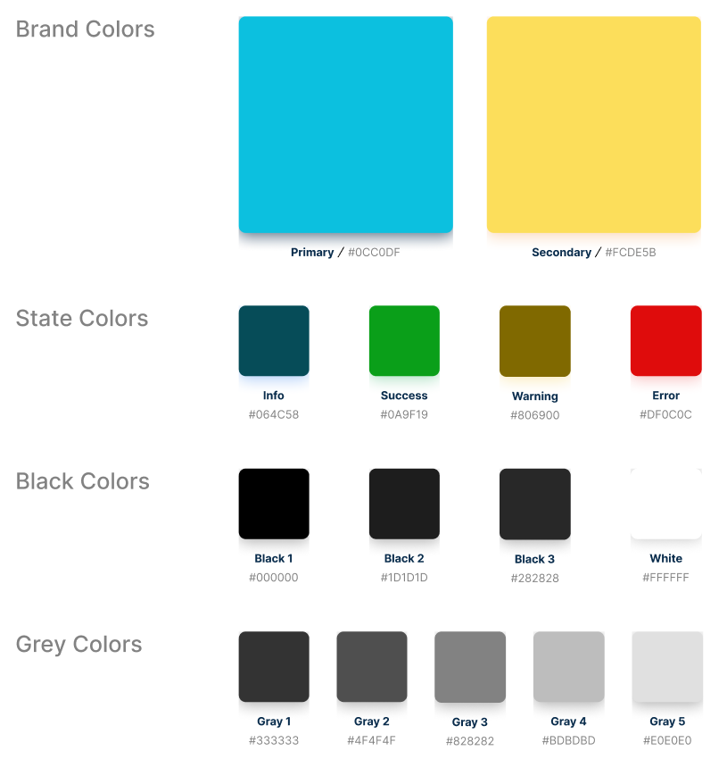

#### Icons

EduSpace cuenta con una colección de íconos específicos para mejorar la interfaz del sistema. Estos íconos están destinados a hacer la navegación más intuitiva y alineada con los objetivos del servicio, incluyendo íconos para las nuevas funcionalidades de monitoreo IoT como temperatura, humedad, ocupación y alertas ambientales.

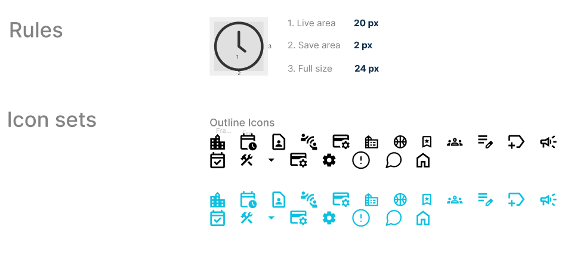

#### Typography

Para garantizar una apariencia uniforme en el desarrollo de nuestro aplicativo, utilizaremos la fuente **Poppins**. Elegimos Poppins por su legibilidad, espaciado equilibrado y diseño sin serifas, lo que proporciona una flexibilidad óptima y una experiencia de lectura clara y coherente en todas las plataformas de EduSpace.

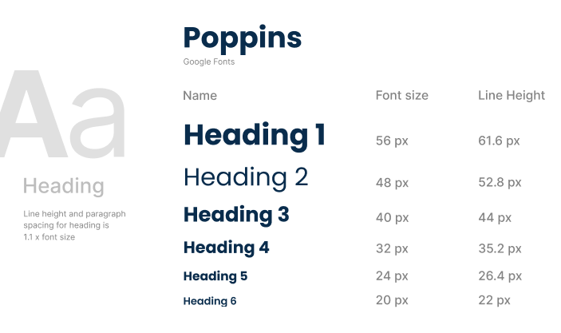

#### Spacing

El espaciado de la plataforma es importante debido a que no queremos abrumar a nuestros usuarios. Nuestra aplicación tiene como objetivo ofrecer una experiencia de usuario sencilla y agradable, especialmente en los dashboards de monitoreo IoT donde se presenta información cuantitativa en tiempo real. Un diseño limpio y organizado mejora la usabilidad y reduce la carga cognitiva del usuario.

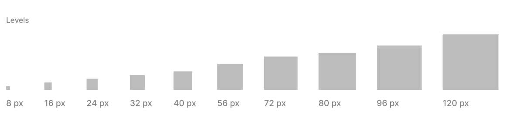

#### Tono de comunicación y lenguaje

El tono de comunicación y lenguaje de EduSpace es profesional, claro y directo. Utilizamos un lenguaje preciso y accesible que resuene con las necesidades laborales de administradores y docentes. En las secciones de monitoreo IoT, el lenguaje prioriza la claridad de los datos presentados, utilizando unidades de medida estándar (°C para temperatura, % para humedad) y mensajes de alerta directos y accionables.

Las dimensiones del tono adoptado son:

| Dimensión | Posición |
|-----------|----------|
| Formal / Casual | Formal |
| Respetuoso / Irreverente | Respetuoso |
| Entusiasta / Sereno | Sereno |
| Divertido / Serio | Serio |

### 5.1.2. Web, Mobile and IoT Style Guidelines

## 5.2. Information Architecture

### 5.2.1. Organization Systems

### 5.2.2. Labeling Systems

### 5.2.3. SEO Tags and Meta Tags

### 5.2.4. Searching Systems

### 5.2.5. Navigation Systems

## 5.3. Landing Page UI Design

### 5.3.1. Landing Page Wireframe

### 5.3.2. Landing Page Mock-up

## 5.4. Applications UX/UI Design

### 5.4.1. Applications Wireframes

### 5.4.2. Applications Wireflow Diagrams

### 5.4.3. Applications Mock-ups

### 5.4.4. Applications User Flow Diagrams

## 5.5. Applications Prototyping

## 5.6. IoT Device Design

# Capítulo VI: Product Implementation, Validation & Deployment

En este capítulo el equipo documenta el proceso de implementación, pruebas, despliegue y validación de los productos digitales que conforman la solución EduSpace IoT —Landing Page, Web Application y RESTful API— organizados en Sprints. Para TB1 se reporta el avance correspondiente al Sprint 1, que sienta la línea base operativa heredada del ciclo previo y prepara el bounded context IoT Monitoring para recibir telemetría real en el Sprint 2.

## 6.1. Software Configuration Management.

### 6.1.1. Software Development Environment Configuration.

**Project management**
* Google Meet: Plataforma de videollamadas utilizada para coordinar reuniones entre los integrantes del equipo. A través de esta herramienta se llevan a cabo discusiones sobre los avances del proyecto, la toma de decisiones relacionadas con los productos y la revisión de las tareas completadas.
  * Ruta de Referencia: (https://meet.google.com/landing)[https://meet.google.com/landing]

* WhatsApp: Aplicación de mensajería empleada para la comunicación interna del equipo, esto nos permite organizar las reuniones, asignar tareas y recordar las fechas de entrega correspondientes a cada avance del proyecto.
  * Ruta de Referencia: (https://web.whatsapp.com/)[https://web.whatsapp.com/]

* GitHub: Una plataforma en la nube que hospedará los repositorios de código del proyecto. Permitirá la colaboración en tiempo real y la revisión de contribuciones de cada miembro del equipo. Los integrantes del equipo podrán acceder a través de sus navegadores web.
  * Ruta de Referencia: (https://github.com/)[https://github.com/]

**Requirements management**
* Jira: Esta plataforma es utilizada para gestionar el proyecto de manera ágil, así manejamos el Product Backlog, y asignar las tareas correspondientes.
  * Ruta de Referencia: (https://www.atlassian.com/software/jira.5)[https://www.atlassian.com/software/jira.5]

**Product Design**
* UX Pressia: Plataforma orientada al diseño de mapas de experiencia de usuario y recorridos de interacción dentro del producto. Con estos diagramas y mapas, identificamos las necesidades de los usuarios y la comprensión de cómo van a actuar con el producto propuesto.
  * Ruta de Referencia: (https://uxpressia.com/)[https://uxpressia.com/]

* Figma: Herramienta colaborativa utilizada para el diseño de las interfaces de EduSpace. Además, permite desarrollar prototipos interactivos, lo que ayuda a simular y evaluar el flujo de navegación y la experiencia de uso de la aplicación.
  * Ruta de Preferencia: (https://www.figma.com/)[https://www.figma.com/]

**Software Development**
* WebStorm - Frontend: Entorno de desarrollo integrado elegido por su soporte completo para tecnologías web como JavaScript, HTML, CSS y frameworks como React y Angular. Ofrece refactorización avanzada, depuración, integración con Git y la posibilidad de agregar plugins. Es compatible con varios sistemas operativos, facilitando la colaboración en equipo.
  * Ruta de Referencia: [https://www.jetbrains.com/webstorm/](https://www.jetbrains.com/webstorm/)

* Visual Studio Code - Backend, IoT: Entorno de desarrollo integrado utilizado para la implementación de los componentes de software del proyecto. Se escogió por el soporte que ofrece para múltiples lenguajes de programación, integración con GitHub y disponibilidad de extensiones para desarrollo, pruebas y depuración.
  * Ruta de Referencia: (https://code.visualstudio.com/)[https://code.visualstudio.com/]

* Wokwi: Plataforma de simulación utilizada para el desarrollo y prueba de los componentes IoT del proyecto. Se escogió debido a que permite simular sensores, microcontroladores y circuitos electrónicos en un entorno virtual, lo que simplifica la validación del comportamiento de los dispositivos y la interacción con la solución antes de una implementación física.
  * Ruta de Referencia: (https://wokwi.com/)[https://wokwi.com/]

* HTML5: HyperText Markup Language, o por sus siglas HTML, es un lenguaje de etiquetado para páginas web. Será empleado en el desarrollo del proyecto para la presentación del contenido en la aplicación.
  * Ruta de Referencia: [https://www.w3schools.com/html/html5_syntax.asp](https://www.w3schools.com/html/html5_syntax.asp)

* CSS: Cascading Style Sheets es un lenguaje que maneja el diseño y presentación de las páginas web, el cual va de la mano con HTML.
  * Ruta de Referencia: [https://google.github.io/styleguide/htmlcssguide.html](https://google.github.io/styleguide/htmlcssguide.html)

* JavaScript: Es un lenguaje de programación interpretado y orientado a objetos. Se utilizará para elaborar la interfaz de usuario dentro de la aplicación.
  * Ruta de Referencia: [https://developer.mozilla.org/es/docs/Web/JavaScript](https://developer.mozilla.org/es/docs/Web/JavaScript)

* C++: Es un lenguaje de programación que se utiliza para el desarrollo de la lógica de los dispositivos IoT y la interacción con sensores simulados dentro de la solución. Este permite controlar el comportamiento de los componentes embebidos y procesar la información recolectada por los sensores.
  * Ruta de Referencia: (https://devdocs.io/cpp/)[https://devdocs.io/cpp/]

* Git: Una herramienta de control de versiones que facilita el registro y la gestión de las distintas versiones del programa. Su propósito es mantener un historial de cambios y simplificar la corrección de errores. Los integrantes del equipo accederán a través de la línea de comandos en sus sistemas locales.
  * Ruta de Referencia: [https://git-scm.com/](https://git-scm.com/)

* ESP32: Es un microcontrolador que se utiliza en la simulación de los componentes IoT del proyecto, esto permite la integración y procesamiento de datos provenientes de los sensores relacionados con el monitoreo de ambientes.
  * Sensores: DHT22 (sensor para medir temperatura y humedad) y PIR (sensor para detección de presencia)
  * Ruta de Referencia: (https://docs.espressif.com/projects/esp-idf/en/stable/esp32/index.html)[https://docs.espressif.com/projects/esp-idf/en/stable/esp32/index.html]

**Software Deployment**

* Github Pages: Es un servicio de alojamiento web proporcionado por GirtHub que permite publicar sitios web estáticos directamente desde repositorios. Se utiliza principalmente para desplegar documentación, portafolios y proyectos personales de forma sencilla y gratuita.
  * Ruta de Referencia: [https://pages.github.com/](https://pages.github.com/)

* Vercel: Plataforma que optimiza el proceso de desarrollo y despliegue de aplicaciones web, especialmente con marcos de trabajo como Next.js y React. Proporciona un entorno colaborativo que agiliza los despliegues rápidos y genera previsualizaciones automáticas con cada commit, lo que facilita la revisión de modificaciones antes de su publicación.
  * Ruta de Referencia: [https://vercel.com/](https://vercel.com/)

**Software Testing**
* Postman: Se utiliza para probar y validar los endpoints REST y cómo responden a las solicitudes de los usuarios.
  * Ruta de Referencia: (https://www.postman.com/)[https://www.postman.com/]

**Software Documentation**
* PlantUML: Herramienta utilizada para la creación de diagramas mediante texto descriptivo, esto nos permite generar representaciones UML de forma rápida y organizada.
  * Ruta de Referencia: (https://plantuml.com/)[https://plantuml.com/]

* LucidChart: Plataforma de diagramación colaborativa empleada para elaborar diagramas y representaciones visuales que agilizan la comprensión de procesos y estructuras del sistema.
  * Ruta de Referencia: (https://www.lucidchart.com/pages)[https://www.lucidchart.com/pages]

* Structurizr: Herramienta enfocada en la elaboración de diagramas bajo el modelo C4, es utilizada para representar la arquitectura del sistema de manera clara y estructurada en distintos niveles de abstracción.
  * Ruta de Referencia: (https://structurizr.com/)[https://structurizr.com/]

* Vertabelo: Plataforma especializada en el diseño y modelado de bases de datos, empleada para crear diagramas entidad-relación y definir la estructura lógica de la información.
  * Ruta de Referencia: (https://vertabelo.com/)[https://vertabelo.com/]

* Swagger API: Solución utilizada para la documentación de APIs REST, lo que permite describir endpoints, métodos, parámetros y respuestas de manera estandarizada e interactiva.
  * Ruta de Referencia: (https://swagger.io/)[https://swagger.io/]

### 6.1.2. Source Code Management.

El proyecto seguirá las convenciones del flujo de trabajo establecido por el modelo GitFlow para el control de versiones, empleando GitHub como plataforma y sistema de control de versiones. A continuación, se describirá la implementación de GitFlow como un flujo de trabajo para el control de versiones.

**Repositorio de GitHub:**
- Enlace de la organización en GitHub: [https://github.com/DesarrolloSolucionIoT](https://github.com/DesarrolloSolucionIoT)
* Enlace para acceder al repositorio de la Landing Page: [https://github.com/DesarrolloSolucionIoT/landing-page](https://github.com/DesarrolloSolucionIoT/landing-page)
* Enlace para acceder al repositorio del reporte: [https://github.com/DesarrolloSolucionIoT/eduspace-report](https://github.com/DesarrolloSolucionIoT/eduspace-report)
* Enlace para acceder al repositorio de la App Web (Frontend): [https://github.com/DesarrolloSolucionIoT/eduspace-frontend-web-app](https://github.com/DesarrolloSolucionIoT/eduspace-frontend-web-app)
- Enlace para acceder al repositorio de la App Móvil (Frontend): [https://github.com/DesarrolloSolucionIoT/eduspace-mobile](https://github.com/DesarrolloSolucionIoT/eduspace-mobile)
- Enlace para acceder al repositorio del Backend: [https://github.com/DesarrolloSolucionIoT/eduspace-platform](https://github.com/DesarrolloSolucionIoT/eduspace-platform)

**Estructura de las ramas:**
1. Main branch (Rama principal): Esta rama servirá como la principal para la aplicación, alojando versiones estables y finales del desarrollo. Únicamente se aceptarán cambios que hayan sido previamente probados y verificados en los features y de ahí en Developer.
2. Develop branch (Rama de desarrollo): El propósito de esta rama es facilitar los avances del proyecto en equipo y mantener los archivos centrales del desarrollo continuo.
3. Feature branch(Ramas de funcionalidad): Cada capitulo desarrollado por el equipo, o separada del enfoque actual del desarrollo, tendrá su propia rama. Una vez que una funcionalidad esté completamente trabajada, se fusionará con la rama de desarrollo del proyecto. Las convenciones para nombrar las ramas de funcionalidad seguirán un patrón descriptivo y único, por ejemplo, "feature/chapter-#".

**Versionado semántico:**
En el proyecto se ha utilizado la convención Semantic Versioning 2.0.0 para definir los lanzamientos del sistema. Se presenta el formato a usar:
* MAJOR.MINOR.PATCH
  * Ejemplo: v2.5.1

En donde cada uno representa:
* MAJOR: Los cambios que son incompatibles con la versión anterior.
* MINOR: Las adiciones de nuevas funcionalidades que son compatibles con la versión actual.
* PATCH: Son las correcciones de errores que no generan incompatibilidades con la versión actual.

**Convenciones de los mensajes de commits:**
Para la redacción de los mensajes de commits, se ha seguido el estándar Convential Commits. Este estándar mejora el entendimiento de los cambios, adiciones y correcciones que se han realizado en el proyecto.

Los tipos que se utilizarán en el proyecto son:
* feat: Para la implementación de una nueva funcionalidad
* fix: Para la corrección de errores y bugs
* docs: Para cambios en la documentación
* refactor: Para la reestructuración del código
* chore: Para tareas de mantenimiento.
* test: Para pruebas realizadas en el código fuente

### 6.1.3. Source Code Style Guide & Conventions
En esta sección se detallan las convenciones de estilo de código que serán utilizadas en el proyecto. Estas reglas permiten que haya consistencia dentro del desarrollo del código.

**HTML**
Algunas de las prácticas que deben seguirse para alcanzar un código coherente, sostenible y ordenado son las siguientes:
1. Cerrar todos los elementos HTML: Por ejemplo, `
Esto es un párrafo.
`.
2. Siempre declarar el tipo de documento en la primera línea del documento, para HTML es `<!DOCTYPE html>`.
3. Escribir en una línea los comentarios cortos.
4. Utilizar comillas en caso de que los atributos contengan espacios entre sí.
5. Procurar especificar el texto `alt` y las dimensiones `width` y `height` de las imágenes, ya que de esta manera se facilitará la disponibilidad del contenido. Por ejemplo:
6. Se nos recomienda no usar el espacio al momento de utilizar los signos porque es más fácil de leerlo de esta forma.

Referencia: [https://www.w3schools.com/html/html5_syntax.asp](https://www.w3schools.com/html/html5_syntax.asp)

**CSS**
Entre las prácticas empleadas se menciona:
1. Se nos recomienda tener una sangría por 2 espacios a la vez, no debemos utilizar tabulaciones ni mezclarlas tabulaciones con espacios para la sangría.
2. Todo el código debe estar en minúscula.
3. Eliminar los espacios en blanco.
4. Usar comentarios para explicar el código.
5. Utilizar nombres de clase significativos o genéricos, nombres que reflejen el propósito de su elemento.

Referencia: [https://google.github.io/styleguide/htmlcssguide.html](https://google.github.io/styleguide/htmlcssguide.html)

**JavaScript**
Algunas de las mejores prácticas para programar incluyen:
1. Utilizar nombres de variables claros: Es importante que los nombres reflejen el propósito de la variable.
2. Ser consistente con las comillas: Elegir entre comillas simples o dobles y mantener esa elección a lo largo del código.
3. Incluir comentarios explicativos: Usar comentarios para aclarar bloques de código, especialmente en secciones complejas, facilita la comprensión.
4. Minimizar el uso de variables globales: Limitar el ámbito de las variables para evitar conflictos y mejorar la mantenibilidad del código.
5. Encapsular lógica en funciones: Mantener el código modular y reutilizable mediante el uso de funciones.
6. Seguir un estilo de codificación uniforme: Mantener un formato consistente mejora la legibilidad del código.

Referencia: [https://www.w3schools.com/js/DEFAULT.asp](https://www.w3schools.com/js/DEFAULT.asp)

**Vue.js**
Para asegurar que el código en Vue.js sea claro y eficiente, se recomiendan las siguientes prácticas:
1. Estructura de carpetas organizada: Mantener una estructura clara para components, pages, model y services.
2. Crear componentes reutilizables: Diseñar componentes que puedan ser utilizados en diversas partes de la aplicación.
3. Separar lógica de negocio de la vista: Utilizar métodos y propiedades computadas para mantener la lógica separada de la presentación.
4. Emplear Vue Router para la navegación: Usar Vue Router para gestionar eficazmente la navegación entre vistas.
5. Documentar componentes: Incluir comentarios y documentación sobre props, eventos y métodos dentro de los componentes.

Referencia: [https://vuejs.org/guide/introduction](https://vuejs.org/guide/introduction)

**Flutter**
Para mantener un código limpio y eficiente en Flutter, se sugieren las siguientes prácticas:
1. Estructura de carpetas organizada: Mantener una estructura clara para lib, test y assets.
2. Utilizar widgets reutilizables: Diseñar widgets que puedan ser utilizados en diversas partes de la aplicación.
3. Separar lógica de negocio de la vista: Utilizar providers o blocs para mantener la lógica separada de la presentación.
4. Emplear rutas nombradas para la navegación: Usar rutas nombradas para gestionar eficazmente la navegación entre vistas.
5. Documentar widgets: Incluir comentarios y documentación sobre props, eventos y métodos dentro de los widgets.

Referencia: [https://flutter.dev/docs](https://flutter.dev/docs)

**C# (Domain-Driven Design)**
Para asegurar que el código en C# siga los principios de Domain-Driven Design (DDD), se recomiendan las siguientes prácticas:

1. Utilizar nombres de dominio significativos: Los nombres de las clases, métodos y variables deben reflejar el lenguaje del dominio.
2. Mantener la lógica de negocio en el dominio: La lógica de negocio debe residir en el modelo de dominio y no en la infraestructura o en la interfaz de usuario.
3. Usar agregados para gestionar la consistencia: Los agregados son entidades que se agrupan para garantizar la consistencia de los cambios en el modelo.
4. Implementar repositorios para el acceso a datos: Los repositorios son responsables de la persistencia y recuperación de los agregados.
5. Aplicar patrones de diseño adecuados: Utilizar patrones de diseño como CQRS, Event Sourcing y DDD para estructurar el código de manera efectiva.

Referencia: [https://www.domainlanguage.com/ddd/reference/](https://www.domainlanguage.com/ddd/reference/)

**C++**
Para asegurar que el código sea claro, eficiente y mantenible en el desarrollo de los componentes IoT, se recomiendan las siguientes prácticas:
1. Utilizar nombres descriptivos para variables y funciones: Los nombres deben reflejar claramente la función o propósito de los elementos dentro del código.
2. Mantener código modular: Es necesario separar la lógica en funciones y módulos reutilizables para agilizar el mantenimiento y comprensión del sistema.
3. Minimizar el uso innecesario de la memoria: Optimizar el uso de variables y estructuras para mejorar el rendimiento en dispositivos embebidos.
4. Documentar el código mediante comentarios: Para entender cada funcionalidad que se encuentra en el código, es importante explicar su comportamiento y qué requieren para funcionar.

Referencia: (https://isocpp.github.io/CppCoreGuidelines/CppCoreGuidelines)[https://isocpp.github.io/CppCoreGuidelines/CppCoreGuidelines]

### 6.1.4. Software Deployment Configuration.
En esta sección se explica la configuración de despligue de EduSpace. Se ha considerado el uso de servicios en la nube que permitan publicar los distintos componentes del sistema a partir de los repositorios de código fuente alojados en GitHub.

* GitHub Pages: La landing page del proyecto se desplegará en GitHub Pages, debido a que agiliza la publicación de sitios web estáticos desde un repositorio GitHub. Asimismo, al tener la funcionalidad de despliegue automático, reduce el tiempo que se dedica a la configuración del producto.
* Vercel: El frontend de la aplicación web se desplegará en Vercel debido a que permite integrar el repositorio de GitHub y generar despliegues automátics. Además, es brinda la opción de previsualizar los cambios en cada commit, lo que mejora el proceso de correción de errores o cambios que se deben de realizar.
* Railway: El backend del proyecto se desplegará en Railway, que es una plataforma orientada al alojamiento de servicios web y APIs REST. Esta herramienta también ofrece despliegues automáticos, y posibilita la conexión con la base de datos. Se escoge debido a que es simple y bastante intuitivo de utilizar ya que detecta el lenguaje de programación y marco de trabajo que utiliza el proyecto.
* Aiven: La base de datos se desplegará en Aiven, una plataforma que administra servicios en la nube. Aiven se ha escogido debido a que permite almacenar y gestionar la información del sistema de manera segura y escalable.

**Flujo de Despliegue**
1. El código fuente de cada producto se almacena en sus respectivos repositorios dentro de la organización en GitHub.
2. La Landing Page se despliega mediante GitHub Pages.
3. El frontend de la aplicación web se despliega en Vercel.
4. El backend encargado de la API REST del proyecto se despliega en Railway.
5. La base de datos se despliega y administra mediante Aiven.
6. Todos los servicios desplegados se comunican mediante endpoints HTTPS, lo que garantiza su integración.

## 6.2. Landing Page, Services & Applications Implementation

Esta sección concentra la evidencia de implementación, testing, ejecución, documentación de servicios, despliegue y colaboración en equipo, agrupada por Sprint. Cada Sprint incluye sus propias subsecciones de Sprint Planning, Aspect Leaders & Collaborators, Sprint Backlog y la evidencia correspondiente para el Sprint Review.

### 6.2.1. Sprint 1

El Sprint 1 corresponde a la primera iteración formal del ciclo 2026-1. Su propósito es re-establecer la línea base desplegada de la plataforma EduSpace y dejar listo el scaffolding del nuevo bounded context IoT Monitoring, evitando comprometer historias de usuario que requieran datos reales de sensores —diferidas al Sprint 2—. Las subsecciones a continuación documentan la planificación, la asignación de líderes y colaboradores por aspecto, y el backlog del Sprint.

#### 6.2.1.1. Sprint Planning 1

Para este primer Sprint, el equipo se enfocó en consolidar la base de la plataforma heredada del ciclo previo —Landing Page, Web Application y RESTful API que cubren los bounded contexts IAM, Space & Resource Management, Reservation & Scheduling y Breakdown Management— y crear el scaffolding inicial del nuevo bounded context IoT Monitoring (estructura de carpetas alineada al Capítulo 4.2.5, entidades de dominio y contratos REST documentados con OpenAPI). La decisión responde a una estrategia explícita de estabilizar primero la base operativa antes de incorporar los flujos de telemetría IoT, programados para el Sprint 2. La reunión de Sprint Planning se realizó al inicio del ciclo siguiendo el formato establecido por Scrum, y el cuadro resumen se presenta a continuación.

| **Sprint #**                       | **Sprint 1**                                                                                                                                                                                                                                                                                                                                                                                                                                                                                                                                                                                                                                                                                                                                                                                                                                                                                               |
|------------------------------------|------------------------------------------------------------------------------------------------------------------------------------------------------------------------------------------------------------------------------------------------------------------------------------------------------------------------------------------------------------------------------------------------------------------------------------------------------------------------------------------------------------------------------------------------------------------------------------------------------------------------------------------------------------------------------------------------------------------------------------------------------------------------------------------------------------------------------------------------------------------------------------------------------------|
| **Sprint Planning Background**     |                                                                                                                                                                                                                                                                                                                                                                                                                                                                                                                                                                                                                                                                                                                                                                                                                                                                                                            |
| Date                               | 2026-05-08                                                                                                                                                                                                                                                                                                                                                                                                                                                                                                                                                                                                                                                                                                                                                                                                                                                                                                 |
| Time                               | 07:00 PM (GMT-5)                                                                                                                                                                                                                                                                                                                                                                                                                                                                                                                                                                                                                                                                                                                                                                                                                                                                                           |
| Location                           | Servidor de Discord del equipo FullStack Fury                                                                                                                                                                                                                                                                                                                                                                                                                                                                                                                                                                                                                                                                                                                                                                                                                                                              |
| Prepared By                        | Loli Ramirez, Camila Cristina                                                                                                                                                                                                                                                                                                                                                                                                                                                                                                                                                                                                                                                                                                                                                                                                                                                                              |
| Attendees (to planning meeting)    | Alva Abanto, Luis Andrés   Antayhua Castillo, Josué Oscar   Loli Ramirez, Camila Cristina   Torres García, Andrés Alberto   Yalán Zhang, Angie Christina                                                                                                                                                                                                                                                                                                                                                                                                                                                                                                                                                                                                                                                                                                                                       |
| Sprint n – 1 Review Summary        | No aplica. Sprint 1 corresponde a la primera iteración formal del ciclo 2026-1. Como insumo se tomó la base de código heredada del ciclo previo (EduSpace sin IoT), validada en AV1, junto con los artefactos de diseño definidos en los Capítulos III y IV de este informe (User Stories, Product Backlog, Bounded Context Canvases y diagramas C4).                                                                                                                                                                                                                                                                                                                                                                                                                                                                                                                                                      |
| Sprint n – 1 Retrospective Summary | No aplica por ser el primer Sprint formal. Tomando como base las lecciones aprendidas del ciclo anterior, el equipo acordó adoptar Conventional Commits, GitFlow con ramas por capítulo/feature y revisiones cruzadas entre líderes y colaboradores de cada aspecto definidos en la matriz LACX (sec. 6.2.1.2).                                                                                                                                                                                                                                                                                                                                                                                                                                                                                                                                                                                            |
| **Sprint Goal & User Stories**     |                                                                                                                                                                                                                                                                                                                                                                                                                                                                                                                                                                                                                                                                                                                                                                                                                                                                                                            |
| Sprint 1 Goal                      | Nuestro foco está en re-establecer la línea base desplegada de la plataforma EduSpace —Landing Page, Web Application y RESTful API que cubren los bounded contexts IAM, Space & Resource Management, Reservation & Scheduling y Breakdown Management— y crear el scaffolding inicial del bounded context IoT Monitoring (estructura de carpetas, entidades de dominio y contratos REST documentados con OpenAPI). Creemos que esto entrega a administradores y docentes una plataforma estable y accesible públicamente, y le entrega al equipo una base lista para integrar telemetría real en el Sprint 2. Lo confirmaremos cuando el Landing Page y la Web Application estén desplegados con URL pública, los cuatro bounded contexts preexistentes pasen pruebas de humo end-to-end, y el scaffolding del bounded context IoT Monitoring esté mergeado a `main` con sus endpoints visibles en Swagger. |
| Sprint 1 Velocity                  | 40 Story Points. El equipo estableció esta velocidad como referencia inicial alineada al desempeño del ciclo anterior (~42 SP/sprint), descontando overhead esperado por el alta del nuevo bounded context IoT Monitoring.                                                                                                                                                                                                                                                                                                                                                                                                                                                                                                                                                                                                                                                                                 |
| Sum of Story Points                | 40 Story Points.                                                                                                                                                                                                                                                                                                                                                                                                                                                                                                                                                                                                                                                                                                                                                                                                                                                                                           |

#### 6.2.1.2. Aspect Leaders and Collaborators

En esta sección se presenta la matriz de Liderazgo y Colaboración (LACX) del Sprint 1. Los aspectos considerados se derivan directamente del modelo estratégico definido en el Capítulo IV.1: los cinco bounded contexts validados —IAM, Space & Resource Management, Reservation & Scheduling, Breakdown Management e IoT Monitoring— y, adicionalmente, el aspecto Landing Page, que aunque no constituye un bounded context, agrupa la entrega del producto digital de visibilidad pública requerido para TB1. Cada miembro del equipo asume rol de Líder (L) en uno o más aspectos —siendo responsable de la coherencia técnica del aspecto, la coordinación de tareas y la integración a `main`— y rol de Colaborador (C) en otros, donde aporta implementación, revisión de código y validación. La asignación se construyó alineando la experiencia previa de cada integrante con el aspecto más afín, garantizando además que cada aspecto cuente con al menos un Líder y un Colaborador para evitar puntos únicos de falla. Esta organización se respeta en la asignación de tasks del Sprint Backlog (sec. 6.2.1.3): cada Work-item se asigna al Líder o a un Colaborador del aspecto al que pertenece la User Story correspondiente.

| Apellidos y Nombres            | GitHub Username | Landing Page | IAM | Space & Resource Management | Reservation & Scheduling | Breakdown Management | IoT Monitoring |
|--------------------------------|-----------------|:------------:|:---:|:---------------------------:|:------------------------:|:--------------------:|:--------------:|
| Torres García, Andrés Alberto  | andrest04       |      C       |  L  |              C              |            —             |          —           |       L        |
| Loli Ramirez, Camila Cristina  | CamilaLoli      |      L       |  C  |              —              |            —             |          C           |       C        |
| Antayhua Castillo, Josué Oscar | Azsher          |      —       |  C  |              L              |            C             |          —           |       C        |
| Alva Abanto, Luis Andrés       | luis-alva0      |      —       |  —  |              C              |            L             |          C           |       —        |
| Yalán Zhang, Angie Christina   | aaaaangie       |      C       |  —  |              —              |            C             |          L           |       —        |

Leyenda: **L** = Leader (responsable del aspecto durante el Sprint), **C** = Collaborator (aporta implementación y revisión), **—** = no participa en ese aspecto durante el Sprint 1.

#### 6.2.1.3. Sprint Backlog 1

El objetivo principal del Sprint 1 es consolidar la línea base desplegada de EduSpace y dejar el scaffolding del bounded context IoT Monitoring listo para recibir telemetría en el Sprint 2. La selección de User Stories prioriza el aspecto Landing Page (US31, US32, US34) por ser entregable obligatorio de TB1, junto con un subconjunto de las historias del Product Backlog (sec. 3.3) cuya entrega depende exclusivamente de funcionalidad ya disponible en la base de código heredada —es decir, historias que pueden completarse sin requerir aún el flujo de datos IoT real—. Las historias de visualización en tiempo real basadas en sensores (US01, US04, US11, US12, US16) se difieren al Sprint 2 una vez que el bounded context IoT Monitoring esté operativo. Adicionalmente se incluyen tareas técnicas (T-IAM-*, T-IoT-*) que materializan la validación de la autenticación heredada y el scaffolding del nuevo bounded context, alineadas a los diagramas de componentes presentados en las secciones 4.2.1.5 y 4.2.5.5.

A continuación se presenta la captura del Sprint Board y el enlace público al tablero del equipo.

URL público del tablero (Jira): <https://upc-team-awnysuez.atlassian.net/jira/software/projects/SCRUM/boards/1>

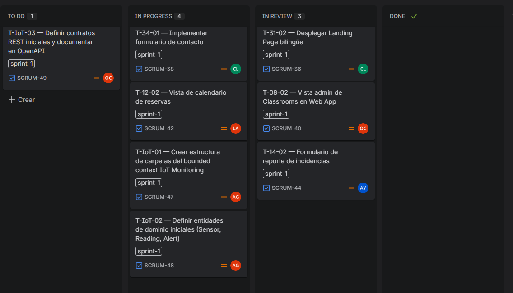

| Sprint #                | Sprint 1                                |                      |                                                                 |                                                                                                                                |                        |                          |            |
|-------------------------|-----------------------------------------|----------------------|-----------------------------------------------------------------|--------------------------------------------------------------------------------------------------------------------------------|------------------------|--------------------------|------------|
| **User Story**          |                                         | **Work-Item / Task** |                                                                 |                                                                                                                                |                        |                          |            |
| **Id**                  | **Title**                               | **Id**               | **Title**                                                       | **Description**                                                                                                                | **Estimation (Hours)** | **Assigned To**          | **Status** |
| US31                    | Ver landing page                        | T-31-01              | Maquetar secciones del Landing Page                             | Implementar header, hero, secciones de propósito y footer en `landing-page/` siguiendo los mockups validados.                  | 6                      | Loli Ramirez, Camila     | Done       |
| US31                    | Ver landing page                        | T-31-02              | Desplegar Landing Page bilingüe                                 | Configurar despliegue público (GitHub Pages) para `index.html` (EN) e `index-es.html` (ES).                                    | 3                      | Loli Ramirez, Camila     | To-Review  |
| US32                    | Conocer beneficios                      | T-32-01              | Implementar sección "Beneficios" con copy validado              | Redactar y maquetar la sección de propuesta de valor, alineada al Lean UX Canvas (sec. 1.2.2.4).                               | 4                      | Yalán Zhang, Angie       | Done       |
| US34                    | Contactar equipo                        | T-34-01              | Implementar formulario de contacto                              | Maquetar el formulario y aplicar validación cliente-side.                                                                      | 4                      | Loli Ramirez, Camila     | In-Process |
| US08                    | Evaluar eficiencia (CRUD base de aulas) | T-08-01              | Endpoint REST CRUD de Classrooms                                | Endpoints `GET/POST/PUT/DELETE /api/v1/classrooms` en bounded context Space & Resource Management.                             | 6                      | Antayhua Castillo, Josué | Done       |
| US08                    | Evaluar eficiencia (CRUD base de aulas) | T-08-02              | Vista admin de Classrooms en Web App                            | Listado y formulario de altas/bajas en `eduspace-frontend-web-app/src/classroom-space-resource-management/`.                   | 5                      | Antayhua Castillo, Josué | To-Review  |
| US12                    | Ver disponibilidad previa (vista base)  | T-12-01              | Endpoint REST de reservas y disponibilidad                      | Endpoints CRUD de reservas en bounded context Reservation & Scheduling.                                                        | 6                      | Alva Abanto, Luis        | Done       |
| US12                    | Ver disponibilidad previa (vista base)  | T-12-02              | Vista de calendario de reservas                                 | Componente de calendario en `reservation-management/` mostrando reservas existentes (sin telemetría aún).                      | 5                      | Alva Abanto, Luis        | In-Process |
| US14                    | Reportar incidencias                    | T-14-01              | Endpoint REST de incidencias                                    | Endpoints CRUD de breakdowns en bounded context Breakdown Management.                                                          | 5                      | Yalán Zhang, Angie       | Done       |
| US14                    | Reportar incidencias                    | T-14-02              | Formulario de reporte de incidencias                            | Implementar formulario en `breakdown-report-management/`.                                                                      | 4                      | Yalán Zhang, Angie       | To-Review  |
| (sin US — task técnico) | Autenticación base                      | T-IAM-01             | Validar endpoints de sign-in / sign-up con JWT                  | Validar y desplegar el flujo de autenticación con JWT del bounded context IAM heredado.                                        | 5                      | Torres García, Andrés    | Done       |
| (sin US — task técnico) | Autenticación base                      | T-IAM-02             | Vista de Login / Sign-up en Web App                             | Conectar la vista existente con el endpoint de IAM y manejar el almacenamiento del token.                                      | 4                      | Loli Ramirez, Camila     | Done       |
| (sin US — task técnico) | Scaffolding IoT Monitoring              | T-IoT-01             | Crear estructura de carpetas del bounded context IoT Monitoring | Crear `IoTMonitoring/{Domain,Application,Infrastructure,Interfaces}` siguiendo Clean Architecture, alineado al Capítulo 4.2.5. | 3                      | Torres García, Andrés    | In-Process |
| (sin US — task técnico) | Scaffolding IoT Monitoring              | T-IoT-02             | Definir entidades de dominio iniciales (Sensor, Reading, Alert) | Implementar Aggregates y Value Objects definidos en sec. 4.2.5.1.                                                              | 4                      | Torres García, Andrés    | In-Process |
| (sin US — task técnico) | Scaffolding IoT Monitoring              | T-IoT-03             | Definir contratos REST iniciales y documentar en OpenAPI        | Endpoints stub `/api/v1/iot-monitoring/{readings,alerts}` documentados con Swagger.                                            | 4                      | Antayhua Castillo, Josué | To-do      |

**Story Points totales del Sprint:** 40 SP, distribuidos en 27 SP de historias del Product Backlog (US31 + US32 + US34 + US08 + US12 + US14) más 13 SP equivalentes en tareas técnicas (autenticación base + scaffolding del bounded context IoT Monitoring).

#### 6.2.1.4. Development Evidence for Sprint Review.

En el Sprint 1 se consolidaron los entregables de implementacion de la Landing Page, la Web Application y los Web Services base, ademas del scaffolding del bounded context IoT Monitoring. A continuacion se presenta la evidencia visual de los avances y la tabla de commits por repositorio (a completar con los IDs reales del Sprint).

**Landing Page**

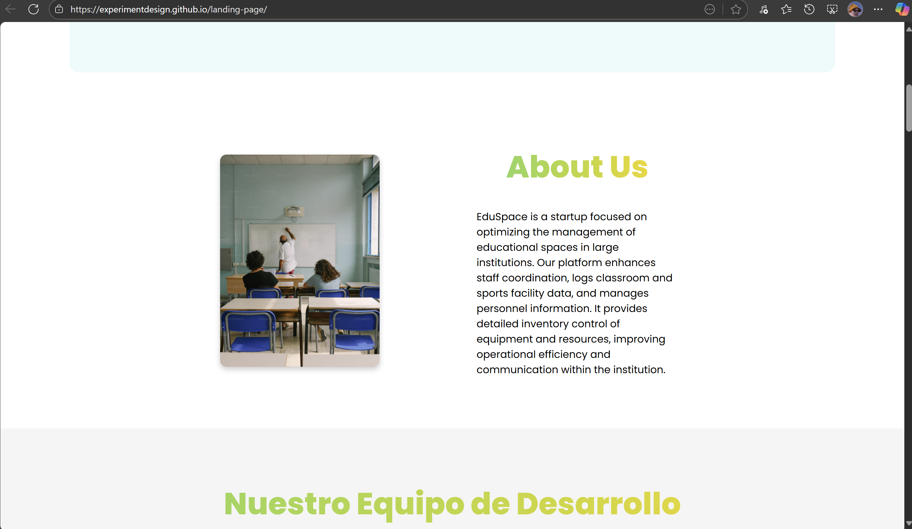
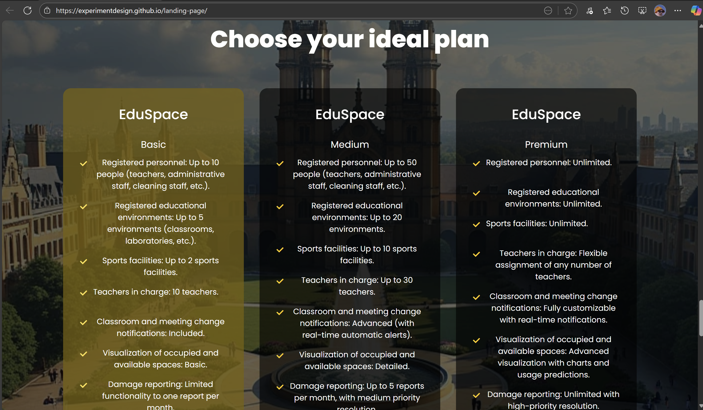
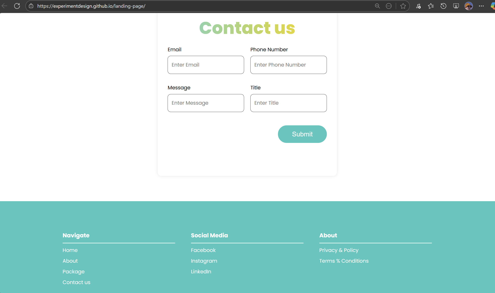

**Web Application**

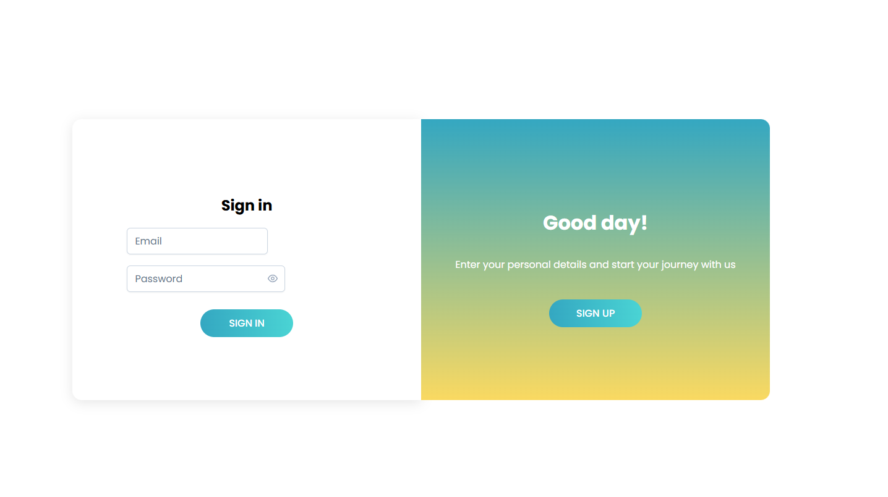
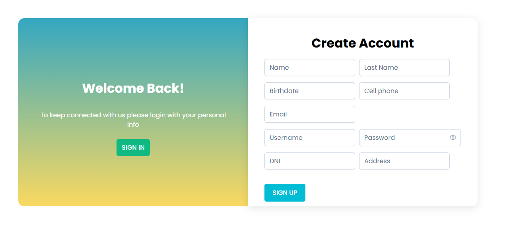
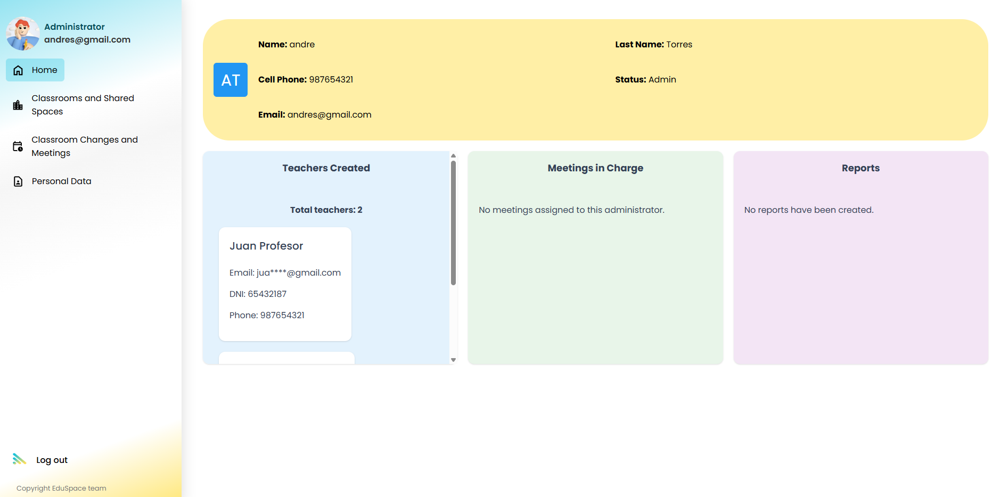
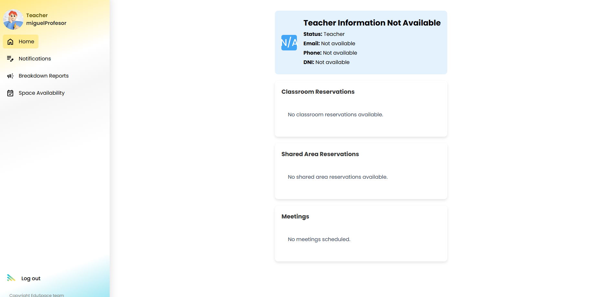
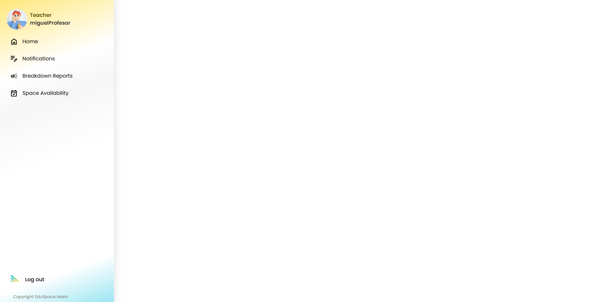

**Web Services (REST API)**

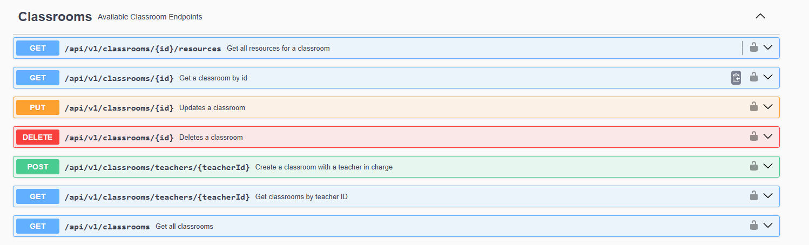
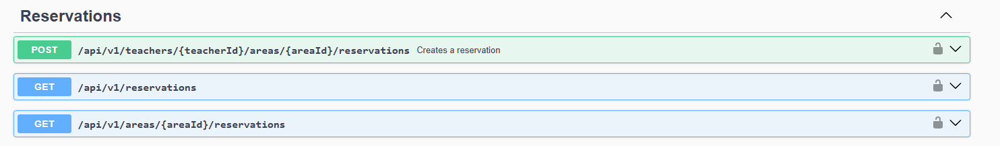
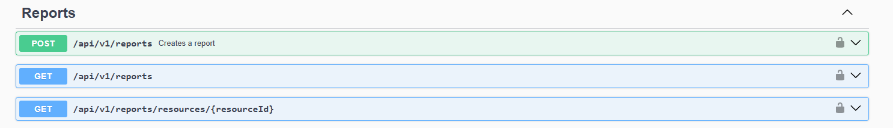
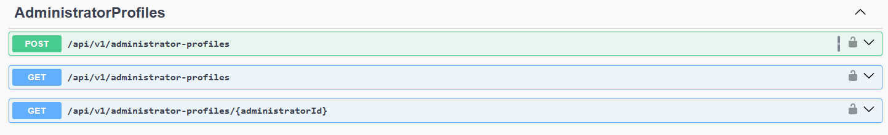

**Commits de Implementacion (por completar)**

| Repository | Branch | Commit Id | Commit Message | Commit Message Body | Commited on (Date) |
| --- | --- | --- | --- | --- | --- |
| DesarrolloSolucionIoT/landing-page | feature/sprint-1 | Por completar | Por completar | Por completar | Por completar |
| DesarrolloSolucionIoT/eduspace-frontend-web-app | feature/sprint-1 | Por completar | Por completar | Por completar | Por completar |
| DesarrolloSolucionIoT/eduspace-platform | feature/sprint-1 | Por completar | Por completar | Por completar | Por completar |

#### 6.2.1.5. Testing Suite Evidence for Sprint Review.

Durante el Sprint 1 se consolidaron pruebas Unit, Integration, BDD y System Tests para Web Services y flujos base de la plataforma. Las pruebas se enfocan en validar el comportamiento de agregados principales, endpoints REST y escenarios de usuario en los flujos de autenticacion y gestion de recursos.

**Relacion de tests disenados**

- Unit Tests: agregados Classroom, Reservation, Meeting, TeacherProfile y Account.
- Integration Tests: endpoints de Classrooms, Shared Areas, Reservations, Meetings y Resources.
- BDD (SpecFlow): escenarios de inicio de sesion y registro en la plataforma.
- System Tests (Selenium): flujos principales de accesibilidad, registro y gestion de espacios.

**Evidencia visual de pruebas**

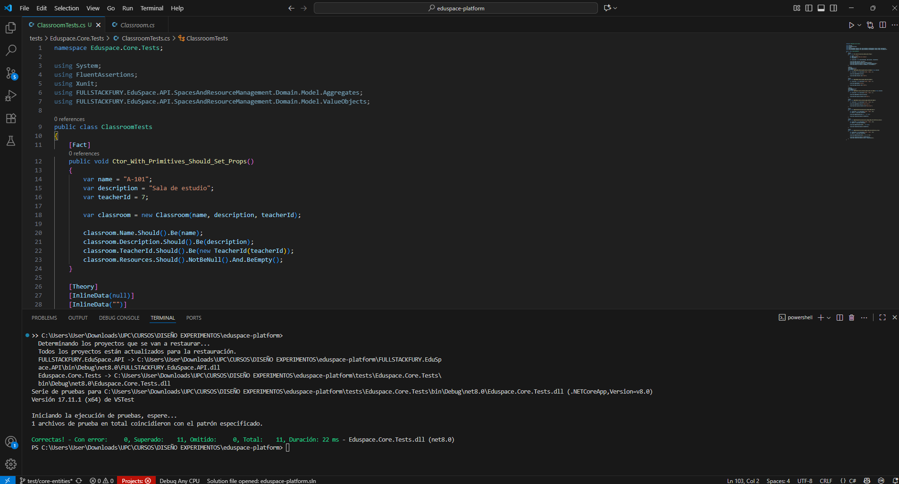
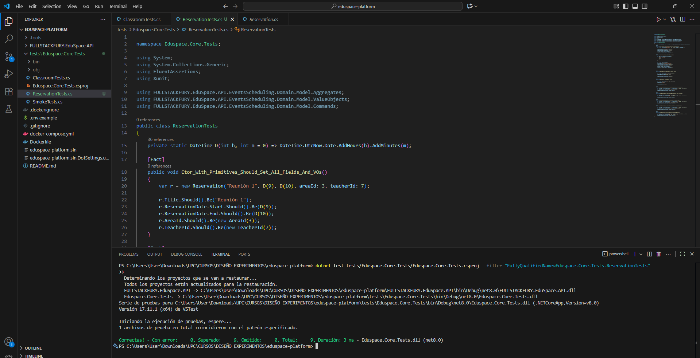
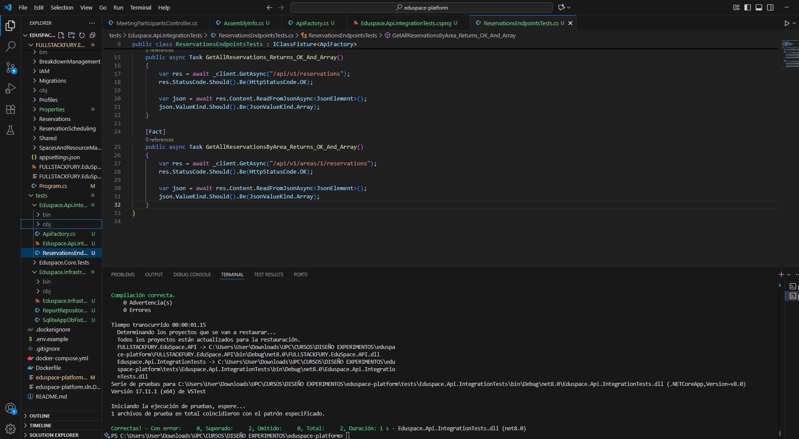
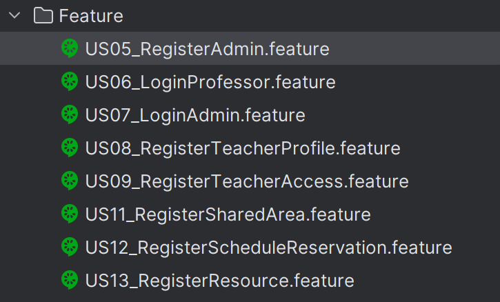
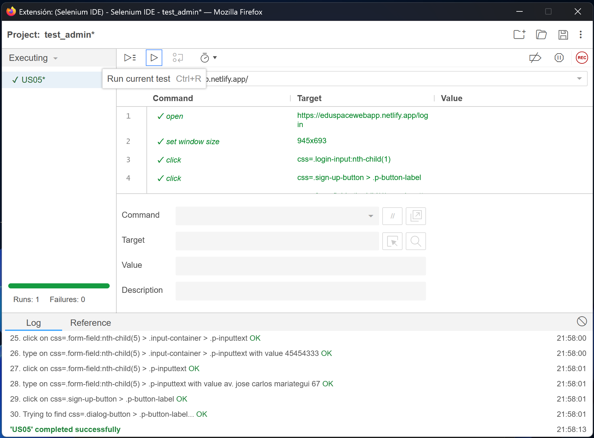

**Commits de Testing (por completar)**

| Repository | Branch | Commit Id | Commit Message | Commit Message Body | Commited on (Date) |
| --- | --- | --- | --- | --- | --- |
| DesarrolloSolucionIoT/eduspace-platform | feature/sprint-1-testing | Por completar | Por completar | Por completar | Por completar |

#### 6.2.1.6. Execution Evidence for Sprint Review.

En el Sprint 1 se alcanzo la ejecucion estable de la Landing Page y la Web Application, junto con la exposicion de endpoints base en la REST API. Las siguientes capturas muestran la navegacion y pantallas clave implementadas, y se incluye un video demostrativo del producto.

**Capturas de ejecucion**

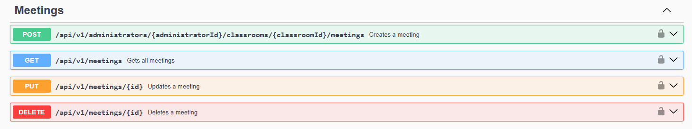

**Video de ejecucion**

Link del video: https://youtu.be/tAP6TujgwuA

#### 6.2.1.7. Services Documentation Evidence for Sprint Review.

Durante el Sprint 1 se documento la API REST con OpenAPI/Swagger, cubriendo los endpoints base de autenticacion, gestion de aulas, reservas y reportes. A continuacion se resume la documentacion por endpoint y se adjuntan capturas de evidencia.

**Resumen de endpoints documentados**

| Endpoint | Actions | Documentacion | Example Response |
| --- | --- | --- | --- |
| /api/v1/Authentication/sign-in | POST | Por completar | { token, username, role } |
| /api/v1/Classrooms | GET, POST | Por completar | [ { id, name, description, teacherId } ] |
| /api/v1/reservations | GET, POST | Por completar | [ { id, start, end, title, areaId } ] |
| /api/v1/Reports | GET, POST | Por completar | [ { id, kindOfReport, description, resourceId, status } ] |

**Capturas de documentacion**

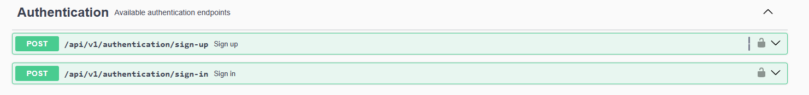

**Commits de Documentacion (por completar)**

| Repository | Branch | Commit Id | Commit Message | Commit Message Body | Commited on (Date) |
| --- | --- | --- | --- | --- | --- |
| DesarrolloSolucionIoT/eduspace-platform | feature/sprint-1-docs | Por completar | Por completar | Por completar | Por completar |

#### 6.2.1.8. Software Deployment Evidence for Sprint Review.

En el Sprint 1 se realizaron despliegues de los productos digitales base. La Landing Page fue publicada en GitHub Pages, la Web Application se desplego en Netlify y el backend en Railway, con base de datos gestionada en Aiven. A continuacion se muestran capturas de los despliegues realizados.

**URLs de despliegue (Sprint 1)**

- Landing Page: https://experimentdesign.github.io/landing-page/
- Web Application: https://eduspacewebapp.netlify.app/

**Capturas de despliegue**

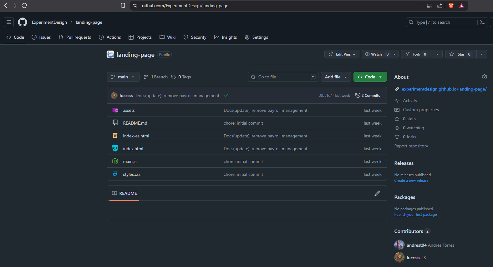
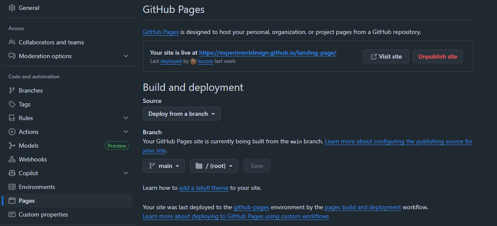
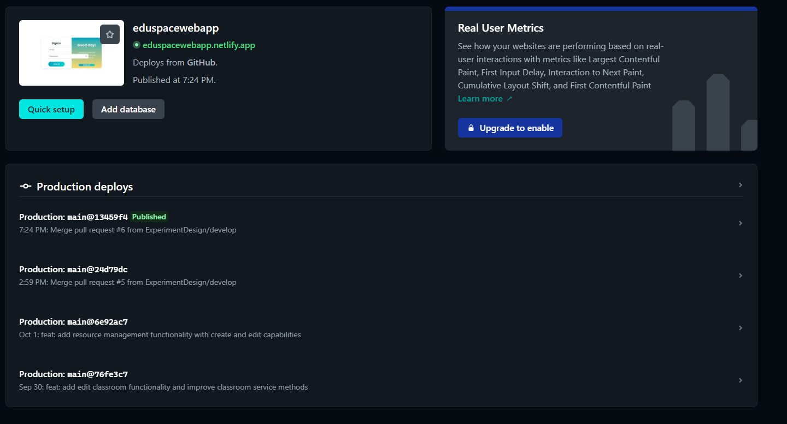
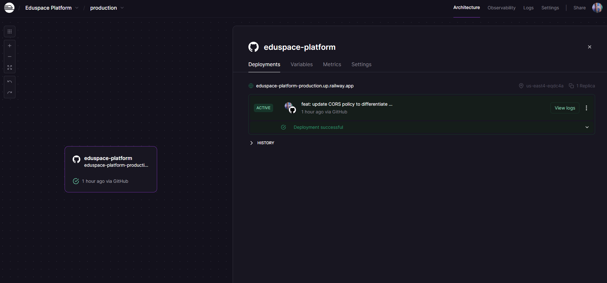
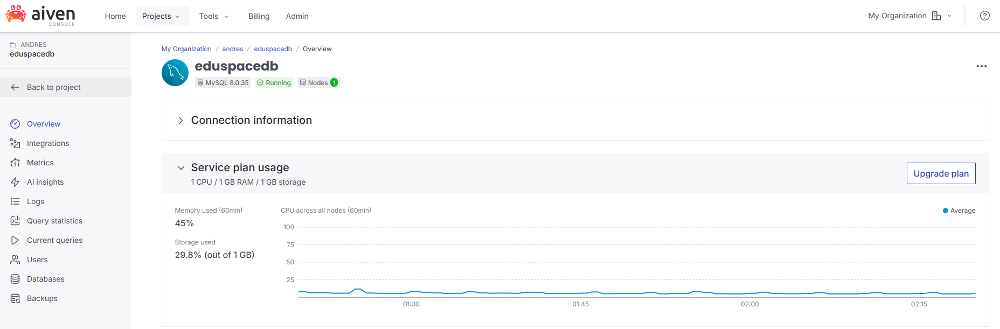

#### 6.2.1.9. Team Collaboration Insights during Sprint.

Durante el Sprint 1 se trabajo con liderazgo por aspecto y colaboraciones cruzadas segun la matriz LACX. A continuacion se registra la contribucion principal de cada integrante y la evidencia de colaboracion en GitHub (por completar con el analitico del Sprint).

| Integrante | Actividad principal en el Sprint 1 |
| --- | --- |
| Alva Abanto, Luis Andres | Por completar |
| Antayhua Castillo, Josue Oscar | Por completar |
| Loli Ramirez, Camila Cristina | Por completar |
| Torres Garcia, Andres Alberto | Por completar |
| Yalan Zhang, Angie Christina | Por completar |

**Evidencia de colaboracion**

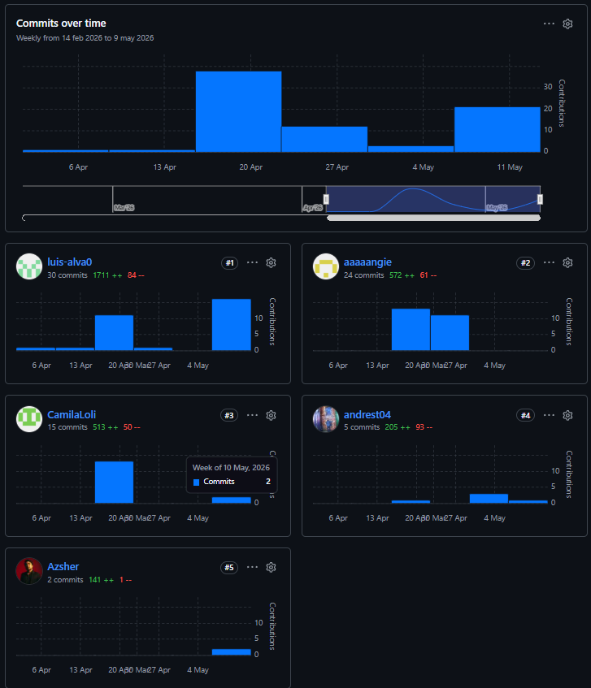

---

# Conclusiones

## Conclusiones y recomendaciones

En conclusión, el diseño de la arquitectura de software para el sistema de gestión de espacios educativos ha sido abordado con un enfoque integral, se consideran aspectos técnicos, operativos y estratégicos. Se han definido claramente los bounded contexts, entidades, servicios y componentes necesarios para garantizar una solución robusta, escalable y alineada con las necesidades de los usuarios finales.

Respecto a la planificación del Sprint 1 (sec. 6.2.1.1), se evidenció que establecer un Sprint Goal acotado a re-estabilizar la línea base heredada y dejar el scaffolding del bounded context IoT Monitoring permitió al equipo proteger el alcance del Trabajo Parcial sin comprometer historias de usuario que dependen de telemetría real, las cuales fueron diferidas de manera explícita al Sprint 2. La fijación de una velocidad inicial de 40 Story Points, calibrada a partir del desempeño del ciclo previo y descontando el overhead del nuevo bounded context, demostró ser una referencia razonable para dimensionar el compromiso del Sprint y servirá como línea base para planificar las iteraciones subsiguientes.

En cuanto a la matriz de Aspect Leaders and Collaborators (sec. 6.2.1.2), se concluye que distribuir el liderazgo a nivel de bounded context —y no a nivel de capa técnica— alinea la organización del equipo con el modelo estratégico definido en el Capítulo IV y refuerza la coherencia entre diseño e implementación. Garantizar que cada aspecto cuente con al menos un Líder y un Colaborador eliminó puntos únicos de falla durante el Sprint y habilitó revisiones cruzadas sistemáticas; se recomienda mantener este criterio en los Sprints siguientes y revisar la asignación al inicio de cada iteración para reflejar la incorporación progresiva de los flujos IoT.

Finalmente, respecto al Sprint Backlog 1 (sec. 6.2.1.3), se confirmó que priorizar las User Stories del aspecto Landing Page (US31, US32, US34) junto con un subconjunto de historias soportadas íntegramente por la base de código heredada permitió cumplir con los entregables obligatorios del Trabajo Parcial sin introducir dependencias bloqueantes hacia componentes aún no implementados. La inclusión de tareas técnicas explícitas (T-IAM-* y T-IoT-*) para validar la autenticación heredada y materializar el scaffolding del bounded context IoT Monitoring resultó clave para dejar la plataforma lista para integrar telemetría real en el Sprint 2, y se recomienda mantener esta práctica de modelar el trabajo técnico no funcional como Work-items de primer orden en el backlog.

---

# Bibliografía

Birimisa, A. (2025, 19 febrero). _El consumo de energía en los Colegios y cómo el FM puede generar ahorros_. https://www.linkedin.com/pulse/el-consumo-de-energ%C3%ADa-en-los-colegios-y-c%C3%B3mo-fm-puede-birimisa-ncnpe/

Córdova Negrete, M. G., Domínguez Toala, G. del P., & Córdova Cabrera, D. J. (2025). Retos y perspectivas de la gestión administrativa en la educación superior: fortalecimiento institucional, calidad educativa y liderazgo académico en el contexto globalizado. _Multidisciplinary Journal of Sciences, Discoveries, and Society_, _2_(2), e-207. https://doi.org/10.71068/xzb5wn45

Expertos En Educación. (2025, 22 septiembre). _Gestión educativa en el Perú: claves, retos y soluciones_. VIU Universidad Online. https://www.universidadviu.com/pe/actualidad/nuestros-expertos/gestion-educativa-en-el-peru-claves-retos-y-soluciones

Diaz, H. (2024, 25 junio). _Infraestructura escolar: soluciones frente al déficit y los desafíos tecnológicos - Educared_. Educared. https://educared.fundaciontelefonica.com.pe/desafios/infraestructura-escolar-soluciones-frente-al-deficit-y-los-desafios-tecnologicos/

Valencia, C., & Almeida, V. (2024). La tecnología en la gestión educativa. _Revista de Investigación Latinoamericana En Competitividad Organizacional_, _6_(23), 9859863. https://dialnet.unirioja.es/descarga/articulo/9859863.pdf#:~:text=En%20resumen%2C%20la%20integraci%C3%B3n%20de%20la%20tecnolog%C3%ADa,a%20la%20mejora%20de%20la%20calidad%20educativa.

Shanganlall, A. (2025, 21 febrero). _Los 7 mayores retos que afectan a la gestión de la educación_. Classter. https://www.classter.com/es/blog/edtech-es/los-7-mayores-retos-que-afectan-a-la-gestion-de-la-educacion/

---

# Anexos

## Anexo A: Estructura para la sección Student Outcome

## Anexo B: Videos de Exposiciones

| Entrega | Título                                             | URL                                                                                                                                                                                                                                                                                                                                                                                                                                                                                                                                                                                                                                                |     |
| ------- | -------------------------------------------------- | -------------------------------------------------------------------------------------------------------------------------------------------------------------------------------------------------------------------------------------------------------------------------------------------------------------------------------------------------------------------------------------------------------------------------------------------------------------------------------------------------------------------------------------------------------------------------------------------------------------------------------------------------- | --- |
| AV1     | upc-pre-202610-1asi0572-6776-edusolutions-expo-av1 | [https://upcedupe-my.sharepoint.com/:v:/g/personal/u202110385_upc_edu_pe/IQBIiMX0AJRMSaQEIAnGe6olAZdW2wzqMkFe6cLaolmhgB0?nav=eyJyZWZlcnJhbEluZm8iOnsicmVmZXJyYWxBcHAiOiJTdHJlYW1XZWJBcHAiLCJyZWZlcnJhbFZpZXciOiJTaGFyZURpYWxvZy1MaW5rIiwicmVmZXJyYWxBcHBQbGF0Zm9ybSI6IldlYiIsInJlZmVycmFsTW9kZSI6InZpZXcifX0%3D&e=PJLtw2](https://upcedupe-my.sharepoint.com/:v:/g/personal/u202110385_upc_edu_pe/IQBIiMX0AJRMSaQEIAnGe6olAZdW2wzqMkFe6cLaolmhgB0?nav=eyJyZWZlcnJhbEluZm8iOnsicmVmZXJyYWxBcHAiOiJTdHJlYW1XZWJBcHAiLCJyZWZlcnJhbFZpZXciOiJTaGFyZURpYWxvZy1MaW5rIiwicmVmZXJyYWxBcHBQbGF0Zm9ybSI6IldlYiIsInJlZmVycmFsTW9kZSI6InZpZXcifX0%3D&e=PJLtw2) |     |