

**Universidad Peruana de Ciencias Aplicadas**

**Facultad de Ingeniería**

**Curso:** 1ASI0572 – Desarrollo de Soluciones IoT

**NRC:** 6776

**Nombre del profesor:** Marco Antonio León Baca

---

## Informe de Trabajo Final

**Nombre de la startup:** EduSolutions

**Nombre del producto:** EduSpace

---

**Integrantes:**

| Código     | Apellidos y Nombres            |
| ---------- | ------------------------------ |
| u202310877 | Alva Abanto, Luis Andrés       |
| u20191e414 | Antayhua Castillo, Josué Oscar |
| u202110385 | Loli Ramirez, Camila Cristina  |
| u202220528 | Torres García, Andrés Alberto  |
| u202312504 | Yalán Zhang, Angie Christina   |

**Lima - abril 2026**

---

## Registro de Versiones del Informe

| Versión | Fecha      | Autor  | Descripción de modificación |
| ------- | ---------- | ------ | --------------------------- |
| 1.0     | 11/04/2026 | Equipo | Creación del informe.       |

---

## Project Report Collaboration Insights

URL del repositorio del Project Report en GitHub: [https://github.com/DesarrolloSolucionIoT/eduspace-report](https://github.com/DesarrolloSolucionIoT/eduspace-report)

---

## Contenido

- [Capítulo I: Introducción](#capítulo-i-introducción)
  - [1.1. Startup Profile](#11-startup-profile)
    - [1.1.1. Descripción de la Startup](#111-descripción-de-la-startup)
    - [1.1.2. Perfiles de integrantes del equipo](#112-perfiles-de-integrantes-del-equipo)
  - [1.2. Solution Profile](#12-solution-profile)
    - [1.2.1. Antecedentes y problemática](#121-antecedentes-y-problemática)
    - [1.2.2. Lean UX Process](#122-lean-ux-process)
      - [1.2.2.1. Lean UX Problem Statements](#1221-lean-ux-problem-statements)
        - [**a. DOMAIN**](#a-domain)
        - [**b. CUSTOMER SEGMENTS**](#b-customer-segments)
        - [**c. PAIN POINTS**](#c-pain-points)
        - [**d. GAP**](#d-gap)
        - [**e. VISION/STRATEGY**](#e-visionstrategy)
        - [**f. INITIAL SEGMENT**](#f-initial-segment)
      - [1.2.2.2. Lean UX Assumptions](#1222-lean-ux-assumptions)
      - [1.2.2.3. Lean UX Hypothesis Statements](#1223-lean-ux-hypothesis-statements)
      - [1.2.2.4. Lean UX Canvas](#1224-lean-ux-canvas)
  - [1.3. Segmentos objetivo](#13-segmentos-objetivo)
- [Capítulo II: Requirements Elicitation \& Analysis](#capítulo-ii-requirements-elicitation--analysis)
  - [2.1. Competidores](#21-competidores)
    - [2.1.1. Análisis competitivo](#211-análisis-competitivo)
    - [2.1.2. Estrategias y tácticas frente a competidores](#212-estrategias-y-tácticas-frente-a-competidores)
      - [**Frente a las fortalezas de los competidores**](#frente-a-las-fortalezas-de-los-competidores)
        - [**Fortalezas de Smart Campus IoT:**](#fortalezas-de-smart-campus-iot)
        - [**Estrategias**](#estrategias)
        - [**Tácticas**](#tácticas)
      - [**Frente a las debilidades de los competidores**](#frente-a-las-debilidades-de-los-competidores)
        - [**Debilidades de Smart Campus IoT:**](#debilidades-de-smart-campus-iot)
        - [**Estrategias**](#estrategias-1)
        - [**Tácticas**](#tácticas-1)
  - [2.2. Entrevistas](#22-entrevistas)
    - [2.2.1. Diseño de entrevistas](#221-diseño-de-entrevistas)
    - [2.2.2. Registro de entrevistas](#222-registro-de-entrevistas)
    - [2.2.3. Análisis de entrevistas](#223-análisis-de-entrevistas)
  - [2.3. Needfinding](#23-needfinding)
    - [2.3.1. User Personas](#231-user-personas)
    - [2.3.2. User Task Matrix](#232-user-task-matrix)
    - [2.3.3. User Journey Mapping](#233-user-journey-mapping)
    - [2.3.4. Empathy Mapping](#234-empathy-mapping)
  - [2.4. Big Picture EventStorming](#24-big-picture-eventstorming)
  - [2.5. Ubiquitous Language](#25-ubiquitous-language)
- [Capítulo III: Requirements Specification](#capítulo-iii-requirements-specification)
  - [3.1. User Stories](#31-user-stories)
  - [3.2. Impact Mapping](#32-impact-mapping)
  - [3.3. Product Backlog](#33-product-backlog)
- [Capítulo IV: Solution Software Design](#capítulo-iv-solution-software-design)
  - [4.1. Strategic-Level Domain-Driven Design](#41-strategic-level-domain-driven-design)
    - [4.1.1. Design-Level EventStorming](#411-design-level-eventstorming)
      - [4.1.1.1. Candidate Context Discovery](#4111-candidate-context-discovery)
      - [4.1.1.2. Domain Message Flows Modeling](#4112-domain-message-flows-modeling)
      - [4.1.1.3. Bounded Context Canvases](#4113-bounded-context-canvases)
    - [4.1.2. Context Mapping](#412-context-mapping)
    - [4.1.3. Software Architecture](#413-software-architecture)
      - [4.1.3.1. Software Architecture System Landscape Diagram](#4131-software-architecture-system-landscape-diagram)
      - [4.1.3.2. Software Architecture Context Level Diagrams](#4132-software-architecture-context-level-diagrams)
      - [4.1.3.3. Software Architecture Container Level Diagrams](#4133-software-architecture-container-level-diagrams)
      - [4.1.3.4. Software Architecture Deployment Diagrams](#4134-software-architecture-deployment-diagrams)
  - [4.2. Tactical-Level Domain-Driven Design](#42-tactical-level-domain-driven-design)
    - [4.2.X. Bounded Context: \<Nombre\>](#42x-bounded-context-nombre)
      - [4.2.X.1. Domain Layer](#42x1-domain-layer)
      - [4.2.X.2. Interface Layer](#42x2-interface-layer)
      - [4.2.X.3. Application Layer](#42x3-application-layer)
      - [4.2.X.4. Infrastructure Layer](#42x4-infrastructure-layer)
      - [4.2.X.5. Bounded Context Software Architecture Component Level Diagrams](#42x5-bounded-context-software-architecture-component-level-diagrams)
      - [4.2.X.6. Bounded Context Software Architecture Code Level Diagrams](#42x6-bounded-context-software-architecture-code-level-diagrams)
        - [4.2.X.6.1. Bounded Context Domain Layer Class Diagrams](#42x61-bounded-context-domain-layer-class-diagrams)
        - [4.2.X.6.2. Bounded Context Database Design Diagram](#42x62-bounded-context-database-design-diagram)
- [Conclusiones](#conclusiones)
  - [Conclusiones y recomendaciones](#conclusiones-y-recomendaciones)
- [Bibliografía](#bibliografía)
- [Anexos](#anexos)
  - [Anexo A: Estructura para la sección Student Outcome](#anexo-a-estructura-para-la-sección-student-outcome)
  - [Anexo B: Videos de Exposiciones](#anexo-b-videos-de-exposiciones)

---

## Student Outcome

El curso contribuye al cumplimiento del Student Outcome ABET:

**ABET – EAC - Student Outcome 5:** La capacidad de funcionar efectivamente en un equipo cuyos miembros juntos proporcionan liderazgo, crean un entorno de colaboración e inclusivo, establecen objetivos, planifican tareas y cumplen objetivos.

En el siguiente cuadro se describe las acciones realizadas y enunciados de conclusiones por parte del grupo, que permiten sustentar el haber alcanzado el logro del ABET – EAC - Student Outcome 5.

| Criterio específico                                                                             | Acciones realizadas                                      | Conclusiones              |
| ----------------------------------------------------------------------------------------------- | -------------------------------------------------------- | ------------------------- |
| Trabaja en equipo para proporcionar liderazgo en forma conjunta                                 | \<Apellido, Nombre\> **AV1** \<descripción de acciones\> | \<Conclusiones grupales\> |
| Crea un entorno colaborativo e inclusivo, establece metas, planifica tareas y cumple objetivos. | \<Apellido, Nombre\> **AV1** \<descripción de acciones\> | \<Conclusiones grupales\> |

---

# Capítulo I: Introducción

## 1.1. Startup Profile

### 1.1.1. Descripción de la Startup

EduSolutions es una startup enfocada en el desarrollo de soluciones tecnológicas innovadoras para el sector educativo. Su objetivo es mejorar el manejo integral de espacios educativos en institutos que cuentan con grandes infraestructuras.

En este contexto, surge la creación de la aplicación EduSpace, una aplicación que facilita la coordinación del personal y fortalece la comunicación entre trabajadores y supervisores.

EduSpace permite registrar y gestionar cada ambiente educativo, incluyendo aulas, su aforo y el docente responsable, así como ambientes deportivos y su equipamiento. La plataforma también gestiona los datos de los trabajadores, como docentes y personal de limpieza, facilitando la reasignación de responsabilidades en caso de ausencias.

Asimismo, cuenta con la interacción de sensores IoT para el monitoreo del entorno, permitiendo detectar la presencia de personas, temperatura, humedad, y automatizar el control de la iluminación. Esto contribuye a una gestión más eficiente y sostenible de recursos.

De esta manera, EduSpace permite a las instituciones educativas optimizar su eficiencia operativa, mejorar el uso de recursos y fortalecer su gestión interna.

**Misión:** Brindar soluciones tecnológicas y sostenibles que optimicen la gestión de espacios y recursos en instituciones educativas, mejorando su eficiencia operativa mediante herramientas digitales e integración de IoT.

**Visión:** Liderar en el rubro de servicios educativos en Latinoamérica con nuestra startup por ofrecer soluciones sostenibles y accesibles, destacando por la innovación en la gestión inteligente de espacios.

### 1.1.2. Perfiles de integrantes del equipo

| Foto del Participante                                                                                                                                                                                     | Nombres y Apellidos           | Código de Estudiante | Descripción de Carrera | Resumen de Conocimientos y Habilidades                                                                                                                                                                                                                                                                                                                                                                                                                                                                                                                                                                                                                                     |
| --------------------------------------------------------------------------------------------------------------------------------------------------------------------------------------------------------- | ----------------------------- | -------------------- | ---------------------- | -------------------------------------------------------------------------------------------------------------------------------------------------------------------------------------------------------------------------------------------------------------------------------------------------------------------------------------------------------------------------------------------------------------------------------------------------------------------------------------------------------------------------------------------------------------------------------------------------------------------------------------------------------------------------- |
|  | Andrés Alberto Torres García  | u202220528           | Ingeniería de Software | Hola, soy Andrés Alberto Torres García, tengo 20 años y curso el séptimo ciclo de Ingeniería de Software. Me apasiona la tecnología y siempre busco entender cómo funcionan las cosas, lo que me ha permitido adquirir experiencia en C++, Python, JavaScript y TypeScript, así como en el desarrollo de aplicaciones web con Next.js, TailwindCSS y Firebase, bases de datos como MySQL, MongoDB y Firestore, y el uso de herramientas como Docker y GitHub. Además, el fútbol es otra de mis grandes pasiones, disciplina que me ha enseñado valores como el trabajo en equipo, la perseverancia y la constancia, que aplico también en mi vida académica y profesional. |
| [                                                                                                                                                          | Camila Cristina Loli Ramirez  | u202110385           | Ingeniería de Software | Soy Camila Cristina Loli Ramirez, tengo 21 años y soy estudiante de la carrera Ingeniería de Software. Mi carrera se basa en los conocimientos y técnicas científicas para crear un programa informático. Tengo experiencia con el trabajo en equipo, creación de proyectos y creación de programas básicos. Aportaré al equipo mi creatividad, compromiso de trabajo en equipo, puntualidad y responsabilidad. Me comprometo a trabajar constantemente para mejorar nuestro proyecto y a generar un entorno de trabajo sano con mi grupo.                                                                                                                                 |
|                                                                                                                                                                                                           | Josué Oscar Antayhua Castillo | u20191e414           | Ingeniería de Software |                                                                                                                                                                                                                                                                                                                                                                                                                                                                                                                                                                                                                                                                            |
|                                                                                                                                                                                                           | Luis Andrés Alva Abanto       | u202310877           | Ingeniería de Software |                                                                                                                                                                                                                                                                                                                                                                                                                                                                                                                                                                                                                                                                            |
|                                                                                                                                                                                                           | Angie Christina Yalán Zhang   | u202312504           | Ingeniería de Software | Mi nombre es Angie Yalán. Soy estudiante de la carrera Ingeniería de Software y tengo 20 años. Me considero una persona proactiva que le gustan nuevas experiencias y aprender cosas diferentes. Sigo en el proceso de mejora en cuanto a la programación y cuento con toda la iniciativa para ser cada día mejor en ello.  |

## 1.2. Solution Profile

### 1.2.1. Antecedentes y problemática

Según el equipo de Expertos en Educación de la Universidad Internacional de Valencia (2025), en Perú, la gestión educativa enfrenta varios obstáculos que incluyen factores económicos, tecnológicos y organizacionales. Estas limitaciones impactan de manera negativa la infraestructura y la disponibilidad de recursos dentro de las instituciones educativas, lo que dificulta su adecuada administración.

Asimismo, el reducido uso de tecnologías en los procesos de gestión impide alcanzar niveles óptimos de eficiencia administrativa (Diaz, 2023). Diferentes estudios mencionan que la integración de herramientas tecnológicas permite optimizar procesos, mejorar la toma decisiones y fortalece la coordinación entre los trabajadores del entorno educativo (Valencia & Almeida, 2024).

Respecto al nivel organizacional, según Córdova Negrete et al. (2025) evidencian que las instituciones educativas presentan ineficiencias en sus procesos administrativos y limitaciones en su capacidad de respuesta. Estas condiciones generan problemas en la gestión de espacios, recursos y personal, lo que afecta la eficiencia operativa.

En consecuencia de la falta de una gestión apropiada, también hay diferentes problemas en el uso de recursos como la energía. El consumo eléctrico puede representar entre el 20% y 30% de los costos operativos en instituciones educativas (Birimisa, 2025), esto causa que haya una falta de control adecuado que perjudica tanto el aspecto financiero como el ambiental.

Además, la ausencia de sistemas de monitoreo impide regular de forma adecuada factores ambientales como la temperatura y la humedad dentro de los espacios educativos (aulas, laboratorios, entre otros). Estas condiciones pueden afectar el bienestar de los usuarios, generando riesgos para la salud, como problemas respiratorios o estrés térmico.

En este contexto, se identifica como problemática principal la gestión ineficiente de los espacios educativos y la falta de sistemas integrados que permitan una coordinación efectiva del personal, el monitoreo en tiempo real y la optimización de los recursos dentro de instituciones educativas con infraestructuras complejas.

Para analizar con más detalle los antecedentes y problemáticas, se realizó con anticipación la técnica 5 ‘W’s & 2 ‘H’s:

- ### _WHAT?_

El problema que se ha identificado es la gestión ineficiente de los espacios educativos con grandes infraestructuras. Estas organizaciones manejan múltiples espacios y recursos, lo que dificulta mantener un control adecuado sobre su disponibilidad y uso. Por consecuencia, esto ocasiona problemas de comunicación entre los empleados, retrasos en la toma de decisiones y dificultades para gestionar cambios o incidencias en tiempo real.

- ### _WHEN?_

La problemática surge cuando las instituciones experimentan un crecimiento o complejidad en su operación diaria, esto dificulta la gestión eficiente de sus espacios, personal y recursos. Esta situación se vuelve más crítica en situaciones como la planificación de nuevos semestres, la coordinación de actividades entre diferentes ambientes, la gestión de ausencias de personal, o cuando se enfrentan a la necesidad de automatizar procesos administrativos para mantener la eficiencia y evitar errores.

- ### _WHERE?_

Esta problemática ocurre dentro de instituciones educativas como universidades, colegios e institutos, especialmente en aquellos entornos que cuentan con múltiples espacios como aulas, laboratorios, bibliotecas y áreas deportivas. Es en estos contextos que la división de recursos y la falta de un sistema centralizado dificultan la gestión y coordinación diaria.

- ### _WHY?_

La causa principal del problema radica en la falta de integración y automatización en la gestión de los espacios y recursos. Muchas instituciones dependen de procesos manuales o sistemas desarticulados, esto genera una comunicación deficiente entre áreas, retrasos en la toma de decisiones y dificultades para coordinar al personal y los recursos disponibles.

- ### _WHO?_

En la problemática abordada, los afectados son los docentes, personal administrativo, y otros miembros del equipo de una institución educativa, quienes dependen de la organización de espacios y recursos para desarrollar sus tareas. La falta de coordinación impacta en su desempeño y en la eficiencia de las operaciones realizadas en la institución.

- ### _HOW?_

Este problema puede abordarse mediante la implementación de una solución tecnológica centralizada que permita gestionar de manera eficiente los espacios, recursos y personal. El uso de herramientas digitales facilitaría la automatización de procesos, mejora en la comunicación interna y monitoreo en tiempo real de los ambientes educativos.

- ### _HOW MUCH?_
  El consumo energético de instituciones educativos puede representar entre el 20% y 30% de sus costos operativos (Birimisa, 2025), lo que evidencia que una gestión ineficiente de los recursos puede generar un impacto económico significativo.

### 1.2.2. Lean UX Process

#### 1.2.2.1. Lean UX Problem Statements

En el estado actual de la gestión administrativa en centros educativos con grandes infraestructuras es deficiente. En ambos segmentos, es complicado seguir un orden de procesos, ya que los procesos administrativos suelen depender de métodos manuales o sistemas desintegrados. Esto dificulta la coordinación del personal, el control de la disponibilidad de los espacios y correcta gestión de recursos.

Esta situación se ve agravada por la falta de herramientas tecnológicas accesibles que permitan monitorear en tiempo real el uso de los ambientes educativos, y factores relevantes como el consumo energético y las condiciones ambientales dentro de las aulas, bibliotecas, laboratorios, entre otros.

En consecuencia, las instituciones sufren de diferentes problemas, como retrasos en la forma de decisiones, uso ineficiente de recursos, aumento en costos operativos y una limitada capacidad de respuesta ante incidentes.

¿Cómo podríamos mejorar la gestión y monitoreo de espacios educativos para optimizar el uso de recursos, reducir costos operativos y elevar la eficiencia en la coordinación del personal?

##### **a. DOMAIN**

Gestión de espacios educativos y recursos en instituciones con infraestructuras complejas que requieren coordinación eficiente del personal, control de ambientes y optimización del uso de recursos.

##### **b. CUSTOMER SEGMENTS**

Administradores de instituciones educativas y docentes y auxiliares que gestionan múltiples espacios físicos y necesitan mejorar su organización y control.

##### **c. PAIN POINTS**

- Coordinación ineficaz del personal entre diferentes espacios.
- Comunicación deficiente entre trabajadores y supervisores.
- Procesos administrativos manuales y propensos a errores.
- Dificultad en el seguimiento y mantenimiento de equipos e inventarios.
- Falta de disponibilidad y uso de os espacios educativos.

##### **d. GAP**

No existe una solución integrada que permita centralizar la gestión de espacios, recursos y personal, y monitorear en tiempo real el uso de los ambientes educativos, esto limita la eficiencia operativa de las instituciones.

##### **e. VISION/STRATEGY**

Desarrollar una plataforma integral que permita facilitar la gestión eficiente de espacios educativos, automatizar tareas administrativas, mejorar la comunicación y coordinación del personal y el monitoreo en tiempo real de recursos, esto contribuye a un funcionamiento más eficiente y sostenible.

##### **f. INITIAL SEGMENT**

Las grandes instituciones educativas que enfrentan problemas en la coordinación de espacios y la administración de personal están buscando una solución digital para optimizar estos procesos.

#### 1.2.2.2. Lean UX Assumptions

Business Assumptions: 

- **Creemos que nuestros usuarios necesitan** una manera eficiente de gestionar los espacios educativos, recursos y personal en instituciones con múltiples ambientes.
- **Estas necesidades se pueden resolver con** una aplicación móvil centralizada que permita automatizar procesos, mejorar la coordinación interna y monitorear en tiempo real el uso de los espacios.
- **Nuestros clientes iniciales son** docentes de instituciones educativas y personal administrativo que buscan optimizar sus procesos.
- **El valor #1 que un cliente requiere de nuestro servicio** es optimizar el uso de espacios y recursos, para evitar ineficiencias en el funcionamiento de la institución.
- **El cliente también puede obtener estos beneficios adicionales** mejorar la comunicación entre el personal, reducción de errores administrativos, ahorro en el consumo energético.
- **Adquiriremos a nuestros clientes a través** campañas de marketing digital, demostraciones en línea y referencias de clientes existentes.
- **Haremos dinero a través** de la venta d planes de suscripción adaptados a las necesidades de las instituciones educativas.
- **Nuestra competencia de mercado** serán aplicaciones de gestión educativa tradicionales que no integran monitoreo en tiempo real ni automatización avanzada de recursos.
- **Los venceremos debido** a la integración de monitoreo en tiempo real, automatización de procesos y optimización del uso de recursos mediante tecnologías IoT.
- **Nuestros mayores riesgos son** que las instituciones educativas no perciban un valor claro en la adopción de una nueva plataforma, que el plan de suscripción no se ajuste a sus necesidades.
- **Resolveremos esto mediante** el desarrollo del producto, nuestra prioridad es entender las necesidades de los usuarios y proveer una solución tecnológica, que sea intuitiva de utilizar.
- **Sabremos que hemos tenido éxito cuando uno de estos cambios en el comportamiento de nuestro cliente:** El usuario logra gestionar la asignación de espacios y recursos en menor tiempo, reduzcan errores en la coordinación de actividades y utilicen activamente el sistema para monitorear el ambiente de las aulas.
- **Qué otras suposiciones tenemos que, de probarse falsas pueden causar que nuestro proyecto fracase:** suponer que los segmentos objetivos prefieren mantener el uso de sistemas manuales para monitorear los ambientes y recursos disponibles.

**Business Outcomes:** 

- Mejorar la eficiencia operativa de las instituciones educativas un 25% en sus primeros 4 meses de uso del sistema.
- Se espera que al menos el 30% de nuestros clientes nos recomienden a otras instituciones dentro de los primeros 6 meses.
- Ofrecer la aplicación en múltiples idiomas incrementará la base de usuarios en un 25% en los primeros seis meses, permitiendo que más instituciones educativas de diferentes regiones utilicen la plataforma y contribuyendo a un crecimiento anual del 15%
-  Crear interfaz fácil de usar y visualmente atractiva que retenga al menos el 50% de usuarios después de los primeros 7 meses.
- Conseguir que más del 65% de usuarios pague la suscripción (anual o mensual) ofrecida. 

**User Assumptions:** 

**¿Quiénes serán nuestros usuarios?** 

Nuestros usuarios principales son: 

- Docentes y auxiliares entre las edades de 22 a 65 años que buscan una solución que facilite el monitoreo de ambientes y mejore la comunicación con los administradores.
- Administradores de instituciones educativas entre 35 a 60 años que necesitan una herramienta que permita gestionar eficazmente los espacios y recursos.

**¿Dónde encaja nuestro producto en su vida o trabajo?** 

El producto se adapta al trabajo diario de los usuarios, facilitando la gestión de ambientes, equipos y recursos del centro educativo, y mejorando la comunicación entre el personal.

**¿Qué problemas tiene nuestro producto y cómo se pueden resolver?** 

La falta de control sobre los espacios educativos, la comunicación ineficiente y la ausencia de monitoreo en tiempo real.

**¿Cómo y cuándo es usado nuestro producto?** 

EduSolutions se utiliza de forma diaria para gestionar la asignación de espacios, coordinar actividades y monitorear el estado de los ambientes educativos.

**¿Qué características son importantes?** 

Acceso en tiempo real, facilidad de uso, centralización de información y automatización de procesos.

**¿Cómo debe verse y comportarse nuestro producto?** 

El producto debe de ser intuitivo, rápido, disponible durante el horario laboral, y accesible desde distintos dispositivos, lo que permitirá una gestión eficiente sin complejidad técnica.

**El valor principal que un usuario quiere obtener de nuestra funcionalidad es:**

- Mejora en la gestión de los espacios y recursos, junto con una comunicación más eficiente entre los trabajadores.

**Los usuarios también pueden obtener estos beneficios adicionales:**

- Acceso rápido a la información en cualquier momento y desde cualquier dispositivo.

**El mayor riesgo para el usuario es:**

- Que la aplicación no se adapte correctamente a diferentes dispositivos o que no facilite la comunicación interna como se espera.

**User Outcomes:**

- Acceso a Notificaciones y Actualizaciones: Al implementar un sistema de notificaciones, se espera que el 80% de los usuarios reciban y respondan a los eventos y cambios importantes en la aplicación dentro de las primeras 24 horas. Esto mejorará su capacidad de gestionar tareas en tiempo real, optimizando su productividad en un 15%.
- Reducción del Tiempo de Familiarización: Una interfaz intuitiva y fácil de usar reducirá el tiempo de familiarización de los usuarios en un 30%, permitiendo que al menos el 90% de ellos dominen las funcionalidades básicas en menos de una semana sin necesidad de capacitaciones adicionales.
- Mejora en el Control de Inventarios: Con la introducción de funciones para registrar y gestionar el inventario de equipos y recursos, se espera que los usuarios logren un aumento del 25% en el control y monitoreo de sus recursos. Esto resultará en una mejora de la productividad en un 20%, al optimizar el uso de los recursos disponibles en los centros educativos.

**Features Assumptions:**

- Acceso a Notificaciones y Actualizaciones:
  - Sistema de Notificaciones en Tiempo Real: Implementar una funcionalidad que envíe notificaciones automáticas sobre eventos importantes y cambios en la aplicación, permitiendo a los usuarios reaccionar rápidamente. Esto ayudará a que el 80% de los usuarios estén al tanto de las actualizaciones dentro de las primeras 24 horas.
- Reducción del Tiempo de Familiarización:
  - Interfaz Intuitiva y Fácil de Usar: Desarrollar una interfaz que sea simple e intuitiva, reduciendo el tiempo de aprendizaje en un 30%. Se espera que el 90% de los usuarios puedan dominar las funciones principales en menos de una semana sin necesidad de capacitación adicional.
- Mejora en el Control de Inventarios:
  - Gestión de Inventarios de Recursos: Crear una funcionalidad que permita a los usuarios registrar y gestionar el inventario de equipos y recursos en su centro educativo. Esto incrementará el control y monitoreo de los recursos en un 25%, mejorando la productividad en un 20% al optimizar el uso de los mismos.

* Monitoreo del ambiente mediante IoT:
  - Incorporación de sensores que permitan detectar la presencia de personas, así como medir la temperatura y humedad en los ambientes educativos.

#### 1.2.2.3. Lean UX Hypothesis Statements

- Nosotros creemos que los usuarios necesitan una aplicación que les permita gestionar los espacios de su centro educativo de manera eficiente. Sabremos que es verdad cuando al menos el 50% de usuarios adquiera los planes de suscripción durante el primer mes.
- Nosotros creemos que al contar con una interfaz intuitiva, visualmente atractiva y sea fácil de usar reducirá la tasa de abandono del sistema. Sabremos que es verdad cuando al menos el 70% de los usuarios continúen utilizando la plataforma después del primer mes.
- Nosotros creemos que el monitoreo en tiempo real mediante tecnologías IoT (presencia, temperatura, humedad y consumo energético) aportará valor a los usuarios en la gestión de los espacios. Sabremos que es verdad cuando los usuarios utilicen activamente estas funcionalidades y las consideren relevantes en la toma de decisiones operativas.

#### 1.2.2.4. Lean UX Canvas

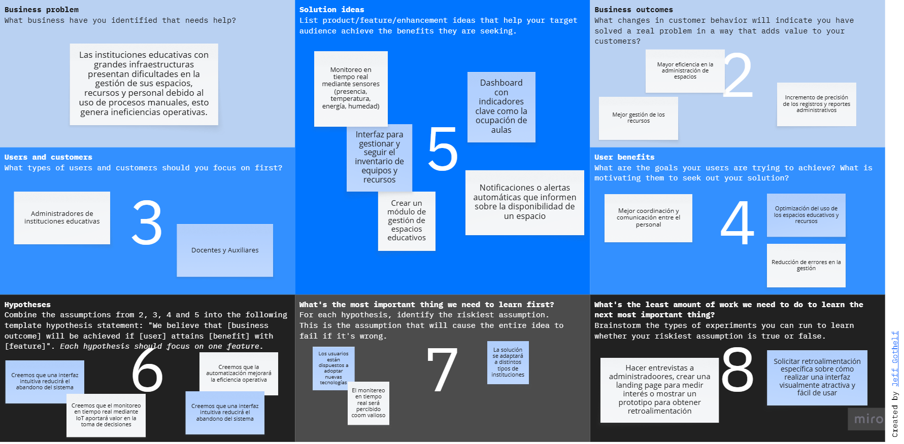

## 1.3. Segmentos objetivo

Nuestra aplicación se enfoca en optimizar la gestión de espacios educativos y la coordinación del personal a través de una plataforma integral. EduSpace facilita la grabación de aulas, espacios deportivos y entornos personales, y permite una gestión detallada de los recursos. Además, automatiza la nómina y proporciona un control completo del inventario de equipos y recursos con valoraciones contables. Los usuarios capturan información sobre sus actividades y necesidades operativas para mejorar la eficiencia y la comunicación. Así, nuestros segmentos objetivo serán los siguientes:

**Administradores de instituciones educativas**

- Edad: 35 a 60 años
- Perfil: Directivos, coordinadores académicos, personal administrativo encargados de la gestión operativo de institución educativa.
- Uso de tecnología: Intermedio
- Necesidad principal: Optimizar la gestión de espacios, recursos y personal de manera centralizada.
- Beneficios buscados: Tener mayor control operativo, reducción de errores, ahorro de tiempo y mejora en la toma de decisiones.

**Características demográficas:** Profesionales entre 35 a 60 años, de género masculino y femenino, con formación en gestión educativa, administración o especialidades afines, que trabajan solamente en instituciones educativas.

**Características geográficas:** Principalmente ubicados en zonas urbanas de Perú, especialmente Lima Metropolitana, donde existen instituciones educativas con infraestructuras grandes y complejas.

**Docentes y auxiliares**

- Edad: 22 a 65 años
- Perfil: Profesores y personal de apoyo que utilizan los espacios educativos de las instituciones donde trabajan para desarrollar sus actividades diarias.
- Uso de tecnología: Básico a intermedio
- Necesidad principal: Acceder rápidamente a información sobre la disponibilidad de espacios y coordinar actividades sin complicaciones.
- Beneficios buscados: Acceso rápido a la información sobre los recursos y espacios disponibles, mejor comunicación y menos errores en la asignación de espacios.

**Características demográficas:** Profesionales del sector educativo entre 22 a 65 años, de género masculino y femenino, con formación académica en sus respectivas disciplinas (ciencias, literatura, entre otros), con experiencia en enseñanza.

**Características geográficas:** Principalmente ubicados en instituciones educativas con infraestructura compleja de zonas urbanas o semiurbanas de Perú, especialmente Lima Metropolitana.

---

# Capítulo II: Requirements Elicitation & Analysis

## 2.1. Competidores

### 2.1.1. Análisis competitivo

El análisis competitivo permite identificar las soluciones existentes que abordan el monitoreo de espacios, consumo energético y condiciones ambientales mediante tecnologías IoT. A partir de este análisis, se evalúan plataformas como Siemens, Cisco, Honeywell y Spacewell, las cuales ofrecen soluciones avanzadas orientadas a entornos corporativos.

<table border="1" cellpadding="10" cellspacing="0" style="margin-left: auto; margin-right: auto;">
  <tr>
    <th colspan="7">Competitive Analysis Landscape</th>
  </tr>
  <tr>
    <td colspan="2" rowspan="2">¿Por qué llevar a cabo este análisis?</td>
    <td colspan="5">¿Cómo se posicionan las soluciones actuales de monitoreo inteligente de espacios frente a una propuesta enfocada en el entorno educativo, y qué oportunidades existen para diferenciarse mediante especialización y analítica en tiempo real?</td>
  </tr>
  <tr>
    <td colspan="5">Identificar cómo las soluciones actuales de smart buildings gestionan espacios, energía y monitoreo, y determinar cómo una solución enfocada en entornos educativos puede diferenciarse mediante especialización, accesibilidad y lógica académica.</td>
  </tr>
  <tr>
   <td colspan="2">Nombre y logo</td>
    <td style="text-align: center;">EduSpace    </td>
    <td style="text-align: center;">Siemens Smart Infrastructure   </td>
    <td style="text-align: center;">Cisco Spaces   </td>
    <td style="text-align: center;">Honeywell Building Tech  </td>
    <td style="text-align: center;">Spacewell   </td> 
  </tr>
  <tr>
    <td rowspan="2">Perfil</td>
    <td>Overview</td>
    <td>Plataforma IoT enfocada en instituciones educativas que monitorea ocupación, ambiente y consumo energético en aulas, generando analítica y alertas en tiempo real</td>
    <td>Ecosistema integral de automatización de edificios inteligentes que incluye energía, seguridad, climatización y analítica avanzada</td>
    <td>Plataforma de analítica de espacios basada en ubicación mediante WiFi, enfocada en comportamiento de usuarios</td>
    <td>Plataforma de gestión de edificios que integra monitoreo ambiental, energía, seguridad y automatización</td>
    <td>Plataforma de facility management que optimiza el uso de espacios de trabajo mediante IoT, sensores y analítica</td>
  </tr>
  <tr>
    <td>Ventaja competitiva ¿Qué valor ofrece a los clientes?</td>
    <td>Especialización en educación + integración con horarios académicos + modelo accesible + lógica de scoring y alertas inteligentes</td>
    <td>Alta precisión, confiabilidad y soluciones completas a gran escala</td>
    <td>Analítica avanzada de ocupación con mapas de calor y comportamiento</td>
    <td>Integración completa de sistemas físicos del edificio + experiencia industrial</td>
    <td>Enfoque en optimización de espacios de trabajo + integración de datos IoT + enfoque en experiencia del usuario</td>
  </tr>
  <tr>
    <td rowspan="2">Perfil de Marketing</td>
    <td>Mercado objetivo</td>
    <td>Instituciones educativas con grandes y pequeñas infraestructuras que buscan optimizar la gestión de sus espacios y recursos.</td>
    <td>Grandes empresas e instituciones que buscan centralizar la gestión de sus instalaciones con un enfoque en sostenibilidad.</td>
    <td>Empresas, retail, oficinas corporativas, que requieren soluciones fáciles de usar para la gestión de instalaciones.</td>
    <td>Grandes instituciones y empresas que necesitan una solución completa para la gestión de sus instalaciones y recursos.</td>
    <td>Industrias, edificios comerciales, hospitales</td>
  </tr>
  <tr>
    <td>Estrategias de marketing</td>
    <td>Marketing dirigido a administradores de grandes y de pequeñas instituciones educativas, destacando la eficiencia y el control exhaustivo de recursos.</td>
    <td>Enfoque en la sostenibilidad y la eficiencia, con campañas dirigidas a administradores de instalaciones y responsables de sostenibilidad.</td>
    <td>Enfoque en la simplicidad y efectividad, con marketing dirigido a usuarios que buscan facilidad de uso en la gestión de instalaciones.</td>
    <td>Posicionamiento como solución de analítica inteligente basada en datos</td>
    <td>Campañas dirigidas a grandes organizaciones que necesitan una solución robusta y completa para la gestión de sus instalaciones.</td>
  </tr>
  <tr>
    <td rowspan="3">Perfil de Producto</td>
    <td>Productos & Servicios</td>
    <td>Monitoreo de aulas, dashboard en tiempo real, sistema de alertas, score de eficiencia, analítica histórica, integración con backend académico</td>
    <td>Automatización HVAC, control energético, seguridad, analítica avanzada, mantenimiento predictivo.</td>
    <td>Mapas de calor, conteo de personas, analítica de comportamiento, optimización de espacios</td>
    <td>Control de climatización, energía, seguridad, monitoreo ambiental, mantenimiento</td>
    <td>Gestión de espacios, sensores de ocupación, reservas de espacios, analítica de uso, facility management</td>
  </tr>
  <tr>
    <td>Precios & Costos</td>
    <td>Planes de suscripción, basados en la escala de la institución educativa y el número de funcionalidades utilizadas. </td>
    <td>Precios basados en suscripciones, ajustados según la cantidad de instalaciones y funcionalidades requeridas.</td>
    <td>Planes de suscripción con diferentes niveles de servicio, ajustados según el tamaño de la institución y sus necesidades.</td>
    <td>Precios altos por la adquisición de licencias e implementación de insfraestructuras.</td>
    <td>Precios personalizados basados en la escala y complejidad de la implementación para grandes organizaciones.</td>
  </tr>
  <tr>
    <td>Canales de distribución (Web y/o Móvil)</td>
    <td>Plataforma web y aplicación móvil.</td>
    <td>Plataforma web con soporte para aplicaciones móviles y monitoreo en tiempo real.</td>
    <td>Plataforma SaaS basada en cloud</td>
    <td>Soluciones empresariales personalizadas</td>
    <td>Plataforma SaaS (web) + integraciones empresariales</td>
  </tr>
  <tr>
    <td rowspan="5">Analisis SWOT</td>
  </tr>
 <tr>
    <td>Fortalezas</td>
    <td>Enfoque educativo; bajo costo; integración con horarios, aulas y docentes; dashboard con alertas y score; fácil adaptación a universidades/colegios.</td>
    <td>Marca global; alta confiabilidad; soluciones completas; gran experiencia en automatización.</td>
    <td>Analítica avanzada de ocupación; mapas de calor; uso de infraestructura WiFi existente.</td>
    <td>Experiencia industrial; integración de energía, seguridad y ambiente; soluciones robustas.</td>
    <td>Fuerte en gestión de espacios; usa IoT y analítica; modelo SaaS; enfoque en experiencia de usuario.</td>
  </tr>
  <tr>
    <td>Debilidades</td>
    <td>Menor precisión frente a soluciones industriales; dependencia de sensores básicos; requiere validación en campo; menor reputación inicial.</td>
    <td>Costos muy altos; implementación compleja; poco enfoque específico en educación.</td>
    <td>Depende de red WiFi robusta; menor enfoque en variables ambientales; no especializado en aulas.</td>
    <td>Alto costo; instalación compleja; enfoque generalista, no educativo.</td>
    <td>Orientado a oficinas/coworking; requiere integración empresarial; costo elevado para instituciones pequeñas.</td>
  </tr>
  <tr>
    <td>Oportunidades</td>
    <td>Crecimiento de smart campus; transformación digital educativa; optimización de aulas; integración futura con IA y predicción de uso.</td>
    <td>Expansión de smart buildings y smart cities; demanda de eficiencia energética.</td>
    <td>Mayor interés por analítica de espacios e híbrido laboral; expansión a campus.</td>
    <td>Crecimiento de edificios sostenibles e inteligentes; mantenimiento predictivo.</td>
    <td>Crecimiento del trabajo híbrido; demanda de optimización de espacios; posible expansión a educación.</td>
  </tr>
  <tr>
    <td>Amenazas</td>
    <td>Grandes empresas pueden adaptar sus soluciones al sector educativo; presupuestos limitados; resistencia al cambio tecnológico.</td>
    <td>Startups más económicas y especializadas; soluciones modulares más accesibles.</td>
    <td>Competidores IoT más completos; privacidad de datos de ubicación.</td>
    <td>Soluciones ágiles más baratas; adopción lenta por costos altos.</td>
    <td>Soluciones especializadas en educación; competidores con hardware más económico; barreras de adopción por costo.</td>
  </tr>
</table>

### 2.1.2. Estrategias y tácticas frente a competidores

Con base en el análisis competitivo realizado, se identificaron las principales fortalezas, debilidades, oportunidades y amenazas de las soluciones actuales en el ámbito de smart buildings y gestión de espacios, como Siemens, Cisco Spaces, Honeywell y Spacewell. Este análisis permite definir un conjunto de estrategias y tácticas que orienten a Smart Campus IoT a posicionarse como una solución diferenciada, accesible y especializada en el sector educativo.

A continuación, se detallan las estrategias y tácticas propuestas:

#### **Frente a las fortalezas de los competidores**

Los competidores analizados destacan por:

- Alto nivel de automatización y precisión en sus sistemas
- Soluciones integrales a gran escala (energía, seguridad, infraestructura)
- Amplia experiencia y posicionamiento en el mercado
- Uso de tecnologías avanzadas como IA, Big Data y analítica predictiva

##### **Fortalezas de Smart Campus IoT:**

- Especialización en el sector educativo
- Integración con procesos académicos (aulas, horarios, docentes)
- Bajo costo de implementación
- Flexibilidad y escalabilidad modular
- Enfoque en analítica aplicada a la toma de decisiones académicas

##### **Estrategias**

- Diferenciar la propuesta mediante un enfoque específico en educación.
- Posicionar la solución como una herramienta de gestión académica basada en datos.
- Priorizar la simplicidad y accesibilidad frente a soluciones complejas y costosas.

##### **Tácticas**

- Desarrollar dashboards orientados a indicadores académicos (uso de aulas, eficiencia).
- Comunicar el valor del sistema en términos de mejora del aprendizaje y optimización de recursos.
- Implementar módulos iniciales simples que puedan escalar progresivamente.

#### **Frente a las debilidades de los competidores**

Se identificaron las siguientes debilidades en los competidores:

- Alto costo de implementación
- Complejidad técnica e infraestructura pesada
- Falta de enfoque en el sector educativo
- Limitada adaptación a procesos académicos específicos

##### **Debilidades de Smart Campus IoT:**

- Menor precisión frente a soluciones industriales
- Dependencia de sensores de bajo costo
- Limitada validación en escenarios reales

##### **Estrategias**

- Aprovechar la falta de especialización educativa de los competidores.
- Enfocar la solución en necesidades concretas de instituciones educativas.
- Diseñar un sistema fácil de implementar y mantener.

##### **Tácticas**

- Desarrollar funcionalidades específicas como monitoreo por horario académico y score de aula.
- Realizar pilotos en instituciones educativas para validar el sistema.
- Optimizar el uso de sensores accesibles manteniendo precisión suficiente para el contexto educativo.

## 2.2. Entrevistas

### 2.2.1. Diseño de entrevistas

### 2.2.2. Registro de entrevistas

### 2.2.3. Análisis de entrevistas

## 2.3. Needfinding

### 2.3.1. User Personas

### 2.3.2. User Task Matrix

### 2.3.3. User Journey Mapping

### 2.3.4. Empathy Mapping

## 2.4. Big Picture EventStorming

Para comprender el dominio del negocio de EduSpace en su totalidad, el equipo llevó a cabo una sesión de Big Picture EventStorming de manera colaborativa. El objetivo principal fue identificar los eventos de dominio más relevantes del sistema, mapear a los actores involucrados y descubrir los bounded contexts de forma natural a partir del flujo de eventos.

La sesión se desarrolló de forma remota utilizando LucidChart como herramienta de trabajo colaborativo. El proceso siguió las siguientes etapas:

1. **Exploración caótica:** Cada miembro del equipo colocó libremente todos los Domain Events que consideró relevantes para el negocio de EduSpace, sin ningún orden establecido. Se utilizaron sticky notes naranjas siguiendo la convención estándar de EventStorming.
2. **Ordenamiento cronológico:** Una vez generados los eventos, el equipo los ordenó en una línea de tiempo de izquierda a derecha, agrupándolos según su secuencia natural dentro del flujo del negocio.
3. **Identificación de actores y sistemas externos:** Se asoció a cada evento el actor que lo origina, ya sea una persona (Admin o Teacher) o un sistema externo (ESP32, Edge API, Web API), utilizando sticky notes amarillas para personas y rojas para sistemas.
4. **Identificación de hotspots:** El equipo marcó con sticky notes rosas los puntos de duda, conflicto o incertidumbre que requieren decisiones de diseño o aclaraciones futuras.
5. **Descubrimiento de Bounded Contexts:** Finalmente, se agruparon los eventos relacionados en bounded contexts, delimitados con rectángulos punteados. Este paso permitió identificar las fronteras naturales del dominio y sirvió como base para el diseño estratégico del sistema.

Como resultado de la sesión se identificaron seis bounded contexts: Identity & Access Management, Profile Management, Space & Resource Management, Reservation & Scheduling, Breakdown Management y el nuevo IoT Monitoring, incorporado para soportar el monitoreo en tiempo real de condiciones ambientales y ocupación de aulas mediante dispositivos IoT.

A continuación se presenta el diagrama resultante de la sesión:

## 2.5. Ubiquitous Language

---

# Capítulo III: Requirements Specification

## 3.1. User Stories

| Epic / Story ID | Título | Descripción | Criterios de Aceptación | Relacionado con (Epic ID) |
| --------------- | ------ | ----------- | ----------------------- | ------------------------- |
|                 |        |             |                         |                           |

## 3.2. Impact Mapping

## 3.3. Product Backlog

| # Orden | User Story ID | Título | Descripción | Story Points (1/2/3/5/8) |
| ------- | ------------- | ------ | ----------- | ------------------------ |
|         |               |        |             |                          |

---

# Capítulo IV: Solution Software Design

## 4.1. Strategic-Level Domain-Driven Design

En este capítulo, el equipo presenta las decisiones de diseño estratégico para la solución EduSpace IoT, aplicando los principios de Domain-Driven Design (DDD). El objetivo de este nivel de diseño es identificar y definir los bounded contexts que conforman el sistema, comprender cómo interactúan entre sí y establecer una arquitectura clara que soporte tanto las funcionalidades existentes de gestión de espacios como las nuevas capacidades de monitoreo IoT. Las secciones a continuación abarcan las sesiones de Design-Level EventStorming, el proceso de Candidate Context Discovery, el modelado de Domain Message Flows, los Bounded Context Canvases, el Context Mapping y los diagramas de Arquitectura de Software.

### 4.1.1. Design-Level EventStorming

Tomando como base el Big Picture EventStorming realizado en el Capítulo II, el equipo llevó a cabo una serie de sesiones de Design-Level EventStorming con el objetivo de modelar cada bounded context con mayor nivel de detalle. A diferencia de la sesión de Big Picture, que se enfocó en comprender el dominio del negocio a alto nivel, el Design-Level EventStorming profundiza en la mecánica interna de cada contexto, incorporando Commands, Aggregates, Policies y Read Models junto a los Domain Events.

Las sesiones se realizaron de forma colaborativa utilizando LucidChart como herramienta de modelado, y abarcaron los seis bounded contexts identificados durante la sesión de Big Picture: Identity & Access Management, Space & Resource Management, Reservation & Scheduling, Breakdown Management y el nuevo contexto de IoT Monitoring. Se prestó especial atención al contexto de IoT Monitoring, al ser la incorporación principal de esta iteración e introducir nuevos actores como el dispositivo ESP32 y el Edge API.

A continuación se presentan los diagramas resultantes para cada bounded context.

#### 4.1.1.1. Candidate Context Discovery

A partir del Design-Level EventStorming realizado, el equipo llevó a cabo el proceso de Candidate Context Discovery con el objetivo de identificar y delimitar los bounded contexts del sistema. Para ello se aplicó la técnica look-for-pivotal-events, que consiste en identificar los eventos clave del negocio que marcan cambios de estado significativos entre diferentes partes del proceso, y que naturalmente señalan las fronteras entre contextos.

Como resultado del análisis, se identificaron seis bounded contexts. A continuación se presenta cada uno con su justificación:

| #   | Bounded Context                           | Eventos pivote que delimitan su frontera                                                                | Justificación                                                                                                                                                                                                                                                                                                                                                                                                                           |
| --- | ----------------------------------------- | ------------------------------------------------------------------------------------------------------- | --------------------------------------------------------------------------------------------------------------------------------------------------------------------------------------------------------------------------------------------------------------------------------------------------------------------------------------------------------------------------------------------------------------------------------------- |
| 1   | **Identity, Access & Profile Management** | `AdminAccountCreated`, `TeacherAccountCreated`, `SessionStarted`                                        | Agrupa todo lo relacionado con la autenticación, control de acceso y gestión de perfiles de usuario. Es el contexto de entrada obligatorio para cualquier usuario y concentra tanto las credenciales de acceso como la información personal asociada a cada cuenta.                                                                                                                                                                     |
| 2   | **Space & Resource Management**           | `ClassroomRegistered`, `SharedAreaRegistered`, `ResourceAddedToClassroom`, `TeacherAssignedToClassroom` | Agrupa la configuración y administración de todos los espacios físicos e inventario de recursos de la institución. Es el contexto core del negocio original.                                                                                                                                                                                                                                                                            |
| 3   | **Reservation & Scheduling**              | `SharedAreaReserved`, `ReservationConfirmed`, `MeetingScheduled`, `TeacherInvitedToMeeting`             | Gestiona la planificación y reserva de espacios compartidos y reuniones. Se separa de Space & Resource Management porque opera sobre disponibilidad y tiempo, no sobre el registro de espacios.                                                                                                                                                                                                                                         |
| 4   | **Breakdown Management**                  | `BreakdownReported`, `ReportStatusUpdated`                                                              | Concentra el ciclo de vida completo de los reportes de averías, desde su creación por un docente hasta su resolución por el administrador.                                                                                                                                                                                                                                                                                              |
| 5   | **IoT Monitoring**                        | `SensorReadingCaptured`, `EnvironmentalThresholdExceeded`, `OccupancyStatusChanged`, `AlertGenerated`   | Contexto nuevo incorporado en esta iteración. Gestiona la captura, procesamiento y visualización de datos provenientes de los dispositivos IoT instalados en las aulas, así como la generación de alertas automáticas. Se delimita como contexto independiente debido a que introduce nuevos actores (ESP32, Edge API), un flujo de datos completamente distinto al resto del sistema y requisitos técnicos propios del mundo embebido. |

#### 4.1.1.2. Domain Message Flows Modeling

En esta sección el equipo modeló los flujos de mensajes entre los bounded contexts identificados, con el objetivo de visualizar cómo colaboran entre sí para resolver los casos de negocio más importantes del sistema. Para ello se aplicó la técnica de Domain Storytelling, que permite representar de forma narrativa y visual cómo los actores, los sistemas y los bounded contexts se comunican e intercambian información a través de work objects (documentos, datos o mensajes).

Se modelaron los siguientes casos de negocio, seleccionados por su relevancia e impacto en el sistema:

1. Registro de un docente y acceso a la plataforma
2. Reserva de un espacio compartido por un docente
3. Monitoreo IoT y generación de alertas

A continuación se presentan los diagramas de Domain Storytelling para cada caso:

**Caso 1: Registro de docentes y acceso a plataforma**

Este flujo modela cómo el administrador registra la cuenta de un nuevo docente en el sistema y cómo este último accede a la plataforma. El bounded context de Identity, Access & Profile Management es el único involucrado, al ser el responsable tanto de la creación de cuentas como de la autenticación. El administrador envía las credenciales del docente al sistema, que confirma el registro. Posteriormente, el docente inicia sesión con sus credenciales y el sistema le carga el dashboard correspondiente a su rol.

**Caso 2: Reserva de espacio compartido**

Este flujo ilustra la colaboración entre los bounded contexts de Reservation & Scheduling y Space & Resource Management. El docente consulta la disponibilidad de un espacio compartido, el sistema le retorna el calendario de disponibilidad, y el docente realiza la solicitud de reserva. Para confirmarla, Reservation & Scheduling consulta los datos del espacio a Space & Resource Management, que le responde con la información necesaria. Finalmente, el sistema confirma la reserva al docente.

**Caso 3: Monitoreo IoT y generación de alertas**

Este flujo modela el nuevo proceso incorporado en esta iteración. El dispositivo ESP32 captura lecturas de los sensores y las envía al Edge API, que las procesa y las reenvía al bounded context de IoT Monitoring. Este contexto evalúa internamente los umbrales configurados y, en caso de detectar una condición anormal, genera una alerta que notifica al bounded context de Identity, Access & Profile Management para que informe a los usuarios correspondientes. Adicionalmente, tanto administradores como docentes pueden consultar el dashboard de IoT Monitoring para visualizar el estado ambiental de las aulas en tiempo real.

#### 4.1.1.3. Bounded Context Canvases

Con el fin de detallar el diseño de cada bounded context identificado durante las sesiones de EventStorming, el equipo elaboró un Bounded Context Canvas por cada contexto, siguiendo la estructura propuesta por el DDD Crew (V4). Este artefacto permite documentar de forma estructurada la descripción del contexto, su clasificación estratégica, el lenguaje ubicuo específico, las decisiones de negocio clave y los flujos de comunicación entrante y saliente con otros colaboradores del sistema.

Los canvases se presentan en orden de importancia para el negocio, comenzando por el contexto core de la nueva iteración IoT y continuando con los contextos de soporte existentes.

A continuación se presentan los cinco Bounded Context Canvases elaborados:

**Iot Monitoring**

**Space & Resource Management**

**Reservation & Scheduling**

**Breakdown Management**

**IAM & Profile Management**

### 4.1.2. Context Mapping

En esta sección el equipo elaboró el Context Map de la plataforma EduSpace IoT, con el objetivo de visualizar las relaciones estructurales entre los bounded contexts identificados y definir los patrones de integración que gobiernan dichas relaciones. Para ello se analizaron las dependencias entre contextos identificadas durante las sesiones de EventStorming y los Bounded Context Canvases, evaluando alternativas de integración y seleccionando los patrones más adecuados según la naturaleza de cada relación.

Los patrones de relación entre Bounded Contexts aplicados en este Context Map son los siguientes:

- Customer/Supplier (C/S): El contexto downstream (customer) depende del contexto upstream (supplier). El supplier define la interfaz y el customer la consume.
- Conformist (CF): El contexto downstream adopta el modelo del upstream sin modificaciones, adaptándose completamente a él.
- Anti-Corruption Layer (ACL): El contexto downstream traduce el modelo del upstream a través de una capa de traducción para proteger su propio modelo de dominio.

A continuación se presenta el diagrama de Context Mapping resultante:

### 4.1.3. Software Architecture

Para la representación de la arquitectura de software de la plataforma EduSpace IoT, el equipo aplicó el modelo C4 (Context, Container, Component, Code), utilizando Structurizr DSL como herramienta de modelado. Este modelo permite describir la arquitectura en diferentes niveles de abstracción, facilitando la comunicación entre los distintos stakeholders del proyecto. A continuación se presentan los diagramas correspondientes a los niveles de System Landscape, System Context, Container y Deployment.

#### 4.1.3.1. Software Architecture System Landscape Diagram

El diagrama de System Landscape presenta una visión general del ecosistema de la plataforma EduSpace IoT, mostrando el sistema principal en relación con los actores que lo utilizan y los sistemas externos con los que interactúa. En este nivel de abstracción, el sistema se representa como una caja única sin detallar su estructura interna.

Los actores identificados son el Administrador, responsable de la gestión institucional y la configuración del monitoreo IoT, y el Docente, quien utiliza la plataforma para reservar espacios, reportar averías y consultar el estado ambiental de las aulas. El único sistema externo con el que interactúa EduSpace IoT es SendGrid, servicio de entrega de correos electrónicos utilizado para el envío de notificaciones y verificaciones a los usuarios.

#### 4.1.3.2. Software Architecture Context Level Diagrams

El diagrama de System Context profundiza en las relaciones directas entre la plataforma EduSpace IoT, sus usuarios y los sistemas externos. A diferencia del System Landscape, este diagrama se centra exclusivamente en el sistema principal y sus interacciones inmediatas.

Dado que EduSpace IoT es una plataforma independiente que no se integra con otros sistemas institucionales externos más allá de SendGrid, el diagrama de System Context coincide con el System Landscape en términos de elementos representados. Esta situación es consistente con el alcance del proyecto, que no contempla integraciones con sistemas de gestión universitaria externos como ERP o SIS institucionales.

#### 4.1.3.3. Software Architecture Container Level Diagrams

El diagrama de Containers desglosa la estructura interna de la plataforma EduSpace IoT, mostrando los contenedores de software que la componen, sus responsabilidades y las relaciones entre ellos. Este nivel de abstracción permite visualizar las principales decisiones tecnológicas y la distribución de responsabilidades entre los distintos componentes del sistema.

La plataforma está compuesta por los siguientes contenedores: la Landing Page como sitio web estático, la Web Application como SPA desarrollada en Vue.js, la Mobile Application desarrollada en Flutter, el Web API como backend RESTful desarrollado en ASP.NET Core que implementa la lógica de negocio de todos los bounded contexts, el Edge API desarrollado en Flask que actúa como intermediario entre los dispositivos IoT y el Web API, la Embedded Application en MicroPython que corre directamente en el ESP32, la Base de Datos principal en PostgreSQL y la Edge Database en SQLite para el almacenamiento local en el Edge API.

#### 4.1.3.4. Software Architecture Deployment Diagrams

El diagrama de Deployment muestra cómo los contenedores de la plataforma EduSpace IoT se distribuyen en la infraestructura de despliegue. Este diagrama refleja las decisiones de infraestructura tomadas para el entorno de producción del proyecto.

La Landing Page se despliega en GitHub Pages por su naturaleza estática y gratuidad. La Web Application se despliega en Netlify, plataforma que ofrece despliegue continuo desde GitHub. La Mobile Application se distribuye mediante Firebase App Distribution para pruebas en dispositivos físicos. El Web API, el Edge API, la Edge Database y la Base de Datos PostgreSQL se despliegan en Railway, plataforma de hosting en la nube que permite gestionar múltiples servicios en un mismo entorno. Finalmente, la Embedded Application reside directamente en el microcontrolador ESP32, instalado físicamente en el aula monitoreada.

# 4.2. Tactical-Level Domain-Driven Design

## Bounded Contexts válidos

1. Identity, Access & Profile Management  
2. Space & Resource Management  
3. Reservation & Scheduling  
4. Breakdown Management  
5. IoT Monitoring  

### 4.2.1. Identity, Access & Profile Management

#### 4.2.1.1. Domain Layer

Este bounded context gestiona la identidad digital de los usuarios, sus credenciales, roles, permisos y datos de perfil dentro de EduSpace IoT.

**Entities**

- **User**
  - Propósito: representa a un usuario registrado en la plataforma.
  - Atributos principales: `id`, `email`, `passwordHash`, `status`, `createdAt`, `updatedAt`.
  - Métodos principales: `activate()`, `deactivate()`, `changePassword()`, `assignRole()`, `removeRole()`.
  - Relaciones clave: posee un `Profile` y mantiene asociación con uno o más `Role`.

- **Profile**
  - Propósito: almacena información personal e institucional del usuario.
  - Atributos principales: `id`, `userId`, `firstName`, `lastName`, `institutionalCode`, `phoneNumber`.
  - Métodos principales: `updatePersonalInformation()`, `updateContactInformation()`.
  - Relaciones clave: pertenece a un único `User`.

- **Role**
  - Propósito: define el nivel de acceso funcional del usuario.
  - Atributos principales: `id`, `name`, `description`.
  - Métodos principales: `addPermission()`, `removePermission()`.
  - Relaciones clave: agrupa múltiples `Permission`.

- **Permission**
  - Propósito: representa una acción autorizada dentro del sistema.
  - Atributos principales: `id`, `code`, `description`.
  - Métodos principales: `matchesAction()`.
  - Relaciones clave: se asocia a uno o más `Role`.

**Value Objects**

- **EmailAddress**
  - Propósito: encapsula y valida el correo electrónico institucional.
  - Atributos principales: `value`.
  - Métodos principales: `validateFormat()`.

- **PasswordHash**
  - Propósito: representa una contraseña cifrada.
  - Atributos principales: `value`, `algorithm`.
  - Métodos principales: `verify()`.

**Aggregates / Aggregate Roots**

- **User** es el aggregate root principal.
  - Controla la consistencia de credenciales, estado, perfil y roles asignados.
  - Garantiza que un usuario inactivo no pueda autenticarse ni ejecutar acciones protegidas.

**Domain Services**

- **AuthenticationDomainService**
  - Propósito: valida credenciales y estado del usuario.
  - Métodos principales: `authenticate(email, password)`.

- **AuthorizationDomainService**
  - Propósito: verifica si un usuario posee permisos para una acción determinada.
  - Métodos principales: `canPerform(user, permissionCode)`.

**Repository Interfaces**

- **UserRepository**
  - Métodos: `findById()`, `findByEmail()`, `save()`, `existsByEmail()`.

- **RoleRepository**
  - Métodos: `findByName()`, `findById()`, `save()`.

**Enumerations**

- **UserStatus**
  - Valores: `ACTIVE`, `INACTIVE`, `LOCKED`.

- **RoleName**
  - Valores sugeridos: `ADMINISTRATOR`, `TEACHER`, `STUDENT`, `MAINTENANCE_STAFF`.

**Reglas de negocio**

- No puede existir más de un usuario con el mismo correo electrónico.
- Solo usuarios activos pueden iniciar sesión.
- Un usuario debe tener al menos un rol asignado para acceder a funciones protegidas.
- Las operaciones administrativas requieren permisos explícitos.

#### 4.2.1.2. Interface Layer

**Controllers / Endpoints**

- `POST /api/auth/login`
- `POST /api/auth/logout`
- `POST /api/users`
- `GET /api/users/{id}`
- `PUT /api/users/{id}/profile`
- `PUT /api/users/{id}/roles`

**Requests y Responses**

- `LoginRequest`: `email`, `password`.
- `LoginResponse`: `accessToken`, `userId`, `roles`, `permissions`.
- `CreateUserRequest`: `email`, `password`, `firstName`, `lastName`, `roleIds`.
- `UserResponse`: `id`, `email`, `status`, `profile`, `roles`.

**Interacción con aplicaciones**

- La Web Application consume la Web API para autenticación, administración de usuarios y gestión de perfiles.
- La Mobile Application consume la Web API para autenticación y consulta del perfil del usuario.
- La RESTful Web API expone los endpoints del contexto.
- No requiere interacción directa con Edge API ni Embedded Application.

**Actores involucrados**

- Administrador
- Docente
- Estudiante
- Personal de mantenimiento

#### 4.2.1.3. Application Layer

**Application Services**

- **AuthenticationApplicationService**
  - Coordina el inicio de sesión, validación de credenciales y emisión de tokens.

- **UserManagementApplicationService**
  - Gestiona creación, actualización, activación y desactivación de usuarios.

- **ProfileApplicationService**
  - Coordina la actualización de datos de perfil.

**Command Handlers**

- `CreateUserCommandHandler`
- `UpdateProfileCommandHandler`
- `AssignRoleCommandHandler`
- `ChangePasswordCommandHandler`

**Query Services**

- `UserQueryService`
  - Consultas: búsqueda por identificador, correo electrónico, rol o estado.

**Casos de uso principales**

- Registrar usuario.
- Autenticar usuario.
- Actualizar perfil.
- Asignar roles.
- Consultar permisos.

**Coordinación**

La capa de aplicación invoca servicios de dominio para validar reglas de autenticación y autorización. Luego utiliza interfaces de repositorio para persistir cambios mediante implementaciones de infraestructura.

#### 4.2.1.4. Infrastructure Layer

**Repository Implementations**

- `SQLiteUserRepository`
- `SQLiteRoleRepository`

**Persistencia**

- Base de datos principal: SQLite.
- Mapeo ORM sugerido: entidades `users`, `profiles`, `roles`, `permissions`, `user_roles`, `role_permissions`.

**Integraciones**

- Servicio externo de correo para recuperación de contraseña y notificaciones de cuenta.

**Adaptadores**

- `EmailNotificationAdapter`
  - Envía correos de activación, recuperación de contraseña o cambios críticos de cuenta.

#### 4.2.1.5. Bounded Context Software Architecture Component Level Diagrams

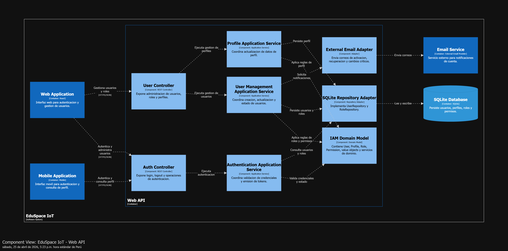

Componentes principales:

- **Auth Controller**
  - Container: Web API.
  - Expone operaciones de autenticación.

- **User Controller**
  - Container: Web API.
  - Expone operaciones de administración de usuarios y perfiles.

- **Authentication Application Service**
  - Container: Web API.
  - Coordina autenticación y generación de tokens.

- **User Management Application Service**
  - Container: Web API.
  - Coordina casos de uso de usuarios, roles y perfiles.

- **Domain Model**
  - Container: Web API.
  - Contiene entidades, value objects, servicios de dominio y reglas de negocio.

- **SQLite Repository Adapter**
  - Container: Web API.
  - Implementa persistencia en SQLite.

- **External Email Adapter**
  - Container: Web API.
  - Integra el servicio externo de correo.

#### 4.2.1.6. Bounded Context Software Architecture Code Level Diagrams

##### 4.2.1.6.1. Bounded Context Domain Layer Class Diagram

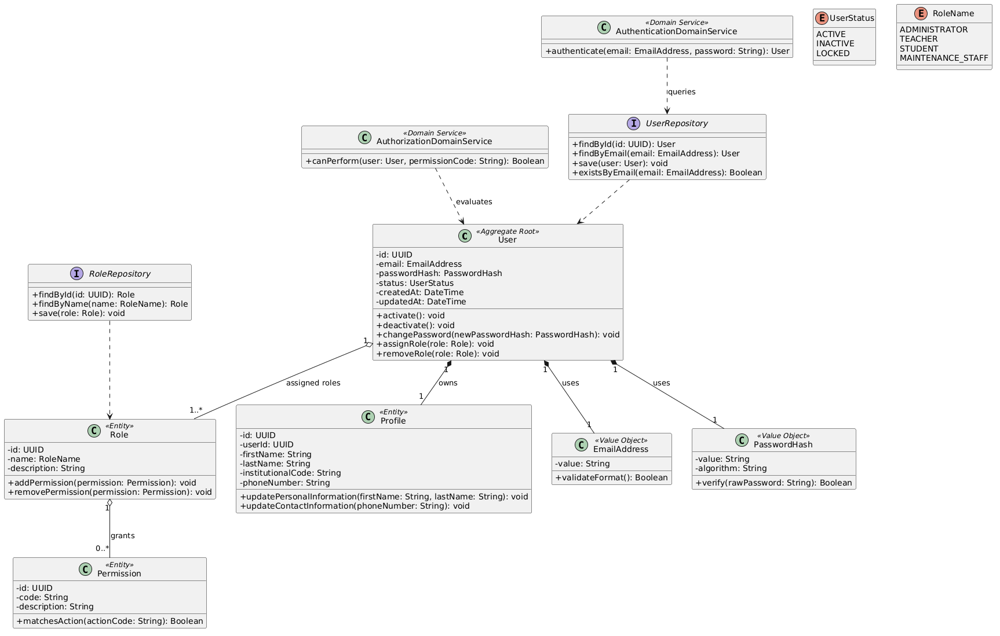

##### 4.2.1.6.2. Bounded Context Database Design Diagram

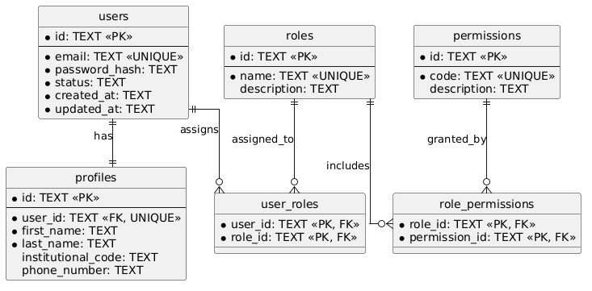

### 4.2.2. Space & Resource Management

#### 4.2.2.1. Domain Layer

Este bounded context administra los espacios físicos de la institución educativa y los recursos disponibles para reserva, operación académica y monitoreo.

**Entities**

- **Space**
  - Propósito: representa un ambiente físico, como aula, laboratorio o sala.
  - Atributos principales: `id`, `name`, `code`, `capacity`, `type`, `status`, `location`.
  - Métodos principales: `enable()`, `disable()`, `updateCapacity()`, `assignResource()`.
  - Relaciones clave: contiene recursos y puede estar asociado a dispositivos IoT.

- **Resource**
  - Propósito: representa un recurso disponible dentro de un espacio.
  - Atributos principales: `id`, `name`, `type`, `status`, `spaceId`.
  - Métodos principales: `markAvailable()`, `markUnavailable()`, `moveToSpace()`.
  - Relaciones clave: pertenece a un `Space`.

- **Location**
  - Propósito: representa la ubicación física del espacio dentro de la institución.
  - Atributos principales: `building`, `floor`, `roomNumber`.
  - Métodos principales: `fullDescription()`.

**Value Objects**

- **SpaceCode**
  - Propósito: identifica de forma única un espacio físico.
  - Atributos principales: `value`.
  - Métodos principales: `validateFormat()`.

- **Capacity**
  - Propósito: encapsula la capacidad máxima permitida.
  - Atributos principales: `value`.
  - Métodos principales: `isExceededBy(quantity)`.

**Aggregates / Aggregate Roots**

- **Space** es el aggregate root.
  - Controla la consistencia de estado, capacidad, ubicación y recursos asociados.

**Domain Services**

- **SpaceAvailabilityDomainService**
  - Propósito: determina si un espacio está habilitado para ser utilizado o reservado.
  - Métodos principales: `isUsable(space)`.

**Repository Interfaces**

- **SpaceRepository**
  - Métodos: `findById()`, `findByCode()`, `save()`, `searchAvailableSpaces()`.

- **ResourceRepository**
  - Métodos: `findById()`, `findBySpaceId()`, `save()`.

**Enumerations**

- **SpaceType**
  - Valores: `CLASSROOM`, `LABORATORY`, `AUDITORIUM`, `MEETING_ROOM`.

- **SpaceStatus**
  - Valores: `AVAILABLE`, `UNAVAILABLE`, `MAINTENANCE`.

- **ResourceStatus**
  - Valores: `AVAILABLE`, `UNAVAILABLE`, `IN_MAINTENANCE`.

**Reglas de negocio**

- Cada espacio debe tener un código único.
- Un espacio en mantenimiento no puede ser reservado.
- La capacidad de un espacio debe ser mayor que cero.
- Un recurso no disponible no debe considerarse como parte de la oferta operativa del espacio.

#### 4.2.2.2. Interface Layer

**Controllers / Endpoints**

- `POST /api/spaces`
- `GET /api/spaces`
- `GET /api/spaces/{id}`
- `PUT /api/spaces/{id}`
- `PUT /api/spaces/{id}/status`
- `POST /api/spaces/{id}/resources`
- `GET /api/spaces/{id}/resources`

**Requests y Responses**

- `CreateSpaceRequest`: `name`, `code`, `capacity`, `type`, `location`.
- `SpaceResponse`: `id`, `name`, `code`, `capacity`, `type`, `status`, `location`.
- `CreateResourceRequest`: `name`, `type`, `spaceId`.
- `ResourceResponse`: `id`, `name`, `type`, `status`.

**Interacción con aplicaciones**

- La Web Application permite administrar espacios y recursos.
- La Mobile Application consulta espacios disponibles.
- La Web API centraliza las operaciones del contexto.
- IoT Monitoring puede referenciar espacios para asociar dispositivos y lecturas.

**Actores involucrados**

- Administrador
- Docente
- Estudiante
- Personal de mantenimiento

#### 4.2.2.3. Application Layer

**Application Services**

- **SpaceApplicationService**
  - Gestiona creación, actualización, habilitación y deshabilitación de espacios.

- **ResourceApplicationService**
  - Gestiona alta, actualización, movimiento y estado de recursos.

**Command Handlers**

- `CreateSpaceCommandHandler`
- `UpdateSpaceCommandHandler`
- `ChangeSpaceStatusCommandHandler`
- `AssignResourceToSpaceCommandHandler`

**Query Services**

- `SpaceQueryService`
  - Consulta espacios por estado, tipo, capacidad y ubicación.

- `ResourceQueryService`
  - Consulta recursos por espacio o estado.

**Casos de uso principales**

- Registrar espacio.
- Actualizar datos de espacio.
- Consultar espacios disponibles.
- Registrar recurso.
- Cambiar estado de recurso.

**Coordinación**

La capa de aplicación valida reglas del dominio antes de persistir espacios o recursos. También proporciona información a Reservation & Scheduling para determinar disponibilidad base de los espacios.

#### 4.2.2.4. Infrastructure Layer

**Repository Implementations**

- `SQLiteSpaceRepository`
- `SQLiteResourceRepository`

**Persistencia**

- Base de datos principal: SQLite.
- Tablas principales: `spaces`, `resources`.

**ORM / Mapeo**

- `SpaceEntity`
- `ResourceEntity`
- Conversión entre modelos persistentes y objetos de dominio.

**Integraciones**

- No requiere integración directa con servicios externos.
- Puede ser referenciado por IoT Monitoring para asociar dispositivos con espacios físicos.

#### 4.2.2.5. Bounded Context Software Architecture Component Level Diagrams

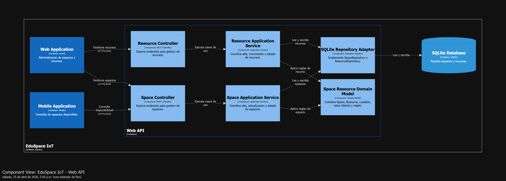

Componentes principales:

- **Space Controller**
  - Container: Web API.
  - Expone endpoints para gestión de espacios.

- **Resource Controller**
  - Container: Web API.
  - Expone endpoints para gestión de recursos.

- **Space Application Service**
  - Container: Web API.
  - Coordina casos de uso sobre espacios.

- **Resource Application Service**
  - Container: Web API.
  - Coordina casos de uso sobre recursos.

- **Domain Model**
  - Container: Web API.
  - Contiene reglas de consistencia del espacio y sus recursos.

- **SQLite Repository Adapter**
  - Container: Web API.
  - Implementa persistencia del contexto.

#### 4.2.2.6. Bounded Context Software Architecture Code Level Diagrams

##### 4.2.2.6.1. Bounded Context Domain Layer Class Diagram

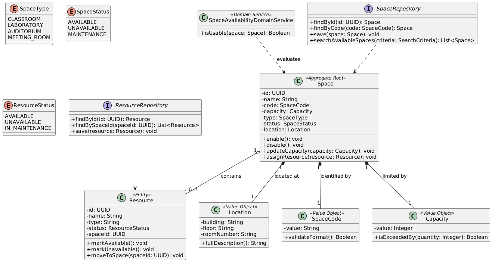

##### 4.2.2.6.2. Bounded Context Database Design Diagram

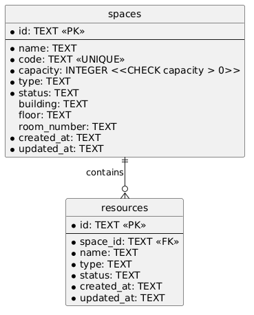

### 4.2.3. Reservation & Scheduling

#### 4.2.3.1. Domain Layer

Este bounded context gestiona reservas de espacios compartidos, reuniones institucionales, disponibilidad, programación horaria y conflictos de calendario.

**Entities**

- **Reservation**
  - Propósito: representa la solicitud o asignación de uso de un shared area.
  - Atributos principales: `id`, `sharedAreaId`, `requestedByUserId`, `schedule`, `purpose`, `status`.
  - Métodos principales: `confirm()`, `cancel()`, `reject()`, `reschedule()`.
  - Relaciones clave: referencia un shared area y al usuario solicitante mediante identificadores.

- **Meeting**
  - Propósito: representa una reunión programada por un administrador o responsable académico.
  - Atributos principales: `id`, `organizerId`, `classroomId`, `meetingDate`, `session`, `topic`, `status`.
  - Métodos principales: `schedule()`, `reschedule()`, `cancel()`, `inviteTeacher()`.
  - Relaciones clave: agrupa una colección de `MeetingInvitation`.

- **MeetingInvitation**
  - Propósito: representa la invitación cursada a un docente para participar en una reunión.
  - Atributos principales: `id`, `meetingId`, `teacherId`, `status`, `sentAt`, `respondedAt`.
  - Métodos principales: `send()`, `accept()`, `decline()`.
  - Relaciones clave: pertenece a un `Meeting`.

- **Schedule**
  - Propósito: representa el intervalo temporal de una reserva de espacio.
  - Atributos principales: `startDateTime`, `endDateTime`.
  - Métodos principales: `overlapsWith()`, `duration()`.

**Value Objects**

- **ReservationPurpose**
  - Propósito: describe el motivo académico o institucional de la reserva.
  - Atributos principales: `description`.
  - Métodos principales: `validateLength()`.

- **MeetingDate**
  - Propósito: representa la fecha calendario de una reunión.
  - Atributos principales: `value`.
  - Métodos principales: `isInPast()`.

- **MeetingSession**
  - Propósito: representa el bloque horario asignado a la reunión.
  - Atributos principales: `startTime`, `endTime`.
  - Métodos principales: `overlapsWith(otherSession)`, `duration()`.

**Aggregates / Aggregate Roots**

- **Reservation** es el aggregate root.
  - Controla estado, horario y reglas de modificación de una reserva.

- **Meeting** es un aggregate root independiente.
  - Controla la programación de la reunión, la coherencia temporal y el ciclo de vida de sus invitaciones.

**Domain Services**

- **ReservationConflictDomainService**
  - Propósito: determina si existe superposición de horarios para un mismo espacio.
  - Métodos principales: `hasConflict(spaceId, schedule)`.

- **ReservationPolicyDomainService**
  - Propósito: valida reglas de reserva según estado del espacio y usuario.
  - Métodos principales: `canCreateReservation(userId, spaceId, schedule)`.

- **MeetingSchedulingDomainService**
  - Propósito: valida disponibilidad del aula y del bloque horario para programar reuniones.
  - Métodos principales: `canScheduleMeeting(classroomId, meetingDate, session)`.

- **TeacherInvitationDomainService**
  - Propósito: valida si un docente puede ser invitado a una reunión sin duplicidad ni conflicto evidente.
  - Métodos principales: `canInviteTeacher(meetingId, teacherId)`.

**Repository Interfaces**

- **ReservationRepository**
  - Métodos: `findById()`, `findBySpaceAndSchedule()`, `findByUserId()`, `save()`.

- **MeetingRepository**
  - Métodos: `findById()`, `findByClassroomAndSession()`, `findByOrganizerId()`, `save()`.

**Enumerations**

- **ReservationStatus**
  - Valores: `PENDING`, `CONFIRMED`, `CANCELLED`, `REJECTED`.

- **MeetingStatus**
  - Valores: `SCHEDULED`, `RESCHEDULED`, `CANCELLED`, `COMPLETED`.

- **InvitationStatus**
  - Valores: `PENDING`, `SENT`, `ACCEPTED`, `DECLINED`.

**Reglas de negocio**

- No se permiten reservas con horarios superpuestos para el mismo espacio.
- Una reserva cancelada no puede confirmarse.
- El horario de fin debe ser posterior al horario de inicio.
- Solo espacios disponibles pueden ser reservados.
- Un usuario autenticado debe ser responsable de cada reserva.
- No se puede programar una reunión en un aula ocupada en la misma franja horaria.
- Una reunión debe tener un organizador válido y al menos un objetivo definido.
- Un docente no debe recibir invitaciones duplicadas para la misma reunión.
- La invitación a docentes solo puede emitirse cuando la reunión ya fue programada.

#### 4.2.3.2. Interface Layer

**Controllers / Endpoints**

- `POST /api/reservations`
- `GET /api/reservations/{id}`
- `GET /api/reservations?userId={userId}`
- `GET /api/spaces/{spaceId}/reservations`
- `PUT /api/reservations/{id}/confirm`
- `PUT /api/reservations/{id}/cancel`
- `PUT /api/reservations/{id}/reschedule`
- `POST /api/meetings`
- `GET /api/meetings/{id}`
- `PUT /api/meetings/{id}/reschedule`
- `PUT /api/meetings/{id}/cancel`
- `POST /api/meetings/{id}/invitations`

**Requests y Responses**

- `CreateReservationRequest`: `spaceId`, `startDateTime`, `endDateTime`, `purpose`.
- `ReservationResponse`: `id`, `spaceId`, `userId`, `schedule`, `purpose`, `status`.
- `RescheduleReservationRequest`: `startDateTime`, `endDateTime`.
- `ScheduleMeetingRequest`: `classroomId`, `meetingDate`, `startTime`, `endTime`, `topic`, `teacherIds`.
- `MeetingResponse`: `id`, `organizerId`, `classroomId`, `meetingDate`, `session`, `topic`, `status`, `invitations`.
- `InviteTeacherRequest`: `teacherId`.

**Interacción con aplicaciones**

- La Web Application permite administrar y aprobar reservas, programar reuniones e invitar docentes.
- La Mobile Application permite consultar y crear reservas, así como revisar reuniones e invitaciones.
- La Web API ejecuta validaciones de disponibilidad, conflictos de horario y emisión de invitaciones.
- Consulta información de Space & Resource Management para validar estado del espacio.

**Actores involucrados**

- Administrador
- Docente
- Estudiante

#### 4.2.3.3. Application Layer

**Application Services**

- **ReservationApplicationService**
  - Coordina creación, confirmación, cancelación y reprogramación de reservas.

- **MeetingSchedulingApplicationService**
  - Coordina programación, reprogramación y cancelación de reuniones.

- **MeetingInvitationApplicationService**
  - Coordina la emisión y seguimiento de invitaciones a docentes.

**Command Handlers**

- `CreateReservationCommandHandler`
- `ConfirmReservationCommandHandler`
- `CancelReservationCommandHandler`
- `RescheduleReservationCommandHandler`
- `ScheduleMeetingCommandHandler`
- `RescheduleMeetingCommandHandler`
- `CancelMeetingCommandHandler`
- `InviteTeacherToMeetingCommandHandler`

**Query Services**

- `ReservationQueryService`
  - Consulta reservas por usuario, espacio, fecha o estado.

- `MeetingQueryService`
  - Consulta reuniones por aula, organizador, fecha o estado.

**Event Handlers**

- `ReservationConfirmedEventHandler`
  - Puede activar notificaciones al usuario.

- `ReservationCancelledEventHandler`
  - Puede notificar cambios de disponibilidad.

- `MeetingScheduledEventHandler`
  - Emite el evento pivote `MeetingScheduled` y desencadena invitaciones iniciales.

- `TeacherInvitedToMeetingEventHandler`
  - Emite el evento pivote `TeacherInvitedToMeeting` y coordina notificaciones.

**Casos de uso principales**

- Crear reserva.
- Confirmar reserva.
- Cancelar reserva.
- Reprogramar reserva.
- Consultar calendario de espacio.
- Programar reunión.
- Reprogramar reunión.
- Invitar docente a reunión.
- Consultar agenda de reuniones.

**Coordinación**

La capa de aplicación consulta repositorios de reserva y reunión, además de servicios del contexto Space & Resource Management, para validar disponibilidad. Luego persiste reservas y reuniones, y emite los eventos pivote `SharedAreaReserved`, `ReservationConfirmed`, `MeetingScheduled` y `TeacherInvitedToMeeting` cuando corresponde.

#### 4.2.3.4. Infrastructure Layer

**Repository Implementations**

- `SQLiteReservationRepository`
- `SQLiteMeetingRepository`

**Persistencia**

- Base de datos principal: SQLite.
- Tablas principales: `reservations`, `meetings`, `meeting_invitations`.

**Integraciones**

- Adaptador de consulta hacia Space & Resource Management para verificar estado del espacio.
- Adaptador de notificación/correo para avisos de confirmación, cancelación o cambios.
- Adaptador SendGrid para remitir invitaciones y actualizaciones de reuniones a docentes.

**Mensajería**

- Eventos internos de aplicación para confirmaciones, cancelaciones, programación de reuniones e invitaciones.

#### 4.2.3.5. Bounded Context Software Architecture Component Level Diagrams

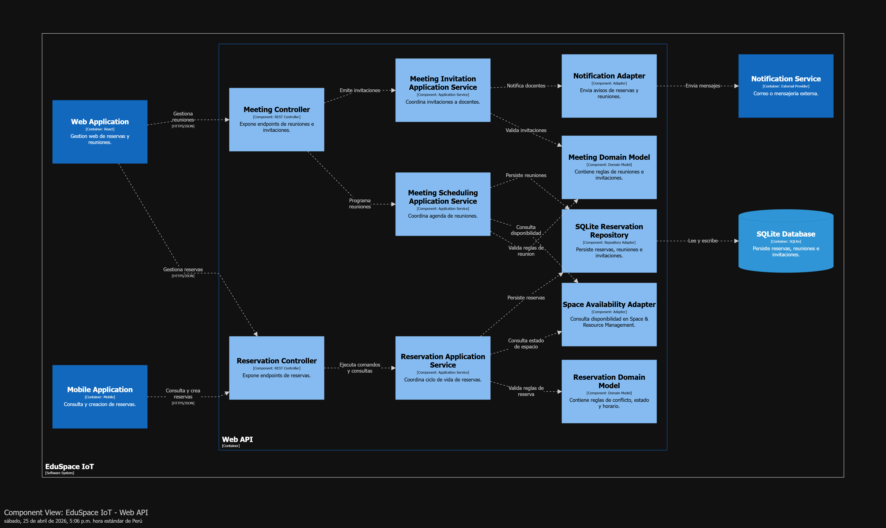

Componentes principales:

- **Reservation Controller**
  - Container: Web API.
  - Expone endpoints de reservas.

- **Meeting Controller**
  - Container: Web API.
  - Expone endpoints para programación de reuniones e invitaciones.

- **Reservation Application Service**
  - Container: Web API.
  - Coordina el ciclo de vida de una reserva.

- **Meeting Scheduling Application Service**
  - Container: Web API.
  - Coordina la agenda de reuniones y la emisión de invitaciones.

- **Reservation Domain Model**
  - Container: Web API.
  - Contiene reglas de conflicto, estado y programación de reservas.

- **Meeting Domain Model**
  - Container: Web API.
  - Contiene reglas de calendario, reuniones e invitaciones.

- **Space Availability Adapter**
  - Container: Web API.
  - Consulta información del contexto Space & Resource Management.

- **SQLite Reservation Repository**
  - Container: Web API.
  - Persiste reservas, reuniones e invitaciones.

- **Notification Adapter**
  - Container: Web API.
  - Envía comunicaciones sobre cambios de reserva y reuniones.

#### 4.2.3.6. Bounded Context Software Architecture Code Level Diagrams

##### 4.2.3.6.1. Bounded Context Domain Layer Class Diagram

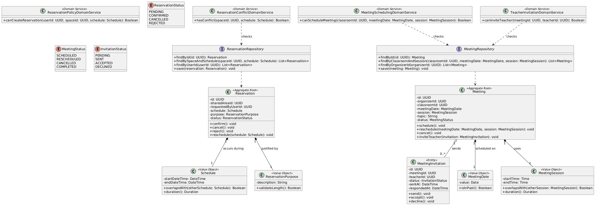

##### 4.2.3.6.2. Bounded Context Database Design Diagram

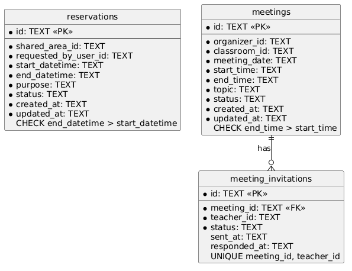

### 4.2.4. Breakdown Management

#### 4.2.4.1. Domain Layer

Este bounded context administra reportes de fallas, incidencias y atención de problemas relacionados con espacios, recursos o dispositivos IoT.

**Entities**

- **BreakdownReport**
  - Propósito: representa un reporte de falla generado por un usuario o por monitoreo IoT.
  - Atributos principales: `id`, `reportedByUserId`, `spaceId`, `resourceId`, `deviceId`, `description`, `priority`, `status`.
  - Métodos principales: `assignTechnician()`, `markInProgress()`, `resolve()`, `close()`.
  - Relaciones clave: puede asociarse a espacio, recurso o dispositivo IoT.

- **MaintenanceAssignment**
  - Propósito: representa la asignación de atención a personal responsable.
  - Atributos principales: `id`, `breakdownReportId`, `technicianUserId`, `assignedAt`.
  - Métodos principales: `reassign()`.

- **ResolutionRecord**
  - Propósito: registra la solución aplicada.
  - Atributos principales: `id`, `breakdownReportId`, `description`, `resolvedAt`.
  - Métodos principales: `updateDescription()`.

**Value Objects**

- **BreakdownDescription**
  - Propósito: encapsula la descripción de la falla.
  - Atributos principales: `value`.
  - Métodos principales: `validateMinimumLength()`.

**Aggregates / Aggregate Roots**

- **BreakdownReport** es el aggregate root.
  - Controla estado, prioridad, asignación y resolución.

**Domain Services**

- **BreakdownPriorityDomainService**
  - Propósito: calcula prioridad según impacto, espacio afectado o alerta IoT.
  - Métodos principales: `calculatePriority()`.

**Repository Interfaces**

- **BreakdownReportRepository**
  - Métodos: `findById()`, `findByStatus()`, `findBySpaceId()`, `save()`.

**Enumerations**

- **BreakdownStatus**
  - Valores: `REPORTED`, `ASSIGNED`, `IN_PROGRESS`, `RESOLVED`, `CLOSED`.

- **BreakdownPriority**
  - Valores: `LOW`, `MEDIUM`, `HIGH`, `CRITICAL`.

**Reglas de negocio**

- Un reporte cerrado no puede modificarse.
- Un reporte debe tener descripción y al menos una referencia válida: espacio, recurso o dispositivo.
- Solo un reporte asignado puede pasar a estado en progreso.
- Todo reporte resuelto debe tener un registro de resolución.

#### 4.2.4.2. Interface Layer

**Controllers / Endpoints**

- `POST /api/breakdowns`
- `GET /api/breakdowns`
- `GET /api/breakdowns/{id}`
- `PUT /api/breakdowns/{id}/assign`
- `PUT /api/breakdowns/{id}/in-progress`
- `PUT /api/breakdowns/{id}/resolve`
- `PUT /api/breakdowns/{id}/close`

**Requests y Responses**

- `CreateBreakdownReportRequest`: `spaceId`, `resourceId`, `deviceId`, `description`.
- `AssignBreakdownRequest`: `technicianUserId`.
- `ResolveBreakdownRequest`: `resolutionDescription`.
- `BreakdownReportResponse`: `id`, `description`, `priority`, `status`, `assignedTechnician`, `createdAt`.

**Interacción con aplicaciones**

- La Web Application permite gestionar reportes y asignaciones.
- La Mobile Application permite reportar fallas y consultar estado.
- IoT Monitoring puede generar reportes automáticos ante alertas críticas.
- La Web API centraliza la operación del contexto.

**Actores involucrados**

- Administrador
- Docente
- Estudiante
- Personal de mantenimiento

#### 4.2.4.3. Application Layer

**Application Services**

- **BreakdownApplicationService**
  - Coordina creación, asignación, avance y cierre de reportes.

**Command Handlers**

- `CreateBreakdownReportCommandHandler`
- `AssignBreakdownCommandHandler`
- `StartBreakdownWorkCommandHandler`
- `ResolveBreakdownCommandHandler`
- `CloseBreakdownCommandHandler`

**Query Services**

- `BreakdownQueryService`
  - Consulta reportes por estado, prioridad, espacio o técnico asignado.

**Event Handlers**

- `IoTAlertRaisedEventHandler`
  - Crea reportes de falla cuando una alerta IoT supera criterios críticos.

- `BreakdownResolvedEventHandler`
  - Notifica resolución al usuario que reportó la incidencia.

**Casos de uso principales**

- Registrar falla.
- Asignar personal de mantenimiento.
- Actualizar estado de atención.
- Resolver falla.
- Cerrar reporte.

**Coordinación**

La capa de aplicación valida transiciones de estado mediante el aggregate root. También puede consumir eventos de IoT Monitoring para crear reportes automáticos.

#### 4.2.4.4. Infrastructure Layer

**Repository Implementations**

- `SQLiteBreakdownReportRepository`

**Persistencia**

- Base de datos principal: SQLite.
- Tablas principales: `breakdown_reports`, `maintenance_assignments`, `resolution_records`.

**Integraciones**

- Adaptador con servicio externo de notificaciones/correo.
- Adaptador de eventos internos desde IoT Monitoring.

**Mensajería**

- Eventos de aplicación para alertas críticas, asignación de reportes y resolución de fallas.

#### 4.2.4.5. Bounded Context Software Architecture Component Level Diagrams

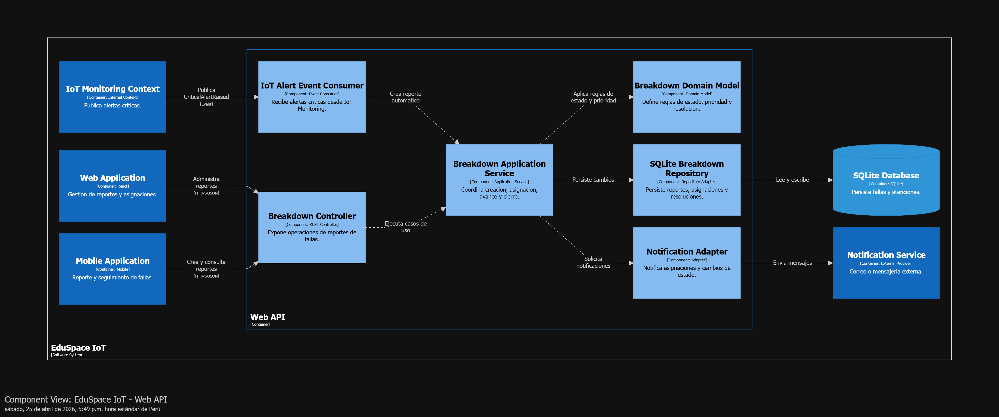

Componentes principales:

- **Breakdown Controller**
  - Container: Web API.
  - Expone operaciones de reportes de fallas.

- **Breakdown Application Service**
  - Container: Web API.
  - Coordina el flujo de atención.

- **Breakdown Domain Model**
  - Container: Web API.
  - Define reglas de estado, prioridad y resolución.

- **IoT Alert Event Consumer**
  - Container: Web API.
  - Recibe alertas críticas desde IoT Monitoring.

- **SQLite Breakdown Repository**
  - Container: Web API.
  - Persiste reportes, asignaciones y resoluciones.

- **Notification Adapter**
  - Container: Web API.
  - Notifica asignaciones y cambios de estado.

#### 4.2.4.6. Bounded Context Software Architecture Code Level Diagrams

##### 4.2.4.6.1. Bounded Context Domain Layer Class Diagram

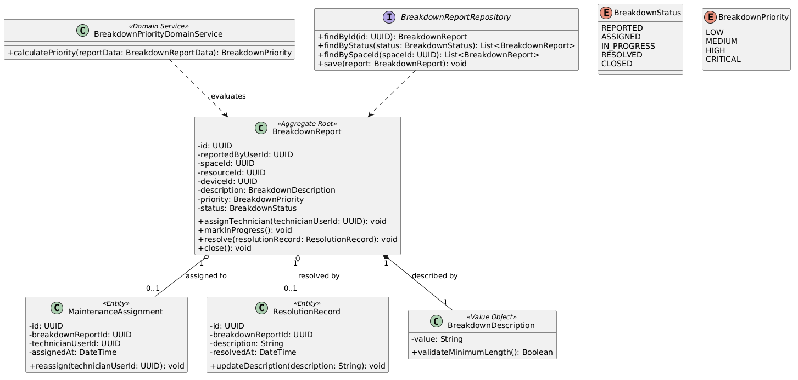

##### 4.2.4.6.2. Bounded Context Database Design Diagram

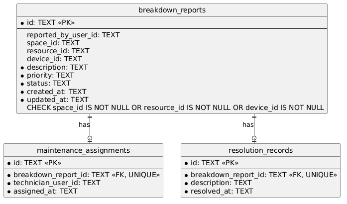

### 4.2.5. IoT Monitoring

#### 4.2.5.1. Domain Layer

Este bounded context gestiona dispositivos IoT, sensores, lecturas ambientales, ocupación, umbrales, alertas y sincronización entre Edge API, Embedded Application y Web API.

**Entities**

- **IoTDevice**
  - Propósito: representa un dispositivo físico instalado en un espacio educativo.
  - Atributos principales: `id`, `deviceCode`, `spaceId`, `status`, `lastConnectionAt`.
  - Métodos principales: `registerConnection()`, `markOffline()`, `assignToSpace()`.
  - Relaciones clave: contiene uno o más sensores.

- **Sensor**
  - Propósito: representa un sensor físico o lógico del dispositivo.
  - Atributos principales: `id`, `deviceId`, `type`, `unit`, `status`.
  - Métodos principales: `activate()`, `deactivate()`, `recordReading()`.
  - Relaciones clave: pertenece a un `IoTDevice`.

- **SensorReading**
  - Propósito: representa una lectura capturada por un sensor.
  - Atributos principales: `id`, `sensorId`, `metricType`, `value`, `recordedAt`, `syncedAt`.
  - Métodos principales: `markAsSynced()`, `isPendingSync()`.
  - Relaciones clave: pertenece a un `Sensor`.

- **Threshold**
  - Propósito: define límites operativos para una métrica ambiental o de ocupación.
  - Atributos principales: `id`, `spaceId`, `metricType`, `minValue`, `maxValue`, `enabled`.
  - Métodos principales: `evaluate(reading)`, `enable()`, `disable()`.

- **Alert**
  - Propósito: representa una condición anómala detectada por lecturas IoT.
  - Atributos principales: `id`, `deviceId`, `sensorId`, `spaceId`, `metricType`, `severity`, `status`, `message`.
  - Métodos principales: `acknowledge()`, `resolve()`, `escalate()`.
  - Relaciones clave: se origina por una o más lecturas fuera de umbral.

- **SyncBatch**
  - Propósito: agrupa lecturas pendientes enviadas desde Edge API hacia Web API.
  - Atributos principales: `id`, `edgeNodeId`, `status`, `createdAt`, `sentAt`.
  - Métodos principales: `markSent()`, `markFailed()`, `markProcessed()`.

**Value Objects**

- **DeviceCode**
  - Propósito: identifica de manera única un dispositivo IoT.
  - Atributos principales: `value`.
  - Métodos principales: `validateFormat()`.

- **MetricValue**
  - Propósito: encapsula el valor numérico de una métrica.
  - Atributos principales: `value`, `unit`.
  - Métodos principales: `isWithin(min, max)`.

- **OccupancyValue**
  - Propósito: representa cantidad o porcentaje de ocupación.
  - Atributos principales: `value`.
  - Métodos principales: `exceedsCapacity(capacity)`.

**Aggregates / Aggregate Roots**

- **IoTDevice**
  - Aggregate root para sensores y estado operativo del dispositivo.

- **Alert**
  - Aggregate root para el ciclo de vida de alertas.

- **SyncBatch**
  - Aggregate root para consistencia de sincronización Edge-Servidor.

**Domain Services**

- **ThresholdEvaluationDomainService**
  - Propósito: evalúa lecturas contra umbrales configurados.
  - Métodos principales: `evaluate(reading, threshold)`.

- **OccupancyCalculationDomainService**
  - Propósito: calcula ocupación a partir de lecturas del sensor.
  - Métodos principales: `calculateOccupancy(readings)`.

- **SyncPolicyDomainService**
  - Propósito: determina si una lectura requiere sincronización.
  - Métodos principales: `shouldSync(reading)`.

**Repository Interfaces**

- **IoTDeviceRepository**
  - Métodos: `findById()`, `findByDeviceCode()`, `save()`.

- **SensorReadingRepository**
  - Métodos: `save()`, `findPendingSync()`, `findBySensorAndDateRange()`.

- **ThresholdRepository**
  - Métodos: `findBySpaceAndMetricType()`, `save()`.

- **AlertRepository**
  - Métodos: `save()`, `findActiveBySpaceId()`, `findById()`.

- **SyncBatchRepository**
  - Métodos: `save()`, `findPending()`, `findById()`.

**Enumerations**

- **DeviceStatus**
  - Valores: `ONLINE`, `OFFLINE`, `MAINTENANCE`.

- **SensorType**
  - Valores: `TEMPERATURE`, `HUMIDITY`, `CO2`, `MOTION`, `OCCUPANCY`, `LIGHT`.

- **MetricType**
  - Valores: `TEMPERATURE`, `HUMIDITY`, `CO2_LEVEL`, `OCCUPANCY`, `LIGHT_LEVEL`.

- **AlertSeverity**
  - Valores: `LOW`, `MEDIUM`, `HIGH`, `CRITICAL`.

- **AlertStatus**
  - Valores: `ACTIVE`, `ACKNOWLEDGED`, `RESOLVED`.

- **SyncStatus**
  - Valores: `PENDING`, `SENT`, `PROCESSED`, `FAILED`.

**Reglas de negocio**

- Un dispositivo debe estar asociado a un espacio válido para reportar métricas operativas.
- Una lectura debe conservar fecha, sensor y tipo de métrica.
- Las lecturas capturadas en Edge deben almacenarse localmente antes de sincronizarse.
- Una lectura fuera de umbral debe generar o actualizar una alerta activa.
- Las lecturas sincronizadas no deben duplicarse en SQLite.
- Una alerta crítica puede originar un reporte en Breakdown Management.
- La pérdida de conexión del dispositivo no debe impedir la captura local si el Edge API sigue disponible.

#### 4.2.5.2. Interface Layer

**Controllers / Consumers / Endpoints**

En Edge API:

- `POST /edge/readings`
- `GET /edge/readings/pending-sync`
- `POST /edge/sync`

En Web API:

- `POST /api/iot/readings/sync`
- `GET /api/iot/devices`
- `GET /api/iot/devices/{id}`
- `GET /api/iot/spaces/{spaceId}/metrics`
- `POST /api/iot/thresholds`
- `PUT /api/iot/thresholds/{id}`
- `GET /api/iot/alerts`
- `PUT /api/iot/alerts/{id}/acknowledge`
- `PUT /api/iot/alerts/{id}/resolve`

**Requests y Responses**

- `RegisterSensorReadingRequest`: `deviceCode`, `sensorId`, `metricType`, `value`, `unit`, `recordedAt`.
- `SyncReadingsRequest`: `edgeNodeId`, `batchId`, `readings`.
- `SensorReadingResponse`: `id`, `sensorId`, `metricType`, `value`, `recordedAt`, `syncStatus`.
- `ThresholdRequest`: `spaceId`, `metricType`, `minValue`, `maxValue`.
- `AlertResponse`: `id`, `spaceId`, `deviceId`, `metricType`, `severity`, `status`, `message`.

**Interacción con aplicaciones**

- La Embedded Application captura datos desde sensores y los envía a Edge API.
- Edge API almacena lecturas en SQLite y sincroniza con Web API.
- Web API persiste el histórico en SQLite.
- Web Application visualiza métricas, alertas, dispositivos y configuración de umbrales.
- Mobile Application puede consultar alertas y estado de espacios.
- Breakdown Management puede recibir eventos de alertas críticas.

**Actores involucrados**

- Administrador
- Personal de mantenimiento
- Docente
- Estudiante, principalmente como consumidor de disponibilidad o estado del espacio

#### 4.2.5.3. Application Layer

**Application Services**

- **EdgeReadingApplicationService**
  - Ejecuta la recepción local de lecturas desde la Embedded Application.

- **ReadingSynchronizationApplicationService**
  - Coordina el envío de lecturas pendientes desde SQLite hacia Web API.

- **IoTMonitoringApplicationService**
  - Procesa lecturas sincronizadas, evalúa umbrales y registra histórico.

- **ThresholdApplicationService**
  - Gestiona configuración de umbrales.

- **AlertApplicationService**
  - Gestiona creación, reconocimiento y resolución de alertas.

**Command Handlers**

- `RegisterSensorReadingCommandHandler`
- `SynchronizeReadingsCommandHandler`
- `CreateThresholdCommandHandler`
- `UpdateThresholdCommandHandler`
- `AcknowledgeAlertCommandHandler`
- `ResolveAlertCommandHandler`

**Query Services**

- `DeviceQueryService`
- `SensorReadingQueryService`
- `EnvironmentalMetricQueryService`
- `AlertQueryService`

**Event Handlers**

- `SensorReadingRecordedEventHandler`
  - Evalúa umbrales localmente o prepara sincronización.

- `ThresholdExceededEventHandler`
  - Crea o actualiza alertas.

- `CriticalAlertRaisedEventHandler`
  - Publica evento para Breakdown Management.

**Casos de uso principales**

- Registrar dispositivo IoT.
- Capturar lectura de sensor.
- Almacenar lectura local en Edge.
- Sincronizar lecturas con servidor.
- Consultar métricas ambientales históricas.
- Configurar umbrales.
- Generar alertas por valores fuera de rango.
- Resolver alertas.

**Coordinación**

La capa de aplicación en Edge API coordina captura local y persistencia en SQLite. La capa de aplicación en Web API recibe lotes sincronizados, evita duplicados, persiste en SQLite, evalúa umbrales y genera alertas o eventos para otros contextos.

#### 4.2.5.4. Infrastructure Layer

**Repository Implementations**

En Edge API:

- `SQLiteSensorReadingRepository`
- `SQLiteSyncBatchRepository`

En Web API:

- `SQLiteIoTDeviceRepository`
- `SQLiteSensorReadingRepository`
- `SQLiteThresholdRepository`
- `SQLiteAlertRepository`
- `SQLiteSyncBatchRepository`

**Persistencia**

- SQLite en Edge API:
  - Almacena lecturas locales, estado de sincronización y lotes pendientes.
- SQLite en Web API:
  - Almacena dispositivos, sensores, histórico de lecturas, umbrales y alertas.

**Integraciones**

- Embedded Application hacia Edge API mediante endpoints locales.
- Edge API hacia Web API mediante sincronización HTTP.
- Web API hacia servicio externo de notificaciones/correo para alertas relevantes.
- Web API hacia Breakdown Management mediante evento interno para alertas críticas.

**Adaptadores**

- `EmbeddedDeviceAdapter`
  - Recibe datos generados por sensores físicos.

- `EdgeSyncHttpAdapter`
  - Envía lotes de lecturas hacia Web API.

- `NotificationAdapter`
  - Envía alertas a responsables.

**Mensajería**

- Eventos internos:
  - `SensorReadingRecorded`
  - `ThresholdExceeded`
  - `CriticalAlertRaised`
  - `ReadingsSynchronized`

#### 4.2.5.5. Bounded Context Software Architecture Component Level Diagrams

**IoT Monitoring - Edge API Component Diagram**

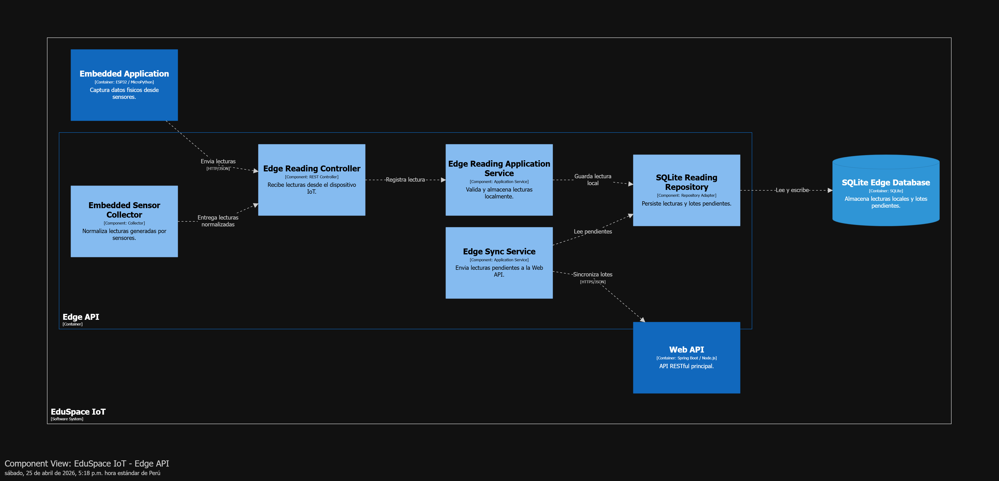

**IoT Monitoring - Web API Component Diagram**

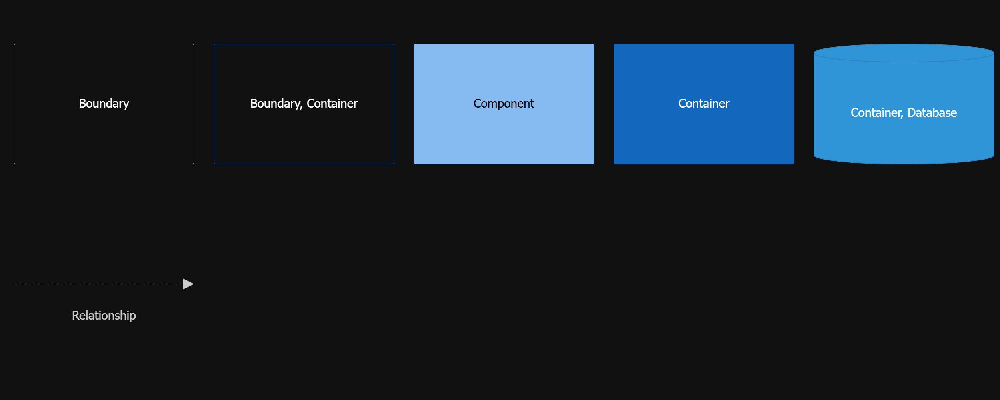

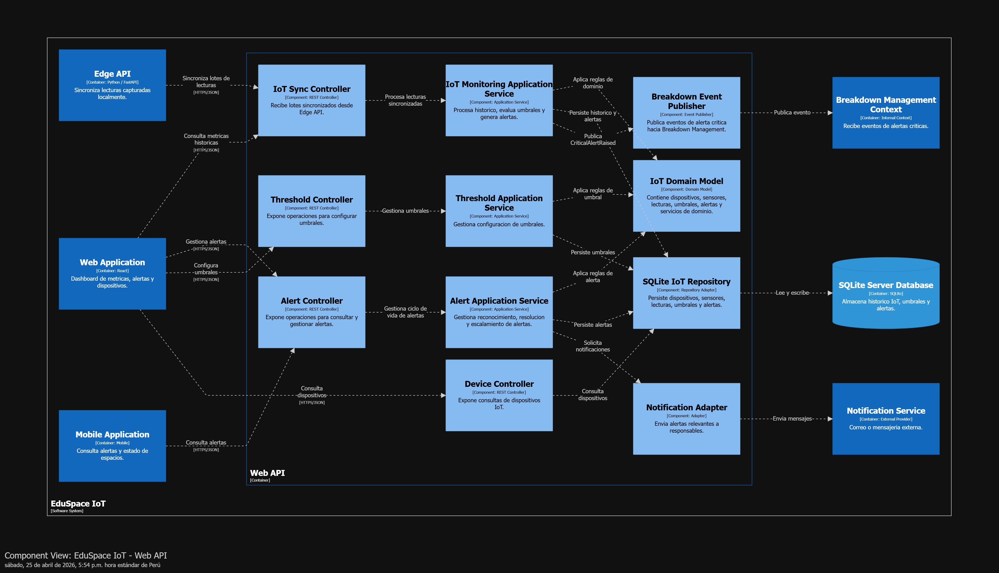

Componentes principales:

- **Embedded Sensor Collector**
  - Container: Embedded Application.
  - Captura datos físicos desde sensores.

- **Edge Reading Controller**
  - Container: Edge API.
  - Recibe lecturas desde el dispositivo IoT.

- **Edge Reading Application Service**
  - Container: Edge API.
  - Valida y almacena lecturas localmente.

- **SQLite Reading Repository**
  - Container: Edge API.
  - Persiste lecturas y lotes pendientes en SQLite.

- **Edge Sync Service**
  - Container: Edge API.
  - Envía lecturas pendientes a la Web API.

- **IoT Sync Controller**
  - Container: Web API.
  - Recibe lotes de lecturas sincronizadas.

- **IoT Monitoring Application Service**
  - Container: Web API.
  - Procesa histórico, evalúa umbrales y genera alertas.

- **Alert Controller**
  - Container: Web API.
  - Expone operaciones para consultar y gestionar alertas.

- **SQLite IoT Repository**
  - Container: Web API.
  - Persiste dispositivos, sensores, lecturas, umbrales y alertas.

- **Web Dashboard Components**
  - Container: Web Application.
  - Visualizan métricas, alertas y estado de dispositivos.

- **Mobile Monitoring Views**
  - Container: Mobile Application.
  - Consultan alertas y condiciones relevantes de espacios.

#### 4.2.5.6. Bounded Context Software Architecture Code Level Diagrams

##### 4.2.5.6.1. Bounded Context Domain Layer Class Diagram

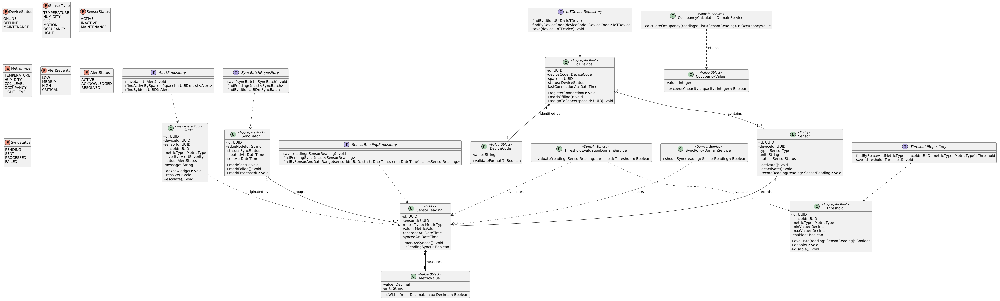

##### 4.2.5.6.2. Bounded Context Database Design Diagram

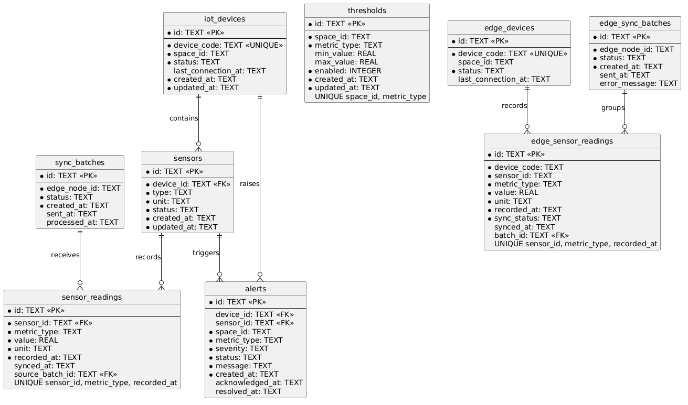

---

# Conclusiones

## Conclusiones y recomendaciones

---

# Bibliografía

Birimisa, A. (2025, 19 febrero). _El consumo de energía en los Colegios y cómo el FM puede generar ahorros_. https://www.linkedin.com/pulse/el-consumo-de-energ%C3%ADa-en-los-colegios-y-c%C3%B3mo-fm-puede-birimisa-ncnpe/

Córdova Negrete, M. G., Domínguez Toala, G. del P., & Córdova Cabrera, D. J. (2025). Retos y perspectivas de la gestión administrativa en la educación superior: fortalecimiento institucional, calidad educativa y liderazgo académico en el contexto globalizado. _Multidisciplinary Journal of Sciences, Discoveries, and Society_, _2_(2), e-207. https://doi.org/10.71068/xzb5wn45

Expertos En Educación. (2025, 22 septiembre). _Gestión educativa en el Perú: claves, retos y soluciones_. VIU Universidad Online. https://www.universidadviu.com/pe/actualidad/nuestros-expertos/gestion-educativa-en-el-peru-claves-retos-y-soluciones

Diaz, H. (2024, 25 junio). _Infraestructura escolar: soluciones frente al déficit y los desafíos tecnológicos - Educared_. Educared. https://educared.fundaciontelefonica.com.pe/desafios/infraestructura-escolar-soluciones-frente-al-deficit-y-los-desafios-tecnologicos/

Valencia, C., & Almeida, V. (2024). La tecnología en la gestión educativa. _Revista de Investigación Latinoamericana En Competitividad Organizacional_, _6_(23), 9859863. https://dialnet.unirioja.es/descarga/articulo/9859863.pdf#:~:text=En%20resumen%2C%20la%20integraci%C3%B3n%20de%20la%20tecnolog%C3%ADa,a%20la%20mejora%20de%20la%20calidad%20educativa.

Shanganlall, A. (2025, 21 febrero). _Los 7 mayores retos que afectan a la gestión de la educación_. Classter. https://www.classter.com/es/blog/edtech-es/los-7-mayores-retos-que-afectan-a-la-gestion-de-la-educacion/

---

# Anexos

## Anexo A: Estructura para la sección Student Outcome

## Anexo B: Videos de Exposiciones

| Entrega | Título | URL |
| ------- | ------ | --- |
| AV1     |        |     |
